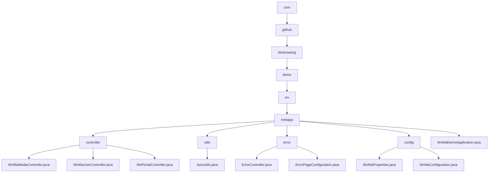

# Basic Information

|      |      |
|------|------|
| Name | com |
| Language | .java |
| Code Path | weixin-java-miniapp-demo/src/main/java/com |
| Package Name | docs.src.main.java.com |
| Brief Description | WeChat Mini Program backend core modules, including media management, user information processing, and message routing functionality, comply with WeChat standards and rely on WeChat JSSDK and Spring Boot. The error handling module uniformly manages HTTP error status codes and custom error pages. The multi-account configuration module dynamically manages Mini Program accounts and message routing. The application entry class is based on Spring Boot startup. |

# Description

## Overview  
This module serves as the core backend system for WeChat Mini Programs, integrating four major functionalities: media management, user authentication, message routing, and error handling. Built on the Spring Boot framework, it adheres to the WeChat Open Platform specifications. Key structures include Media_id lists, user session information, and message handler mappings. Dependencies include WeChat JSSDK, Lombok, and Spring Web components. For example, uploading media returns a media_id, user login exchanges a code for an openid, and error handling supports custom 404 pages. The JSON serialization tool employs a configurable ObjectMapper for efficient conversion.  

## Key Business Scenarios  
The system manages the entire lifecycle of Mini Programs: media files operate similarly to CDN, user authentication follows the OAuth2.0 flow, message routing adopts an event bus pattern, and error handling mimics frontend route interception. Typical workflows consist of three stages: request validation → business processing → resource cleanup. For instance, decrypting encrypted phone numbers requires session key verification. Integration cases cover five types of message processing, with exceptions handled through logging and fallback mechanisms. The startup class initializes multi-account configuration services via @SpringBootApplication.

### Package Internal Structure View

This flowchart illustrates the complete directory structure of the WeChat Mini Program Demo project, starting from the root directory `com` and expanding level by level until reaching various submodules and files under the `miniapp` module. It includes four subdirectories (`controller`, `utils`, `error`, `config`) along with the main application file, each containing corresponding functional class files. This clearly presents the modular and layered organizational structure of the project.

# File List

| Name   | Type  | Description |
|-------|------|-------------|
| [github](github/_module.md) | package | WeChat Mini Program backend core modules, including media management, user information processing, and message routing functionality, comply with WeChat standards and rely on WeChat JSSDK and Spring Boot. The error handling module uniformly manages HTTP error status codes and custom error pages. The multi-account configuration module dynamically manages Mini Program accounts and message routing. The application entry class is based on Spring Boot startup. |

