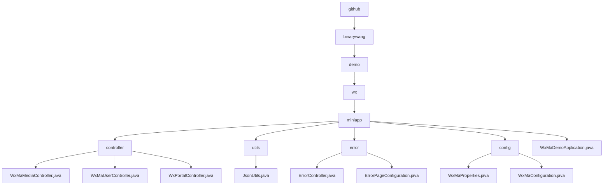

# Basic Information

|      |      |
|------|------|
| Name | github |
| Language | .java |
| Code Path | weixin-java-miniapp-demo/src/main/java/com/github |
| Package Name | docs.src.main.java.com.github |
| Brief Description | The core backend module of the WeChat Mini Program includes media management, user sessions, and WeChat interaction functionalities, relying on the WeChat SDK and Lombok. It supports file uploads, identity authentication, and message routing, with processes encompassing validation, processing, and cleanup. The error handling module uniformly manages 404/500 responses. The configuration module handles Mini Program properties and message service initialization. The Spring Boot application entry class launches the entire Demo. |

# Description

## Overview  
This module is an integrated solution for WeChat Mini Program backend services, with core responsibilities including media file management, user session management, interaction with WeChat servers, and unified error handling. The interface specification requires validating AppID validity, adhering to Spring MVC standards, and injecting configurations via the `wx.miniapp` prefix. Key data structures encompass media_id, user session objects, WeChat message encapsulation, and the WxMaProperties.Config configuration class. External dependencies include the WeChat SDK, Spring Framework, and Lombok utility library. For example, the media controller handles multi-file uploads, the error controller returns unified views, and the configuration class implements multi-account management.  

## Key Business Scenarios  
The module supports four typical types of interactions: media file transfer (similar to cloud storage interfaces), user authentication (similar to OAuth2.0), WeChat message routing (similar to an event bus pattern), and HTTP error handling (similar to web server error pages). The complete business process consists of three stages: credential validation → business processing → resource cleanup, such as redirecting to an error page during user login verification code or exceptions. Integration cases cover file uploads, session decryption, message responses, and error prompts, such as POST interfaces processing encrypted messages or GET returning 404 views. All interactions are implemented through standard Spring MVC controllers.

### Package Internal Structure View

This flowchart illustrates the core directory structure of a WeChat Mini Program Demo project, starting from the root directory 'github' and expanding hierarchically to the 'miniapp' module, which includes submodules such as 'controller', 'utils', 'error', 'config', and their corresponding Java class files. The 'controller' contains three controller classes, 'utils' and 'error' each have two utility classes, 'config' includes two configuration classes, and the top-level is the application startup class 'WxMaDemoApplication.java'. The entire structure clearly reflects the standard organization of backend code for a WeChat Mini Program.

# File List

| Name   | Type  | Description |
|-------|------|-------------|
| [binarywang](binarywang/_module.md) | package | The core backend module of the WeChat Mini Program includes media management, user sessions, and WeChat interaction functionalities, relying on the WeChat SDK and Lombok. It supports file uploads, identity authentication, and message routing, with processes covering validation, processing, and cleanup. The error handling module uniformly manages 404/500 responses. The configuration module manages Mini Program properties and initializes message services. The Spring Boot application entry class launches the entire demo. |

