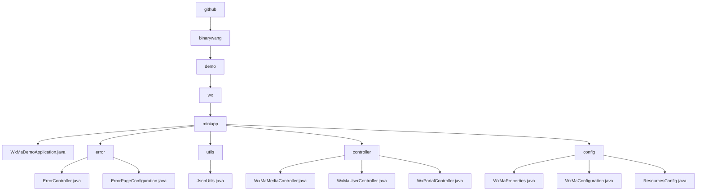

# Basic Information

|      |      |
|------|------|
| Name | github |
| Language | .java |
| Code Path | weixin-java-miniapp-demo/src/main/java/com/github |
| Package Name | docs.src.main.java.com.github |
| Brief Description | Spring Boot WeChat Mini Program Demo entry class, including error handling, JSON utilities, controllers, and configuration modules. Error handling covers 404/500 redirects, JSON utilities serialize objects, controllers manage media, users, and messages, while the configuration module handles account and routing settings. |

# Description

## Overview  
This module serves as the core system for the WeChat Mini Program backend, implemented using the Spring Boot framework. Its primary responsibilities include Mini Program account configuration management, WeChat message routing, user session maintenance, and unified error handling. The system adheres to RESTful API standards, exposing APIs for media management and user authentication via Controllers, and integrates JSON serialization tools. Key data structures encompass WeChat message bodies, user session information, and error status code mappings. External dependencies include Spring Web, WeChat SDK, AES encryption libraries, and Lombok. For example, multi-tenant configurations are managed via `WxMaProperties.Config`, while `ErrorController` renders unified error pages.  

## Key Business Scenarios  
The module supports four typical scenarios: 1) Multi-account configuration initialization (similar to a microservices configuration center), 2) Media file transfer (e.g., temporary material uploads), 3) User OAuth-style login (validating code to obtain openid), and 4) WeChat message processing (similar to event bus routing). Business processes follow a "validate-process-cleanup" pattern—for instance, user login requires appid validation and ThreadLocal data cleanup. Interaction methods include synchronous HTTP requests (e.g., GET for QR codes) and message callbacks (e.g., handling encrypted pushes). Typical use cases include bulk message configuration, phone number decryption, and 404 error fallback page display.

### Package Internal Structure View

This flowchart illustrates the Java code directory structure of a WeChat Mini Program Demo project, starting from the root directory 'github' and expanding level by level until reaching specific Java class files. It primarily includes the main 'miniapp' module and its subordinate submodules: 'error', 'utils', 'controller', and 'config'. Each submodule contains corresponding functional class files, such as controller classes, configuration classes, and utility classes, fully presenting the organizational architecture of the project code.

# File List

| Name   | Type  | Description |
|-------|------|-------------|
| [binarywang](binarywang/_module.md) | package | Spring Boot WeChat Mini Program Demo entry class, including error handling, JSON utilities, controllers, and configuration modules. Error handling covers 404/500 redirection, JSON utilities serialize objects, controllers manage media, users, and messages, and configuration modules handle account and routing settings. |

