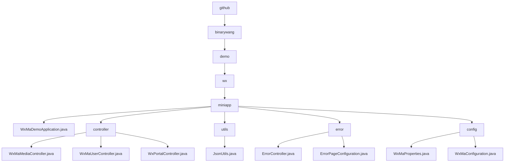

# Basic Information

|      |      |
|------|------|
| Name | github |
| Language | .java |
| Code Path | weixin-java-miniapp-demo/src/main/java/com/github |
| Package Name | docs.src.main.java.com.github |
| Brief Description | Spring Boot WeChat Mini Program Demo, including startup class, controllers, JSON utilities, error handling, and configuration modules. The controllers handle media, users, and messages, the utility class manages JSON serialization, the error module uniformly processes HTTP errors, and the configuration module manages multiple accounts and messaging services. |

# Description

## Overview  
This module is a Spring Boot implementation for WeChat Mini Program backend services, with core responsibilities including media file management, user session handling, WeChat message interaction, and unified error handling. It adheres to RESTful interface standards, supports JSON/XML data formats, and key data structures encompass Media_id lists, user session information (sessionKey/openid), and WeChat message bodies. External dependencies include WeChat server APIs, AES encryption libraries, the Spring Web framework, and Lombok. For example, the media controller handles file uploads, the user controller manages login authorization, and the configuration module initializes multi-account services.  

## Key Business Scenarios  
The module supports four typical types of interactions: media transfer (similar to FTP), identity authentication (similar to OAuth), message processing (similar to an event bus), and error fallback (similar to a route interceptor). Business processes follow the "validate-process-cleanup" pattern, such as user login first verifying the code before retrieving session information. Typical applications include uploading temporary materials, decrypting user phone numbers, and processing encrypted messages. All interfaces strictly validate appid to ensure multi-tenant isolation. Integration examples include subscription message推送 and 500 error page rendering.

### Package Internal Structure View

This flowchart illustrates the Java code structure of a WeChat Mini Program project, starting from the root directory 'github' and hierarchically expanding to the 'binarywang', 'demo', 'wx', and 'miniapp' levels. Under the 'miniapp' level, it includes the main application file 'WxMaDemoApplication.java' as well as four submodules: 'controller', 'utils', 'error', and 'config'. Each submodule contains specific functional class files, clearly presenting the modular organizational structure of the project.

# File List

| Name   | Type  | Description |
|-------|------|-------------|
| [binarywang](binarywang/_module.md) | package | Spring Boot WeChat Mini Program Demo, including startup class, controllers, JSON utilities, error handling, and configuration modules. The controllers handle media, users, and messages; the utility class manages JSON serialization; the error module uniformly processes HTTP errors; and the configuration module manages multi-account and message services. |

