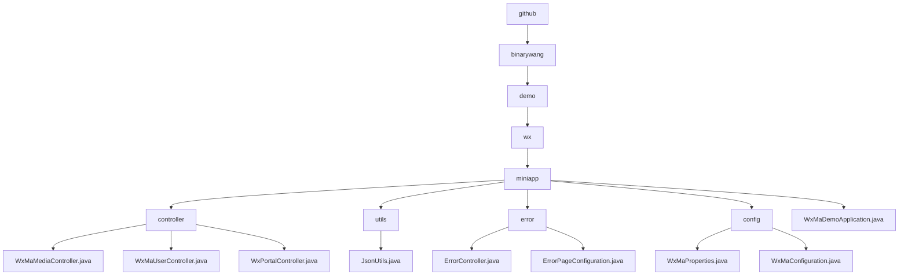

# Basic Information

|      |      |
|------|------|
| Name | github |
| Language | .java |
| Code Path | weixin-java-miniapp-demo/src/main/java/com/github |
| Package Name | docs.src.main.java.com.github |
| Brief Description | The WeChat Mini Program backend core modules include media management, user sessions, and WeChat interaction functionalities, utilizing ThreadLocal to ensure thread safety. The configuration center manages multiple accounts and message routing, while the error handling module uniformly processes status codes such as 404/500. It relies on the WeChat SDK and Spring framework, supporting a high-concurrency stateless design. |

# Description

## Overview  
This module is a collection of backend services for WeChat Mini Programs, comprising core controllers, configuration centers, and error handling systems. Its core responsibilities include media file management, user session maintenance, interaction with WeChat servers, and unified error routing, employing ThreadLocal to ensure thread safety in a manner similar to an event bus pattern. The unified interface specification covers POST/PGET request processing, AppID validation, JSON responses, and Spring MVC error routing. Key data structures include MediaID lists, user session information (SessionKey/OpenID), WeChat message bodies, and ErrorPage mappings. It relies on the WeChat JSSDK, AES encryption libraries, and the Spring Web framework, such as invoking WeChat APIs via JNI or dynamically loading multi-account configurations.

## Primary Business Scenarios  
The typical application pattern involves: users obtaining a SessionKey upon login to decrypt data, media files being transferred via MediaID, and erroneous requests automatically routed to preset pages. Business processes follow a "validate-process-cleanup" model, such as validating the AppID before calling WeChat APIs for file uploads and finally clearing thread configurations. Full functionality covers OAuth2.0 authorization, AES-ECB decryption, batch multi-file uploads, and message routing (e.g., QR code processing). The interaction design follows a RESTful style, including server-side rendered interfaces (error pages) and customer service message responses, ensuring thread safety and state management under high concurrency.

### Package Internal Structure View

This flowchart illustrates the core directory structure of the WeChat Mini Program Demo project, starting from the root directory 'github' and expanding hierarchically to 'binarywang', 'demo', 'wx', and 'miniapp' levels. Under 'miniapp', there are four subdirectories: 'controller', 'utils', 'error', 'config', along with the main application file. Each subdirectory contains specific functional class files. The clear structure demonstrates the project's modular design, with separated functionalities such as controllers, utility classes, error handling, and configuration management.

# File List

| Name   | Type  | Description |
|-------|------|-------------|
| [binarywang](binarywang/_module.md) | package | WeChat Mini Program backend core modules, including media management, user sessions, and WeChat interaction functionalities, utilizing ThreadLocal to ensure thread safety. The configuration center manages multiple accounts and message routing, while the error handling module uniformly processes status codes like 404/500. Dependent on WeChat SDK and Spring framework, supporting high-concurrency stateless design. |

