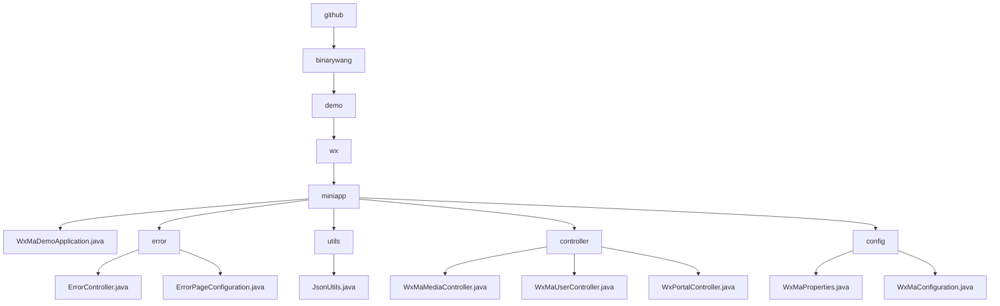

# Basic Information

|      |      |
|------|------|
| Name | github |
| Language | .java |
| Code Path | weixin-java-miniapp-demo/src/main/java/com/github |
| Package Name | docs.src.main.java.com.github |
| Brief Description | The Spring Boot WeChat Mini Program Demo includes a startup class, error handling, JSON utilities, controllers, and configuration modules. The startup class follows a standard structure, the error module handles 404/500 redirects, the utility class provides JSON serialization, controllers manage media and user messages, and the configuration module handles multi-account initialization. |

# Description

## Overview  
This module is a collection of backend services for WeChat Mini Programs, with core responsibilities including application startup configuration, error handling, business logic control, and multi-tenant management. Built using the Spring Boot framework, it follows the standard MVC pattern and exposes RESTful interfaces and WeChat callback interfaces through Controllers. Key data structures include error page mappings (ErrorPage), user session information (sessionKey/openid), and WeChat message objects. External dependencies include Spring Web, the WeChat Mini Program Java SDK, and JSON processing tools. For example, WxMaDemoApplication serves as the startup entry, JsonUtils handles serialization, and WxMaProperties manages multi-account configurations.  

## Key Business Scenarios  
The module implements a complete backend process for WeChat Mini Programs, resembling a SaaS service architecture. Primary business flows include: 1) Error interception chain handling status codes like 404/500; 2) Media management enabling temporary file uploads and downloads; 3) User services completing login authorization and sensitive data decryption; 4) Configuration center initializing multi-tenant instances. Typical interactions, such as user login → media operations → message processing, ensure thread safety via ThreadLocal. API integration examples can be seen in the error handling subsystem, multi-format message routing (XML/JSON), and unified exception capture for WeChat APIs.

### Package Internal Structure View

This flowchart illustrates the complete directory structure of the WeChat Mini Program Demo project, starting from the root directory 'github' and expanding hierarchically to the deepest-level files. The core module 'miniapp' consists of 5 sub-nodes: the main application file, error handling module, utility classes, controllers, and configuration modules. Each sub-module is further divided into specific implementation files. For example, the controllers include 3 functionally distinct Controllers, and the configuration module comprises 2 configuration classes, fully presenting the project's foundational architecture and functional division.

# File List

| Name   | Type  | Description |
|-------|------|-------------|
| [binarywang](binarywang/_module.md) | package | The Spring Boot WeChat Mini Program Demo includes a startup class, error handling, JSON utilities, controller, and configuration modules. The startup class follows a standard structure, the error module handles 404/500 redirects, the utility class provides JSON serialization, the controller manages media and user messages, and the configuration module handles multi-account initialization. |

