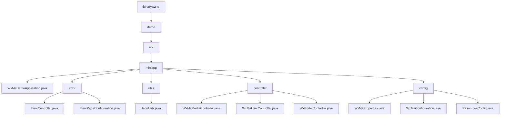

# Basic Information

|      |      |
|------|------|
| Name | binarywang |
| Language | .java |
| Code Path | weixin-java-miniapp-demo/src/main/java/com/github/binarywang |
| Package Name | docs.src.main.java.com.github.binarywang |
| Brief Description | Spring Boot WeChat Mini Program Demo entry class, including error handling, JSON utilities, controllers, and configuration modules. Error handling covers 404/500 redirection, JSON utilities serialize objects, controllers manage media, users, and messages, and configuration modules handle account and routing settings. |

# Description

## Overview  
This module serves as the core system for the WeChat Mini Program backend, implemented using the Spring Boot framework. Its primary responsibilities include Mini Program account configuration management, WeChat message routing, user session maintenance, and unified error handling. The system adheres to RESTful API specifications, exposing APIs for media management and user authentication through Controllers, and integrates JSON serialization tools. Key data structures encompass WeChat message bodies, user session information, and error status code mappings. External dependencies include Spring Web, WeChat SDK, AES encryption libraries, and Lombok. For example, multi-tenant configurations are managed via `WxMaProperties.Config`, while `ErrorController` renders unified error pages.  

## Key Business Scenarios  
The module supports four typical scenarios: 1) Multi-account configuration initialization (similar to a microservices configuration center), 2) Media file transmission (e.g., temporary material uploads), 3) User OAuth-style login (validating code to obtain openid), and 4) WeChat message processing (resembling an event bus routing mechanism). Business processes follow a "validate-process-cleanup" pattern—for instance, user login requires appid verification and ThreadLocal data cleanup. Interaction methods include synchronous HTTP requests (e.g., GET for QR codes) and message callbacks (e.g., handling encrypted pushes). Typical use cases include bulk message configuration, phone number decryption, and 404 error fallback page display.

### Package Internal Structure View

This flowchart illustrates the core code structure of the WeChat Mini Program Demo project, starting from the root directory `binarywang` and hierarchically expanding to `demo`, `wx`, and `miniapp` levels. The `miniapp` module, as the main component, includes the startup class `WxMaDemoApplication.java` and branches into four submodules: `error` (error handling), `utils` (utility classes), `controller` (controllers), and `config` (configuration). Each submodule contains corresponding functional class files. For example, the error handling module includes the error controller and page configuration, while the configuration module encompasses property settings and resource configurations. The overall structure clearly reflects the layered architecture of a typical Spring Boot application.

# File List

| Name   | Type  | Description |
|-------|------|-------------|
| [demo](demo/_module.md) | package | Spring Boot WeChat Mini Program Demo entry class, including error handling, JSON utilities, controllers, and configuration modules. Error handling covers 404/500 redirects, JSON utilities serialize objects, controllers manage media, users, and messages, while configuration modules handle account and routing settings. |

