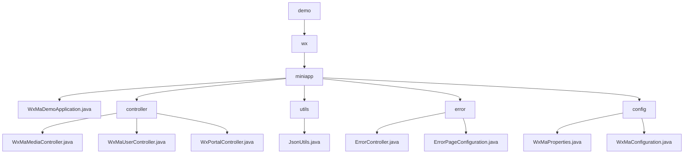

# Basic Information

|      |      |
|------|------|
| Name | demo |
| Language | .java |
| Code Path | weixin-java-miniapp-demo/src/main/java/com/github/binarywang/demo |
| Package Name | docs.src.main.java.com.github.binarywang.demo |
| Brief Description | Spring Boot WeChat Mini Program Demo, including startup class, controllers, JSON utilities, error handling, and configuration modules. Controllers handle media, users, and messages; utility classes manage JSON serialization; error module uniformly processes HTTP errors; configuration module manages multi-account and messaging services. |

# Description

## Overview  
This module is a Spring Boot implementation for the backend service of WeChat Mini Programs. Its core responsibilities include media file management, user session handling, WeChat message interaction, and unified error handling. It adheres to RESTful interface standards and supports JSON/XML data formats. Key data structures encompass Media_id lists, user session information (sessionKey/openid), and WeChat message bodies. External dependencies include the WeChat server API, AES encryption library, Spring Web framework, and Lombok. For example, the media controller handles file uploads, the user controller manages login authorization, and the configuration module initializes multi-account services.  

## Key Business Scenarios  
The module supports four typical types of interactions: media transfer (similar to FTP), identity authentication (similar to OAuth), message processing (similar to an event bus), and error fallback (similar to a route interceptor). Business processes follow the "validate-process-cleanup" pattern, such as user login, which first verifies the code before retrieving session information. Typical applications include uploading temporary materials, decrypting user phone numbers, and processing encrypted messages. All interfaces strictly validate appid to ensure multi-tenant isolation. Integration examples include subscription message推送 and 500 error page rendering.

### Package Internal Structure View

This flowchart illustrates the core structure of a WeChat Mini Program Demo project, starting from the root directory 'demo' and hierarchically expanding to the 'wx' and 'miniapp' layers. The 'miniapp' includes the main application class, controllers, utility classes, error handling, and configuration modules. Under the controllers, there are three specific implementation classes, while the error handling and configuration modules each contain two components. The overall structure clearly reflects the layered design of a typical Spring Boot application.

# File List

| Name   | Type  | Description |
|-------|------|-------------|
| [wx](wx/_module.md) | package | Spring Boot WeChat Mini Program Demo, including startup class, controllers, JSON utilities, error handling, and configuration modules. Controllers handle media, users, and messages; utility classes manage JSON serialization; the error module uniformly processes HTTP errors; the configuration module manages multi-account and message services. |

