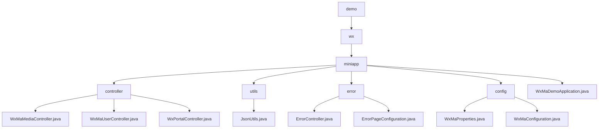

# Basic Information

|      |      |
|------|------|
| Name | demo |
| Language | .java |
| Code Path | weixin-java-miniapp-demo/src/main/java/com/github/binarywang/demo |
| Package Name | docs.src.main.java.com.github.binarywang.demo |
| Brief Description | The core backend module of the WeChat Mini Program includes media management, user sessions, and WeChat interaction functionalities, relying on the WeChat SDK and Lombok. It supports file uploads, identity authentication, and message routing, with processes covering validation, processing, and cleanup. The error handling module uniformly manages 404/500 responses. The configuration module manages Mini Program properties and initializes message services. The Spring Boot application entry class launches the entire demo. |

# Description

## Overview  
This module is an integrated solution for WeChat Mini Program backend services, with core responsibilities including media file management, user session management, interaction with WeChat servers, and unified error handling. The interface specifications require validating AppID effectiveness, adhering to Spring MVC standards, and injecting configurations via the `wx.miniapp` prefix. Key data structures encompass media_id, user session objects, WeChat message encapsulation, and the WxMaProperties.Config configuration class. External dependencies include the WeChat SDK, Spring Framework, and Lombok utility library. For example, the media controller handles multi-file uploads, the error controller returns unified views, and the configuration class implements multi-account management.  

## Primary Business Scenarios  
The module supports four types of typical interactions: media file transfer (similar to cloud storage interfaces), user authentication (similar to OAuth2.0), WeChat message routing (similar to event bus patterns), and HTTP error handling (similar to web server error pages). The complete business process consists of three phases: credential verification → business processing → resource cleanup, such as redirecting to an error page during user login verification code validation or exceptions. Integration use cases cover file uploads, session decryption, message responses, and error prompts, such as POST interfaces processing encrypted messages or GET returning 404 views. All interactions are implemented through standard Spring MVC controllers.

### Package Internal Structure View

This flowchart illustrates the core structure of the WeChat Mini Program Demo project, starting from the root directory `demo` and hierarchically expanding to the `wx` and `miniapp` directories. The `miniapp` directory contains submodules such as controllers, utility classes, error handling, and configuration, each of which includes specific implementation class files. The entire structure clearly reflects the organization of the backend code for a WeChat Mini Program. Controllers handle different business requests, utility classes provide auxiliary functions, the error handling module manages exceptions, and the configuration module is responsible for parameter settings.

# File List

| Name   | Type  | Description |
|-------|------|-------------|
| [wx](wx/_module.md) | package | The WeChat Mini Program backend core module includes media management, user sessions, and WeChat interaction functionalities, relying on the WeChat SDK and Lombok. It supports file uploads, identity authentication, and message routing, with processes covering validation, processing, and cleanup. The error handling module uniformly manages 404/500 responses. The configuration module handles Mini Program properties and message service initialization. The Spring Boot application entry class launches the entire demo. |

