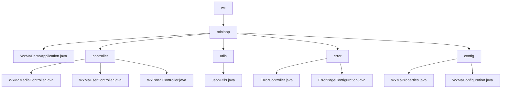

# Basic Information

|      |      |
|------|------|
| Name | wx |
| Language | .java |
| Code Path | weixin-java-miniapp-demo/src/main/java/com/github/binarywang/demo/wx |
| Package Name | docs.src.main.java.com.github.binarywang.demo.wx |
| Brief Description | Spring Boot WeChat Mini Program Demo, including startup class, controllers, JSON utilities, error handling, and configuration modules. Controllers handle media, users, and messages; utility classes manage JSON serialization; the error module uniformly processes HTTP errors; the configuration module manages multi-account and message services. |

# Description

## Overview  
This module is a Spring Boot implementation for WeChat Mini Program backend services, with core responsibilities including media file management, user session handling, WeChat message interaction, and unified error handling. It adheres to RESTful interface standards, supports JSON/XML data formats, and key data structures encompass Media_id lists, user session information (sessionKey/openid), and WeChat message bodies. External dependencies include WeChat server APIs, AES encryption libraries, the Spring Web framework, and Lombok. For example, the media controller handles file uploads, the user controller manages login authorization, and the configuration module initializes multi-account services.  

## Key Business Scenarios  
The module supports four types of typical interactions: media transfer (similar to FTP), identity authentication (similar to OAuth), message processing (similar to an event bus), and error fallback (similar to a route interceptor). Business processes follow the "validate-process-cleanup" pattern, such as user login first verifying the code before retrieving session information. Typical applications include uploading temporary materials, decrypting user phone numbers, and processing encrypted messages. All interfaces strictly validate appid to ensure multi-tenant isolation. Integration examples can be seen in subscription message推送 and 500 error page rendering.

### Package Internal Structure View

This flowchart illustrates the directory structure of a WeChat Mini Program demo project. The root node is "wx", containing the main directory "miniapp", which is further divided into four submodules: controller, utilities (utils), error handling (error), and configuration (config). Each submodule contains corresponding functional class files. For example, the controller includes three Controller classes with different functionalities, while the config module includes Properties and Configuration classes. The overall structure is clear and adheres to the layered architecture typical of a Spring Boot application.

# File List

| Name   | Type  | Description |
|-------|------|-------------|
| [miniapp](miniapp/_module.md) | package | Spring Boot WeChat Mini Program Demo, including startup class, controllers, JSON utilities, error handling, and configuration modules. The controllers handle media, users, and messages, the utility class manages JSON serialization, the error module uniformly processes HTTP errors, and the configuration module manages multi-account and messaging services. |

