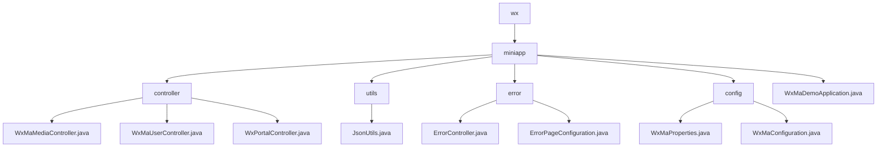

# Basic Information

|      |      |
|------|------|
| Name | wx |
| Language | .java |
| Code Path | weixin-java-miniapp-demo/src/main/java/com/github/binarywang/demo/wx |
| Package Name | docs.src.main.java.com.github.binarywang.demo.wx |
| Brief Description | WeChat Mini Program backend core modules, including media management, user information processing, and message routing functionality, comply with WeChat standards and rely on WeChat JSSDK and Spring Boot. The error handling module uniformly manages HTTP error status codes and custom error pages. The multi-account configuration module dynamically manages Mini Program accounts and message routing. The application entry class is based on Spring Boot startup. |

# Description

## Overview  
This module serves as the core backend system for WeChat Mini Programs, integrating four major functionalities: media management, user authentication, message routing, and error handling. Built on the Spring Boot framework, it adheres to the WeChat Open Platform specifications. Key structures include Media_id lists, user session information, and message handler mappings. It relies on WeChat JSSDK, Lombok, and Spring Web components. For example, uploading media returns a media_id, user login exchanges a code for an openid, and error handling supports custom 404 pages. The JSON serialization tool employs a configurable ObjectMapper for efficient conversion.  

## Key Business Scenarios  
The system manages the entire lifecycle of Mini Programs: media files operate similarly to CDN, user authentication follows the OAuth2.0 flow, message routing adopts an event bus pattern, and error handling mimics frontend routing interception. Typical workflows include three phases: request validation → business processing → resource cleanup. For instance, decrypting an encrypted phone number requires session key verification. Integration cases cover five types of message processing, with exceptions handled through logging and fallback mechanisms. The startup class initializes multi-account configuration services via @SpringBootApplication.

### Package Internal Structure View

This flowchart illustrates the core code structure of a WeChat Mini Program Demo project, with `miniapp` as the root node branching into four submodules (`controller`, `utils`, `error`, `config`) and the main application file. Each module contains specific functional classes, such as controllers handling media/user/portal requests, utility classes providing JSON processing, the error module managing exception pages, and the configuration module storing Mini Program parameters. The clear structure reflects the layered design of a typical Spring Boot application.

# File List

| Name   | Type  | Description |
|-------|------|-------------|
| [miniapp](miniapp/_module.md) | package | The core backend module of the WeChat Mini Program includes media management, user information processing, and message routing functions, adhering to WeChat standards and relying on the WeChat JSSDK and Spring Boot. The error handling module uniformly manages HTTP error status codes and custom error pages. The multi-account configuration module dynamically manages Mini Program accounts and message routing. The application entry class is based on Spring Boot startup. |

