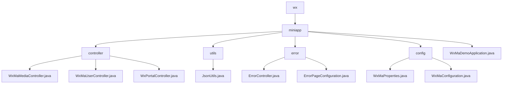

# Basic Information

|      |      |
|------|------|
| Name | wx |
| Language | .java |
| Code Path | weixin-java-miniapp-demo/src/main/java/com/github/binarywang/demo/wx |
| Package Name | docs.src.main.java.com.github.binarywang.demo.wx |
| Brief Description | WeChat Mini Program backend core modules, including media management, user sessions, and WeChat interaction functionalities, utilize ThreadLocal to ensure thread safety. The configuration center manages multi-account and message routing, while the error handling module uniformly processes status codes like 404/500. It relies on the WeChat SDK and Spring framework, supporting a high-concurrency stateless design. |

# Description

## Overview  
This module is a collection of backend services for WeChat Mini Programs, comprising core controllers, configuration centers, and error handling systems. Its primary responsibilities include media file management, user session maintenance, interaction with WeChat servers, and unified error routing, utilizing ThreadLocal to ensure thread safety in a pattern similar to an event bus. The unified interface specification covers POST/PGET request handling, AppID validation, JSON responses, and Spring MVC error routing. Key data structures include MediaID lists, user session information (SessionKey/OpenID), WeChat message bodies, and ErrorPage mappings. It relies on the WeChat JSSDK, AES encryption libraries, and the Spring Web framework, such as invoking WeChat APIs via JNI or dynamically loading multi-account configurations.

## Core Business Scenarios  
The typical application pattern involves: users obtaining a SessionKey upon login to decrypt data, media files being transferred via MediaID, and error requests automatically routed to preset pages. Business processes follow a "validate-process-cleanup" pattern, such as validating the AppID before calling WeChat APIs for file uploads and finally clearing thread configurations. Full functionality includes OAuth2.0 authorization, AES-ECB decryption, batch multi-file uploads, and message routing (e.g., QR code processing). The interaction design follows a RESTful style, incorporating server-side rendering interfaces (error pages) and customer service message responses, ensuring thread safety and state management under high concurrency.

### Package Internal Structure View

This flowchart illustrates the directory structure of a WeChat Mini Program Demo project. The root node is wx, containing the miniapp subdirectory, which branches into four subdirectories (controller, utils, error, config) and the main application file. Each subdirectory contains corresponding functional class files, such as controller classes, utility classes, error handling classes, and configuration classes, forming a clear modular structure.

# File List

| Name   | Type  | Description |
|-------|------|-------------|
| [miniapp](miniapp/_module.md) | package | WeChat Mini Program backend core modules, including media management, user sessions, and WeChat interaction functionalities, utilize ThreadLocal to ensure thread safety. The configuration center manages multiple accounts and message routing, while the error handling module uniformly processes status codes such as 404/500. It relies on the WeChat SDK and Spring framework, supporting a high-concurrency stateless design. |

