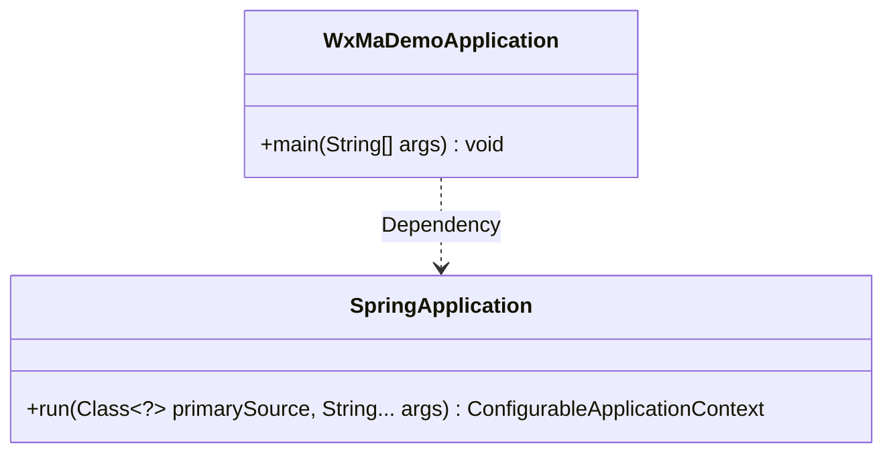
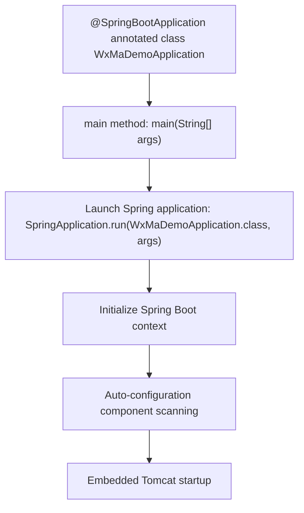

# Basic Information

|      |      |
|------|------|
| Name | WxMaDemoApplication |
| Language | .java |
| Code Path | weixin-java-miniapp-demo/src/main/java/com/github/binarywang/demo/wx/miniapp/WxMaDemoApplication.java |
| Package Name | com.github.binarywang.demo.wx.miniapp |
| Dependencies | ['org.springframework.boot.SpringApplication', 'org.springframework.boot.autoconfigure.SpringBootApplication'] |
| Brief Description | SpringBoot application startup class, containing the main method to run the Spring application. |

# Description

This is an entry class for a WeChat Mini Program Demo application based on the Spring Boot framework. The class is annotated with `@SpringBootApplication`, indicating it is the main configuration class for a Spring Boot application. The `main` method serves as the program entry point, launching the entire application via the `SpringApplication.run` method and passing the current class as the primary configuration class. This structure represents the standard startup approach for a typical Spring Boot application.

# Class Summary

| Name   | Type  | Description |
|-------|------|-------------|
| WxMaDemoApplication | class | SpringBoot application startup class, containing the main method to run the Spring application. |

## Class WxMaDemoApplication

|      |      |
|------|------|
| Access Modifier | @SpringBootApplication;public |
| Type | class |
| Name | WxMaDemoApplication |
| Description | SpringBoot application startup class, containing the main method to run the Spring application. |

### UML Class Diagram

This code demonstrates a simple Spring Boot application launcher class `WxMaDemoApplication`, which invokes `SpringApplication.run()` via its `main` method to bootstrap the application. The class diagram includes two classes: `WxMaDemoApplication` and `SpringApplication`, where the former relies on the latter's `run` method to complete application startup. This represents a typical Spring Boot entry-point class structure, adhering to Spring Boot's convention-over-configuration principle.

### Internal Method Call Graph

This flowchart illustrates the startup process of a WeChat Mini Program Demo application based on Spring Boot. Starting from the main class annotated with @SpringBootApplication, it demonstrates the key steps of invoking SpringApplication.run via the main method, followed by Spring context initialization, auto-configuration loading, and embedded server startup. The entire process embodies Spring Boot's convention-over-configuration philosophy, where only a single annotation and startup call are required to prepare the application for deployment.

### Field List

| Name  | Type  | Description |
|-------|-------|------|

### Method List

| Name  | Type  | Description |
|-------|-------|------|
| main | void | Start a Spring Boot application by running the main method in the WxMaDemoApplication class. |

