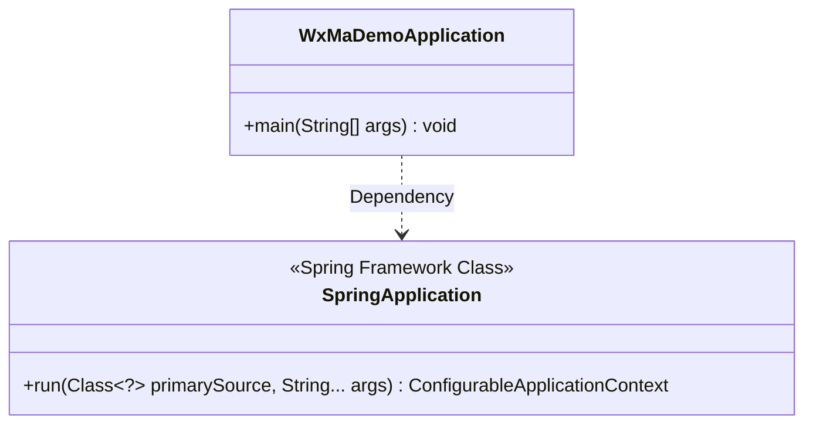
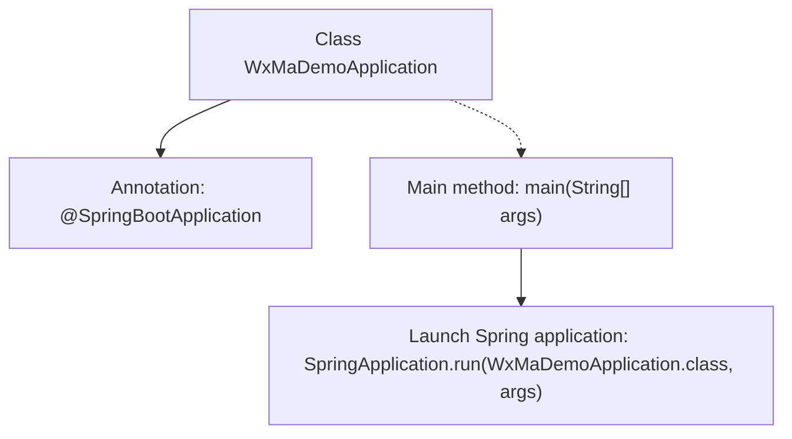

# Basic Information

|      |      |
|------|------|
| Name | WxMaDemoApplication |
| Language | .java |
| Code Path | weixin-java-miniapp-demo/src/main/java/com/github/binarywang/demo/wx/miniapp/WxMaDemoApplication.java |
| Package Name | com.github.binarywang.demo.wx.miniapp |
| Dependencies | ['org.springframework.boot.SpringApplication', 'org.springframework.boot.autoconfigure.SpringBootApplication'] |
| Brief Description | SpringBoot application startup class, containing the main method to run the Spring application. |

# Description

This is a WeChat Mini Program Demo application startup class based on the Spring Boot framework. The class is named WxMaDemoApplication and marked with the @SpringBootApplication annotation, indicating it serves as the main configuration class for a Spring Boot application. This annotation combines the functionality of three core annotations: @Configuration, @EnableAutoConfiguration, and @ComponentScan. The main method acts as the program entry point, launching the Spring Boot application via SpringApplication.run by passing the current class object and command-line arguments (args). This class structure follows the standard Spring Boot application startup template.

# Class Summary

| Name   | Type  | Description |
|-------|------|-------------|
| WxMaDemoApplication | class | This is the main class of a Spring Boot application, marked with the @SpringBootApplication annotation, which starts the application via the main method. |

## Class WxMaDemoApplication

|      |      |
|------|------|
| Access Modifier | @SpringBootApplication;public |
| Type | class |
| Name | WxMaDemoApplication |
| Description | This is the main class of a Spring Boot application, marked with the @SpringBootApplication annotation, which starts the application via the main method. |

### UML Class Diagram

This class diagram illustrates a WeChat Mini Program Demo application startup class WxMaDemoApplication based on Spring Boot. It depends on the run method of the SpringApplication class through its main method to launch the entire Spring Boot application. The diagram clearly marks SpringApplication's role as the core startup class of the Spring Framework, along with the simple structure of WxMaDemoApplication as a user-defined startup class, demonstrating the standard bootstrapping pattern of a Spring Boot application.

### Internal Method Call Graph

This code represents a typical Spring Boot application starter class, where the main configuration class is marked with the @SpringBootApplication annotation. The main method invokes SpringApplication.run() to start the embedded web server and load the application context. The flowchart illustrates the dependency relationship between the class and its annotation, as well as how the main method serves as the entry point to trigger the core Spring application startup process, demonstrating Spring Boot's convention-over-configuration principle.

### Field List

| Name  | Type  | Description |
|-------|-------|------|

### Method List

| Name  | Type  | Description |
|-------|-------|------|
| main | void | Launching a Spring Boot application via the Java main method, with the parameters being the WxMaDemoApplication class and command-line arguments. |

