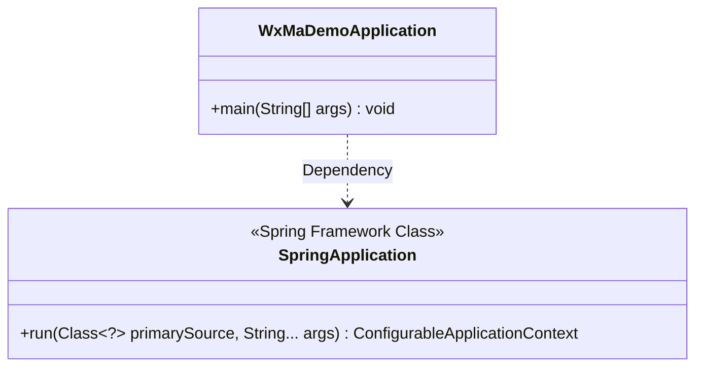
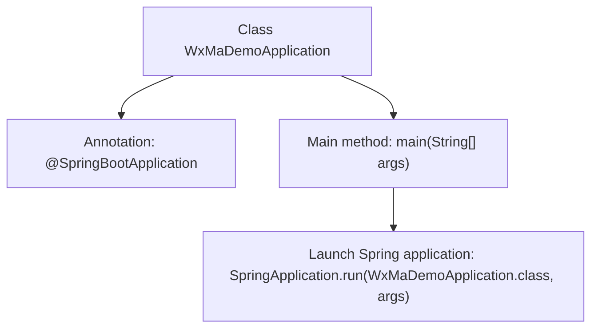

# Basic Information

|      |      |
|------|------|
| Name | WxMaDemoApplication |
| Language | .java |
| Code Path | weixin-java-miniapp-demo/src/main/java/com/github/binarywang/demo/wx/miniapp/WxMaDemoApplication.java |
| Package Name | com.github.binarywang.demo.wx.miniapp |
| Dependencies | ['org.springframework.boot.SpringApplication', 'org.springframework.boot.autoconfigure.SpringBootApplication'] |
| Brief Description | This is a Spring Boot application startup class containing the main method to run the WeChat Mini Program example. |

# Description

This is the entry class of a WeChat Mini Program Demo application based on the Spring Boot framework. The class is annotated with `@SpringBootApplication`, indicating that it is the main configuration class of a Spring Boot application, which will automatically enable auto-configuration and component scanning. The `main` method serves as the program entry point, launching the entire Spring Boot application via the `SpringApplication.run` method, with the current class object and command-line arguments passed in. The structure of this class follows the standard startup pattern of a Spring Boot application.

# Class Summary

| Name   | Type  | Description |
|-------|------|-------------|
| WxMaDemoApplication | class | This is the main class of a Spring Boot application, marked with the @SpringBootApplication annotation, which starts the application via the main method. |

## Class WxMaDemoApplication

|      |      |
|------|------|
| Access Modifier | @SpringBootApplication;public |
| Type | class |
| Name | WxMaDemoApplication |
| Description | This is the main class of a Spring Boot application, marked with the @SpringBootApplication annotation, which starts the application via the main method. |

### UML Class Diagram

This code demonstrates a standard Spring Boot application startup class structure. The WxMaDemoApplication class is marked as the Spring Boot application entry point via the @SpringBootApplication annotation, and its main method launches the entire application through SpringApplication.run(). The class diagram clearly shows the dependency relationship between WxMaDemoApplication and the SpringApplication class, as well as the run method provided by SpringApplication as a core framework class. This method accepts the primary configuration class and command-line arguments, returning an application context object. This structure reflects Spring Boot's design philosophy of convention over configuration.

### Internal Method Call Graph

This flowchart illustrates the startup process of a WeChat Mini Program Demo application based on Spring Boot. The class WxMaDemoApplication is marked as the Spring Boot application entry point by the @SpringBootApplication annotation. The main method invokes SpringApplication.run() to start the embedded server and load application configurations. The arrows clearly depict the complete call chain from class definition to application launch.

### Field List

| Name  | Type  | Description |
|-------|-------|------|

### Method List

| Name  | Type  | Description |
|-------|-------|------|
| main | void | This is a startup method for a Java Spring Boot application, which runs the main class WxMaDemoApplication via SpringApplication. |

