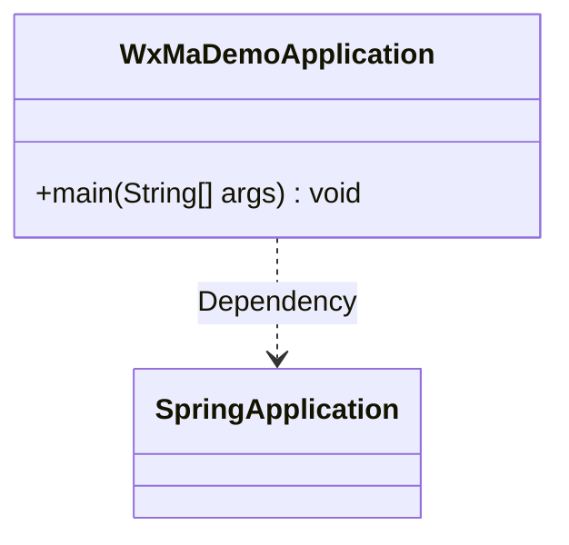
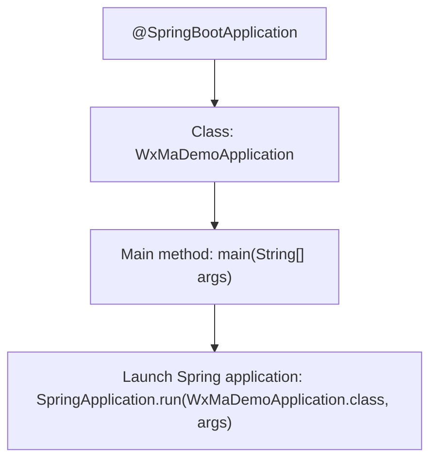

# Basic Information

|      |      |
|------|------|
| Name | WxMaDemoApplication |
| Language | .java |
| Code Path | weixin-java-miniapp-demo/src/main/java/com/github/binarywang/demo/wx/miniapp/WxMaDemoApplication.java |
| Package Name | com.github.binarywang.demo.wx.miniapp |
| Dependencies | ['org.springframework.boot.SpringApplication', 'org.springframework.boot.autoconfigure.SpringBootApplication'] |
| Brief Description | This is the main class of a Spring Boot application, marked with the @SpringBootApplication annotation, which starts the application via the main method. |

# Description

This is the entry class for a WeChat Mini Program application based on the Spring Boot framework. The class is named WxMaDemoApplication and is marked with the @SpringBootApplication annotation, indicating that it is the main configuration class for a Spring Boot application. The class contains a standard main method, which starts the entire Spring Boot application by calling the SpringApplication.run method, passing the current class name and command-line arguments as parameters. This class serves as the application's launch entry point, responsible for initializing the Spring container and auto-configuring related components.

# Class Summary

| Name   | Type  | Description |
|-------|------|-------------|
| WxMaDemoApplication | class | This is the main class of a Spring Boot application, marked with the @SpringBootApplication annotation, which starts the application via the main method. |

## Class WxMaDemoApplication

|      |      |
|------|------|
| Access Modifier | @SpringBootApplication;public |
| Type | class |
| Name | WxMaDemoApplication |
| Description | This is the main class of a Spring Boot application, marked with the @SpringBootApplication annotation, which starts the application via the main method. |

### UML Class Diagram

Class Diagram Description:  
This diagram illustrates a simple Spring Boot application entry class WxMaDemoApplication, which contains the main method as the program entry point. The class invokes the SpringApplication.run() method through a dependency relationship to launch the application. The diagram clearly demonstrates the core structure of a Spring Boot application's startup process, specifically the invocation relationship between the main class and the SpringApplication framework class.

### Internal Method Call Graph

This flowchart illustrates the startup process of a WeChat Mini Program Demo application based on Spring Boot. The `@SpringBootApplication` annotation marks the main configuration class, while the `main` method serves as the entry point to invoke `SpringApplication.run` for launching the embedded container and loading the application context. The entire process embodies Spring Boot's convention-over-configuration philosophy, where most initialization tasks are automatically handled through annotations.

### Field List

| Name  | Type  | Description |
|-------|-------|------|

### Method List

| Name  | Type  | Description |
|-------|-------|------|
| main | void | The main method in Java, using SpringApplication to launch the WxMaDemoApplication class. |

