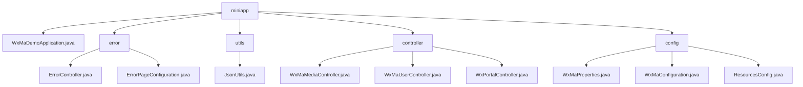

# Basic Information

|      |      |
|------|------|
| Name | miniapp |
| Language | .java |
| Code Path | weixin-java-miniapp-demo/src/main/java/com/github/binarywang/demo/wx/miniapp |
| Package Name | docs.src.main.java.com.github.binarywang.demo.wx.miniapp |
| Brief Description | Spring Boot WeChat Mini Program Demo entry class, including error handling, JSON utilities, controllers, and configuration modules. Error handling covers 404/500 redirection, JSON utilities serialize objects, controllers manage media, users, and messages, while configuration modules handle account and routing settings. |

# Description

## Overview  
This module serves as the core system for the backend services of WeChat Mini Programs, implemented using the Spring Boot framework. Its primary responsibilities include Mini Program account configuration management, WeChat message routing, user session maintenance, and unified error handling. The system adheres to RESTful API standards, exposing APIs for media management and user authentication through Controllers, and integrates JSON serialization tools. Key data structures encompass WeChat message bodies, user session information, and error status code mappings. External dependencies include Spring Web, WeChat SDK, AES encryption libraries, and Lombok. For example, multi-tenant configurations are managed via `WxMaProperties.Config`, while `ErrorController` renders unified error pages.  

## Key Business Scenarios  
The module supports four typical scenarios: 1) Multi-account configuration initialization (similar to a microservice configuration center), 2) Media file transmission (e.g., temporary material uploads), 3) User OAuth-style login (validating code to obtain openid), and 4) WeChat message processing (similar to event bus routing). Business processes follow a "validate-process-cleanup" pattern—for instance, user login requires appid verification and ThreadLocal data cleanup. Interaction methods include synchronous HTTP requests (e.g., GET for QR codes) and message callbacks (e.g., handling encrypted pushes). Typical use cases include bulk message configuration, phone number decryption, and 404 error fallback page display.

### Package Internal Structure View

This flowchart illustrates the core structure of a WeChat Mini Program Demo project, comprising the main application class, error handling module, utility classes, controllers, and configuration modules. The top-level node is the miniapp directory, which branches into 5 submodules. The error module contains 2 error handling classes, the utils module includes 1 utility class, the controller module consists of 3 controller classes, and the config module encompasses 3 configuration classes, presenting a clear hierarchical relationship overall.

# File List

| Name   | Type  | Description |
|-------|------|-------------|
| [WxMaDemoApplication.java](WxMaDemoApplication.md) | file | SpringBoot application startup class, containing the main method to run the Spring application. |
| [error](error/_module.md) | package | The Spring MVC controller handles 404/500 errors and returns the error view. The configuration class registers error pages, with 404 redirecting to /error/404 and 500 redirecting to /error/500. |
| [utils](utils/_module.md) | package | The JsonUtils utility class uses ObjectMapper to convert objects into JSON strings, automatically ignoring null values and formatting the output, returning null in case of exceptions. |
| [controller](controller/_module.md) | package | WeChat Mini Program Controller Classes: The Media Controller handles file uploads and downloads, the User Controller manages login/information/phone number functionalities, and the Portal Controller is responsible for authentication and message processing. All interfaces validate the appid and ensure thread safety. |
| [config](config/_module.md) | package | WeChat Mini Program Java Configuration Classes: WxMaProperties defines core configuration items for mini programs; WxMaConfiguration initializes multi-account services and message routing; ResourcesConfig configures local file storage and cross-origin access. |

