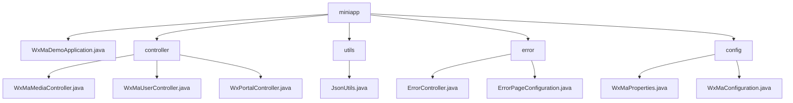

# Basic Information

|      |      |
|------|------|
| Name | miniapp |
| Language | .java |
| Code Path | weixin-java-miniapp-demo/src/main/java/com/github/binarywang/demo/wx/miniapp |
| Package Name | docs.src.main.java.com.github.binarywang.demo.wx.miniapp |
| Brief Description | WeChat Mini Program backend core modules, including media management, user sessions, and WeChat interaction functionalities, utilize ThreadLocal to ensure thread safety. The configuration center manages multiple accounts and message routing, while the error handling module uniformly processes status codes such as 404/500. It relies on the WeChat SDK and Spring framework, supporting a high-concurrency stateless design. |

# Description

## Overview  
This module is a collection of backend services for WeChat Mini Programs, comprising core controllers, configuration centers, and error handling systems. Its core responsibilities include media file management, user session maintenance, interaction with WeChat servers, and unified error routing, employing ThreadLocal to ensure thread safety in a pattern similar to an event bus. The unified interface specification covers POST/PGET request processing, AppID validation, JSON responses, and Spring MVC error routing. Key data structures include MediaID lists, user session information (SessionKey/OpenID), WeChat message bodies, and ErrorPage mappings. It relies on the WeChat JSSDK, AES encryption libraries, and the Spring Web framework, such as invoking WeChat APIs via JNI or dynamically loading multi-account configurations.  

## Primary Business Scenarios  
The typical application pattern involves: users obtaining SessionKey upon login to decrypt data, media files being transferred via MediaID, and error requests automatically routed to preset pages. Business processes follow a "validate-process-cleanup" pattern—for example, validating AppID before calling WeChat APIs for file uploads and finally clearing thread configurations. Full functionality covers OAuth2.0 authorization, AES-ECB decryption, batch multi-file uploads, and message routing (e.g., QR code processing). The interaction design follows a RESTful style, including server-side rendering interfaces (error pages) and customer service message responses, ensuring thread safety and state management under high concurrency.

### Package Internal Structure View

This flowchart illustrates the core structure of a WeChat Mini Program Demo project. The root node "miniapp" contains five submodules: the main application class, controller package, utility package, error handling package, and configuration package. The controller package includes three controller classes with distinct functionalities, while the error handling and configuration packages each contain two related classes. The utility package consists of a single JSON utility class. The overall structure clearly reflects the layered architecture typical of a Spring Boot application.

# File List

| Name   | Type  | Description |
|-------|------|-------------|
| [WxMaDemoApplication.java](WxMaDemoApplication.md) | file | SpringBoot application startup class, containing the main method to run the Spring application. |
| [config](config/_module.md) | package | The WxMaProperties class configures WeChat Mini Program attributes, including fields such as appid and secret. The WxMaConfiguration class initializes Mini Program services, sets message routing rules, and processes messages like text and images. |
| [error](error/_module.md) | package | The Spring MVC controller ErrorController handles the /error path, including 404 and 500 error handling methods that return the error view. The ErrorPageConfiguration class configures the redirection paths for 404 and 500 error pages. |
| [utils](utils/_module.md) | package | The JsonUtils utility class, configured with ObjectMapper to serialize non-NULL fields and format output, provides the toJson method to convert objects into JSON strings, returning null in case of exceptions. |
| [controller](controller/_module.md) | package | The three controller classes in the WeChat Mini Program: The Media Management class handles file uploads and downloads; the User Management class provides interfaces for login, user information, and phone numbers; the Background class handles WeChat authentication and message push. All classes clean up ThreadLocal configurations, log activities, and handle exceptions. |

