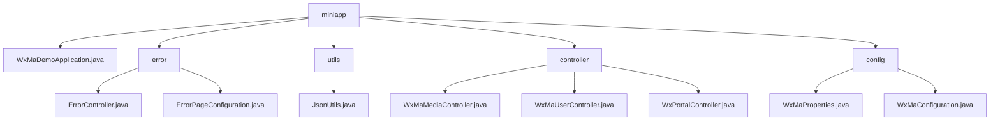

# Basic Information

|      |      |
|------|------|
| Name | miniapp |
| Language | .java |
| Code Path | weixin-java-miniapp-demo/src/main/java/com/github/binarywang/demo/wx/miniapp |
| Package Name | docs.src.main.java.com.github.binarywang.demo.wx.miniapp |
| Brief Description | The Spring Boot WeChat Mini Program Demo includes a startup class, error handling, JSON utilities, controllers, and configuration modules. The startup class follows a standard structure, the error module handles 404/500 redirects, the utility class provides JSON serialization, the controllers manage media and user messages, and the configuration module handles multi-account initialization. |

# Description

## Overview  
This module is a collection of backend services for WeChat Mini Programs, with core responsibilities including application startup configuration, error handling, business logic control, and multi-tenant management. Built using the Spring Boot framework, it follows the standard MVC pattern and exposes RESTful interfaces and WeChat callback interfaces through Controllers. Key data structures cover error page mappings (ErrorPage), user session information (sessionKey/openid), and WeChat message objects. External dependencies include Spring Web, the WeChat Mini Program Java SDK, and JSON processing tools. For example, WxMaDemoApplication serves as the startup entry, JsonUtils handles serialization, and WxMaProperties manages multi-account configurations.  

## Main Business Scenarios  
The module implements a complete backend workflow for WeChat Mini Programs, resembling a SaaS service architecture. Primary business flows include: 1) Error interception chain handling status codes like 404/500; 2) Media management enabling temporary file uploads and downloads; 3) User services completing login authorization and sensitive data decryption; 4) Configuration center initializing multi-tenant instances. Typical interactions, such as user login → media operations → message processing, ensure thread safety via ThreadLocal. API integration examples can be seen in the error handling subsystem, multi-format message routing (XML/JSON), and unified exception capture for WeChat APIs.

### Package Internal Structure View

This flowchart illustrates the core structure of the WeChat Mini Program Demo project, with the root node being "miniapp," which includes the main application class, error handling module, utility classes, controllers, and configuration modules. The controller module contains three specific controllers, the configuration module comprises two configuration classes, the error handling module has two related classes, and the utility module includes a JSON utility class. The overall structure clearly demonstrates the hierarchical relationships between the modules.

# File List

| Name   | Type  | Description |
|-------|------|-------------|
| [WxMaDemoApplication.java](WxMaDemoApplication.md) | file | SpringBoot application startup class, containing the main method to run the Spring application. |
| [error](error/_module.md) | package | The Spring MVC controller ErrorController handles the /error path, including 404 and 500 error handling methods that return the error view. The ErrorPageConfiguration class configures the redirection paths for 404 and 500 error pages. |
| [utils](utils/_module.md) | package | JsonUtils utility class, which uses ObjectMapper to configure non-NULL field serialization and formatted output, provides the toJson method to convert objects into JSON strings, and returns null in case of exceptions. |
| [config](config/_module.md) | package | The WxMaProperties class configures WeChat Mini Program attributes, including fields such as appid and secret. The WxMaConfiguration class initializes Mini Program services and message routing, handling message types like subscriptions and text, with exception handling included. |
| [controller](controller/_module.md) | package | WeChat Mini Program Controller Classes: The Media Controller handles file uploads and downloads; the User Controller manages login, user information, and phone numbers; the Portal Controller handles WeChat server authentication and message routing. All include thread-safe cleanup and exception handling. |

