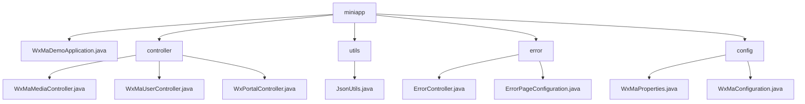

# Basic Information

|      |      |
|------|------|
| Name | miniapp |
| Language | .java |
| Code Path | weixin-java-miniapp-demo/src/main/java/com/github/binarywang/demo/wx/miniapp |
| Package Name | docs.src.main.java.com.github.binarywang.demo.wx.miniapp |
| Brief Description | The WeChat Mini Program backend core module includes media management, user sessions, and WeChat interaction functionalities, relying on the WeChat SDK and Lombok. It supports file uploads, identity authentication, and message routing, with processes covering validation, processing, and cleanup. The error handling module uniformly manages 404/500 responses. The configuration module manages Mini Program properties and initializes message services. The Spring Boot application entry class launches the entire demo. |

# Description

## Overview  
This module is an integrated solution for WeChat Mini Program backend services, with core responsibilities including media file management, user session management, interaction with WeChat servers, and unified error handling. The interface specifications require validating AppID effectiveness, adhering to Spring MVC standards, and injecting configurations via the `wx.miniapp` prefix. Key data structures encompass media_id, user session objects, WeChat message encapsulation, and the WxMaProperties.Config configuration class. External dependencies include the WeChat SDK, Spring Framework, and Lombok utility library. For example, the media controller handles multi-file uploads, the error controller returns unified views, and the configuration class implements multi-account management.  

## Key Business Scenarios  
The module supports four types of typical interactions: media file transfer (similar to cloud storage interfaces), user authentication (similar to OAuth 2.0), WeChat message routing (similar to an event bus pattern), and HTTP error handling (similar to web server error pages). The complete business process consists of three stages: credential verification → business processing → resource cleanup. For instance, user login involves verifying a code or redirecting to an error page in case of exceptions. Integration use cases cover file uploads, session decryption, message responses, and error prompts, such as POST interfaces processing encrypted messages or GET returning 404 views. All interactions are implemented through standard Spring MVC controllers.

### Package Internal Structure View

This flowchart illustrates the directory structure of a WeChat Mini Program Demo project. The root directory "miniapp" contains the main application file, controllers, utility classes, error handling modules, and configuration modules. The controller directory includes three functional controllers, the error directory comprises an error controller and page configuration, while the config directory contains property settings and the main configuration class. The overall structure is clear and adheres to the layered architecture typical of a Spring Boot application.

# File List

| Name   | Type  | Description |
|-------|------|-------------|
| [WxMaDemoApplication.java](WxMaDemoApplication.md) | file | This is a Spring Boot application startup class that includes the main method to run a WeChat Mini Program example. |
| [config](config/_module.md) | package | WeChat Mini Program Java configuration classes: WxMaProperties binds Mini Program configuration items (ID, secret key, etc.), WxMaConfiguration initializes services and handles message routing (text, image reply logic, etc.). |
| [error](error/_module.md) | package | The Spring MVC controller handles error pages, mapping the `/error` path and providing methods to handle 404 and 500 errors. The configuration class implements error page registration, redirecting 404 and 500 errors to specified paths respectively. |
| [utils](utils/_module.md) | package | The JsonUtils class provides static JSON serialization methods, using ObjectMapper configuration to ignore null values and format output, returning null in case of exceptions. |
| [controller](controller/_module.md) | package | The three controller classes in the WeChat Mini Program: the Media Management class handles file uploads and downloads; the User Management class provides interfaces for login, user information, and phone numbers; the Backend class handles WeChat server authentication and message routing. All classes validate the appid and clean up ThreadLocal. |

