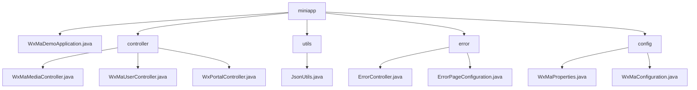

# Basic Information

|      |      |
|------|------|
| Name | miniapp |
| Language | .java |
| Code Path | weixin-java-miniapp-demo/src/main/java/com/github/binarywang/demo/wx/miniapp |
| Package Name | docs.src.main.java.com.github.binarywang.demo.wx.miniapp |
| Brief Description | The core backend module of the WeChat Mini Program includes media management, user information processing, and message routing functions, adhering to WeChat standards and relying on the WeChat JSSDK and Spring Boot. The error handling module uniformly manages HTTP error status codes and custom error pages. The multi-account configuration module dynamically manages Mini Program accounts and message routing. The application entry class is based on Spring Boot startup. |

# Description

## Overview  
This module serves as the core backend system for WeChat Mini Programs, integrating four major functionalities: media management, user authentication, message routing, and error handling. Built on the Spring Boot framework, it adheres to the WeChat Open Platform specifications. Key structures include Media_id lists, user session information, and message handler mappings. It relies on WeChat JSSDK, Lombok, and Spring Web components. For example, uploading media returns a media_id, user login exchanges a code for an openid, and error handling supports custom 404 pages. The JSON serialization tool utilizes a configurable ObjectMapper for efficient conversion.  

## Key Business Scenarios  
The system manages the entire lifecycle of Mini Programs: media files operate similarly to CDN operations, user authentication follows the OAuth2.0 flow, message routing adopts an event bus pattern, and error handling mimics frontend route interception. Typical workflows consist of three stages: request validation → business processing → resource cleanup. For instance, decrypting an encrypted phone number requires session key verification. Integration cases cover five types of message processing, with exceptions handled through log-based degradation. The startup class initializes multi-account configuration services via @SpringBootApplication.

### Package Internal Structure View

This flowchart illustrates the directory structure of a WeChat Mini Program Demo project. The root directory `miniapp` contains the main application class, controller package, utility package, error handling package, and configuration package. The controller package includes three controllers for WeChat media, user, and portal functionalities. The utility package contains a JSON utility class, the error handling package comprises an error controller and page configuration, while the configuration package includes property settings and the main configuration class. The structure clearly demonstrates a typical layered architecture of a Spring Boot project.

# File List

| Name   | Type  | Description |
|-------|------|-------------|
| [WxMaDemoApplication.java](WxMaDemoApplication.md) | file | This is the main class of a Spring Boot application, marked with the @SpringBootApplication annotation, which starts the application via the main method. |
| [controller](controller/_module.md) | package | The three controller classes in the WeChat Mini Program: the Media Controller handles file uploads and downloads; the User Controller manages login, user information, and phone numbers; the Portal Controller handles authentication and message routing. All include ThreadLocal cleanup and logging. |
| [config](config/_module.md) | package | The configuration class WxMaProperties for WeChat Mini Program is bound to the prefix wx.miniapp, containing a list of multiple mini-program configurations. Each configuration includes fields such as appid and secret. The WxMaConfiguration class initializes mini-program services and configures message routing, handling message types like text and images, and includes upload and generation functionalities. |
| [error](error/_module.md) | package | The ErrorController class handles requests to the /error path, including 404 and 500 error handling methods, and returns the error view. The ErrorPageConfiguration class registers the redirection paths for 404 and 500 error pages. |
| [utils](utils/_module.md) | package | The JsonUtils class provides a static method `toJson`, which uses ObjectMapper to convert an object into a JSON string, automatically ignoring null values and formatting the output. |

