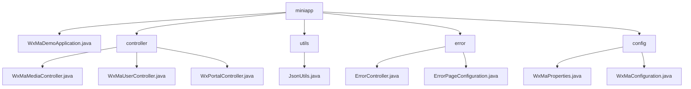

# Basic Information

|      |      |
|------|------|
| Name | miniapp |
| Language | .java |
| Code Path | weixin-java-miniapp-demo/src/main/java/com/github/binarywang/demo/wx/miniapp |
| Package Name | docs.src.main.java.com.github.binarywang.demo.wx.miniapp |
| Brief Description | Spring Boot WeChat Mini Program Demo, including startup class, controllers, JSON utilities, error handling, and configuration modules. The controllers handle media, users, and messages, the utility class manages JSON serialization, the error module uniformly processes HTTP errors, and the configuration module manages multi-account and messaging services. |

# Description

## Overview  
This module is a Spring Boot implementation for WeChat Mini Program backend services, with core responsibilities including media file management, user session handling, WeChat message interaction, and unified error handling. It adheres to RESTful API standards, supports JSON/XML data formats, and key data structures cover Media_id lists, user session information (sessionKey/openid), and WeChat message bodies. External dependencies include WeChat server APIs, AES encryption libraries, the Spring Web framework, and Lombok. For example, the media controller handles file uploads, the user controller manages login authorization, and the configuration module initializes multi-account services.  

## Key Business Scenarios  
The module supports four typical types of interactions: media transfer (similar to FTP), identity authentication (similar to OAuth), message processing (similar to an event bus), and error fallback (similar to a route interceptor). Business processes follow the "validate-process-cleanup" pattern, such as user login first verifying the code before retrieving session information. Typical applications include uploading temporary materials, decrypting user phone numbers, and processing encrypted messages. All interfaces strictly validate appid to ensure multi-tenant isolation. Integration examples include subscription message推送 and 500 error page rendering.

### Package Internal Structure View

This flowchart illustrates the core code structure of a WeChat Mini Program Demo project. The root node "miniapp" contains the main application class, controller package, utility package, error handling package, and configuration package. The controller package includes three functional controllers for processing media, user, and portal requests respectively. The error handling package consists of an error controller and page configuration, while the configuration package stores the mini program properties and configuration classes. The overall structure clearly reflects the layered architecture of a typical Spring Boot application.

# File List

| Name   | Type  | Description |
|-------|------|-------------|
| [WxMaDemoApplication.java](WxMaDemoApplication.md) | file | SpringBoot application startup class, containing the main method to run the Spring application. |
| [config](config/_module.md) | package | The WxMaProperties class configures WeChat Mini Program attributes, including fields such as appid and secret. The WxMaConfiguration class initializes Mini Program services and message routing, defining the logic for various message handlers. |
| [error](error/_module.md) | package | The Spring MVC controller handles 404/500 errors and returns the error view. The configuration class registers error pages, with 404 redirecting to /error/404 and 500 redirecting to /error/500. |
| [utils](utils/_module.md) | package | The JsonUtils utility class uses ObjectMapper to convert objects to JSON strings, automatically ignoring null values and formatting the output, returning null in case of exceptions. |
| [controller](controller/_module.md) | package | WeChat Mini Program Controller Classes: The Media Controller handles file uploads and downloads, the User Controller manages login/information/phone number functionalities, and the Portal Controller is responsible for authentication and message processing. All interfaces validate the appid and ensure thread safety. |

