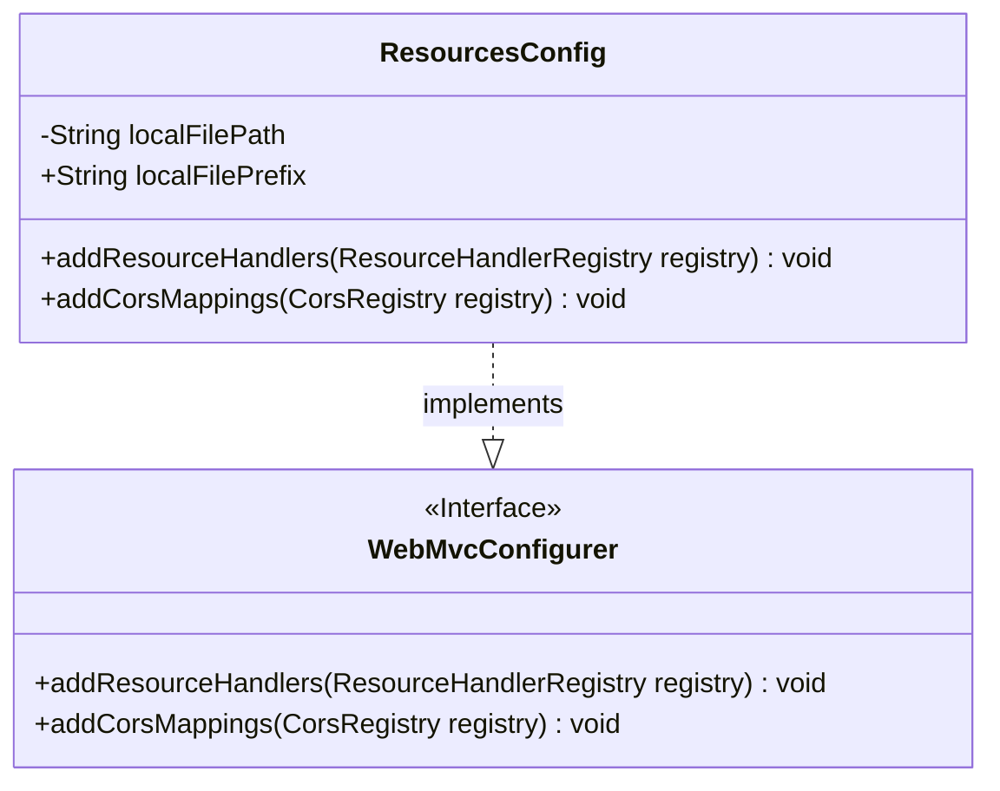
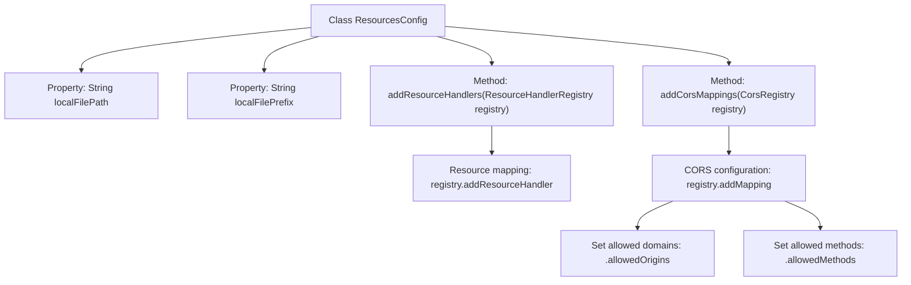

# Basic Information

|      |      |
|------|------|
| Name | ResourcesConfig |
| Language | .java |
| Code Path | weixin-java-miniapp-demo/src/main/java/com/github/binarywang/demo/wx/miniapp/config/ResourcesConfig.java |
| Package Name | com.leaniss.file.config |
| Dependencies | ['java.io.File', 'org.springframework.beans.factory.annotation.Value', 'org.springframework.context.annotation.Configuration', 'org.springframework.web.servlet.config.annotation.CorsRegistry', 'org.springframework.web.servlet.config.annotation.ResourceHandlerRegistry', 'org.springframework.web.servlet.config.annotation.WebMvcConfigurer'] |
| Brief Description | Resource configuration class, defining local file paths and prefixes, mapping resource paths, and enabling cross-origin support to allow GET request access. |

# Description

This is a resource configuration class for Spring Boot that implements the WebMvcConfigurer interface. Its primary functions include configuring local file storage paths and enabling cross-origin access. Through annotations, it reads the root file storage path and resource mapping prefix from the configuration file. By overriding the `addResourceHandlers` method, it maps URL requests with a specified prefix to local file paths. Additionally, it overrides the `addCorsMappings` method to enable cross-origin access for the file paths, allowing all domains to access resources under this path via the GET method. The entire configuration achieves the functionality of local file storage and network access for file resources.

# Class Summary

| Name   | Type  | Description |
|-------|------|-------------|
| ResourcesConfig | class | Resource mapping configuration class, which sets the local file storage path and prefix, and configures cross-domain access permissions. |

## Class ResourcesConfig

|      |      |
|------|------|
| Access Modifier | @Configuration;public |
| Type | class |
| Name | ResourcesConfig |
| Description | Resource mapping configuration class, which sets the local file storage path and prefix, and configures cross-domain access permissions. |

### UML Class Diagram

Class diagram description: The ResourcesConfig class implements the WebMvcConfigurer interface to configure Spring MVC's resource handling and cross-origin settings. This class contains two member variables: localFilePath (local file storage path) and localFilePrefix (resource mapping prefix), and overrides the addResourceHandlers method (configuring static resource mappings) and addCorsMappings method (configuring cross-origin access rules) from the interface. Parameter values are injected from configuration files via the @Value annotation.

### Internal Method Call Graph

This code represents a Spring Boot configuration class primarily used for configuring static resource mapping and cross-origin settings. Through the `addResourceHandlers` method, it maps local file paths to specified URL prefixes to enable file access services. Simultaneously, the `addCorsMappings` method allows GET requests from all origins to access these resources cross-domain. The configuration class dynamically injects path parameters from configuration files using the `@Value` annotation, achieving flexible resource path configuration.

### Field List

| Name  | Type  | Description |
|-------|-------|------|
| localFilePath | String | The code snippet uses Spring's @Value annotation to inject the value of the file.path property from the configuration file into the localFilePath variable. |
| localFilePrefix | String | Configure injection local file prefix path |

### Method List

| Name  | Type  | Description |
|-------|-------|------|
| addResourceHandlers | void | This method configures the local file upload path, mapping the specified URL prefix to a local file system path. |
| addCorsMappings | void | This method configures cross-origin requests, allowing all domains to access resources under the specified route via the GET method. |

