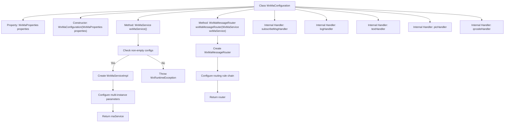
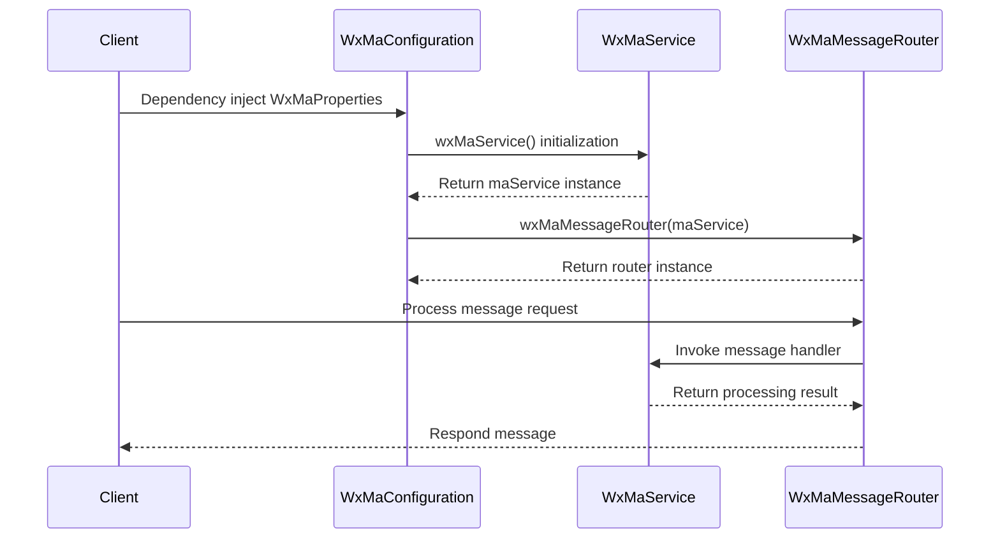

# Basic Information

|      |      |
|------|------|
| Name | WxMaConfiguration |
| Language | .java |
| Code Path | weixin-java-miniapp-demo/src/main/java/com/github/binarywang/demo/wx/miniapp/config/WxMaConfiguration.java |
| Package Name | com.github.binarywang.demo.wx.miniapp.config |
| Dependencies | ['cn.binarywang.wx.miniapp.api.WxMaService', 'cn.binarywang.wx.miniapp.api.impl.WxMaServiceImpl', 'cn.binarywang.wx.miniapp.bean.WxMaKefuMessage', 'cn.binarywang.wx.miniapp.bean.WxMaSubscribeMessage', 'cn.binarywang.wx.miniapp.config.impl.WxMaDefaultConfigImpl', 'cn.binarywang.wx.miniapp.config.impl.WxMaRedisConfigImpl', 'cn.binarywang.wx.miniapp.message.WxMaMessageHandler', 'cn.binarywang.wx.miniapp.message.WxMaMessageRouter', 'com.google.common.collect.Lists', 'lombok.extern.slf4j.Slf4j', 'me.chanjar.weixin.common.bean.result.WxMediaUploadResult', 'me.chanjar.weixin.common.error.WxErrorException', 'me.chanjar.weixin.common.error.WxRuntimeException', 'org.springframework.beans.factory.annotation.Autowired', 'org.springframework.boot.context.properties.EnableConfigurationProperties', 'org.springframework.context.annotation.Bean', 'org.springframework.context.annotation.Configuration', 'redis.clients.jedis.JedisPool', 'java.io.File', 'java.util.List', 'java.util.stream.Collectors'] |
| Brief Description | WeChat Mini Program configuration class, initializes services and message routing, handles subscription, text, image, and QR code messages. |

# Description

This is a configuration class for a WeChat Mini Program backend service, with main functionalities including initializing the WeChat Mini Program service and multi-account configuration, as well as setting up message routing rules. The class injects configuration properties through its constructor, creates a WxMaService instance after validating the configuration, and sets parameters such as App ID and secret key for each Mini Program account. The message router defines processing logic for different content types (e.g., text, images, QR codes), including features like logging, subscription message replies, image uploads, and QR code generation. Various message handlers return corresponding content to users via the customer service API, such as sending temporarily uploaded images or generated QR codes to users. The configuration class ensures all WeChat Mini Program-related services are properly initialized and processes user messages according to the defined rules.

# Class Summary

| Name   | Type  | Description |
|-------|------|-------------|
| WxMaConfiguration | class | This is a WeChat Mini Program configuration class that includes service initialization and message routing setup. It configures multiple Mini Program parameters through WxMaProperties and creates the WxMaService. The message routing handles subscription, text, image, and QR code messages, with corresponding processors defined for each. |

## Class WxMaConfiguration

|      |      |
|------|------|
| Access Modifier | @Slf4j;@Configuration;@EnableConfigurationProperties(WxMaProperties.class);public |
| Type | class |
| Name | WxMaConfiguration |
| Description | This is a WeChat Mini Program configuration class that includes service initialization and message routing setup. It configures multiple Mini Program parameters through WxMaProperties and creates the WxMaService. The message routing handles subscription, text, image, and QR code messages, with corresponding processors defined for each. |

### UML Class Diagram

```mermaid
classDiagram
    class WxMaConfiguration {
        -WxMaProperties properties
        -WxMaMessageHandler subscribeMsgHandler
        -WxMaMessageHandler logHandler
        -WxMaMessageHandler textHandler
        -WxMaMessageHandler picHandler
        -WxMaMessageHandler qrcodeHandler
        +WxMaConfiguration(WxMaProperties properties)
        +WxMaService wxMaService()
        +WxMaMessageRouter wxMaMessageRouter(WxMaService wxMaService)
    }

    class WxMaProperties {
        +List~Config~ getConfigs()
    }

    class WxMaProperties.Config {
        +String getAppid()
        +String getSecret()
        +String getToken()
        +String getAesKey()
        +String getMsgDataFormat()
    }

    class WxMaService {
        <<Interface>>
        +void setMultiConfigs(Map~String, WxMaConfig~ configs)
        +WxMaMsgService getMsgService()
        +WxMaMediaService getMediaService()
        +WxMaQrcodeService getQrcodeService()
    }

    class WxMaServiceImpl {
        +void setMultiConfigs(Map~String, WxMaConfig~ configs)
    }

    class WxMaDefaultConfigImpl {
        +String getAppid()
        +void setAppid(String appid)
        +void setSecret(String secret)
        +void setToken(String token)
        +void setAesKey(String aesKey)
        +void setMsgDataFormat(String msgDataFormat)
    }

    class WxMaMessageRouter {
        +WxMaMessageRouter(WxMaService wxMaService)
        +rule() WxMaMessageRouterRule
    }

    class WxMaMessageHandler {
        <<Interface>>
        +Object handle(WxMaMessage wxMessage, Map~String, Object~ context, WxMaService service, WxSessionManager sessionManager)
    }

    class WxMaMessage {
        +String getFromUser()
        +String toJson()
    }

    class WxMaKefuMessage {
        +static Builder newTextBuilder()
        +static Builder newImageBuilder()
    }

    class WxMediaUploadResult {
        +String getMediaId()
    }

    WxMaConfiguration --> WxMaProperties : Dependency
    WxMaConfiguration --> WxMaService : Create
    WxMaConfiguration --> WxMaMessageRouter : Create
    WxMaConfiguration ..|> WxMaMessageHandler : Implement
    WxMaServiceImpl ..|> WxMaService : Implement
    WxMaDefaultConfigImpl ..|> WxMaConfig : Implement
    WxMaMessageRouter --> WxMaService : Dependency
    WxMaMessageRouter --> WxMaMessageRouterRule : Contain
    WxMaMessageHandler <|.. WxMaConfiguration : Implement
    WxMaService --> WxMaMsgService : Dependency
    WxMaService --> WxMaMediaService : Dependency
    WxMaService --> WxMaQrcodeService : Dependency
```

This code represents a backend configuration class for WeChat Mini Program, primarily responsible for initializing WeChat Mini Program services (WxMaService) and message routers (WxMaMessageRouter). The WxMaConfiguration class, annotated with @Configuration, indicates it is a Spring configuration class. It reads configuration information from WxMaProperties to initialize WxMaService and creates a message router to handle different types of WeChat messages. The message router is configured with multiple rules to process subscription messages, text messages, image messages, QR code messages, etc. The design employs dependency injection and the strategy pattern, utilizing the WxMaMessageHandler interface to implement logic for processing different types of messages.

### Internal Method Call Graph

The flowchart demonstrates the core structure of WeChat Mini Program configuration class WxMaConfiguration, including service initialization and message routing configuration. The sequence diagram depicts the complete call chain from property injection to message processing, highlighting the multi-config initialization of wxMaService and the rule chain construction of wxMaMessageRouter, along with the final message handling response flow. The code configures 5 message handlers via fluent API to process subscription, log, text, image, and QR code message types respectively.

### Field List

| Name  | Type  | Description |
|-------|-------|------|
| properties | WxMaProperties | Private immutable WeChat Mini Program configuration property object. |
| picHandler = (wxMessage, context, service, sessionManager) -> {        try {            WxMediaUploadResult uploadResult = service.getMediaService()                .uploadMedia("image", "png",                    ClassLoader.getSystemResourceAsStream("tmp.png"));            service.getMsgService().sendKefuMsg(                WxMaKefuMessage                    .newImageBuilder()                    .mediaId(uploadResult.getMediaId())                    .toUser(wxMessage.getFromUser())                    .build());        } catch (WxErrorException e) {            e.printStackTrace();        }        return null;    } | WxMaMessageHandler | Define a WeChat Mini Program image message handler to upload temporary images and return them as customer service messages to users, while logging errors in case of exceptions. |
| subscribeMsgHandler = (wxMessage, context, service, sessionManager) -> {        service.getMsgService().sendSubscribeMsg(WxMaSubscribeMessage.builder()            .templateId("此处更换为自己的模板id")            .data(Lists.newArrayList(                new WxMaSubscribeMessage.MsgData("keyword1", "339208499")))            .toUser(wxMessage.getFromUser())            .build());        return null;    } | WxMaMessageHandler | Define a WeChat Mini Program subscription message handler, using the specified template ID and user data to send subscription messages, with the recipient being the message sender. |
| logHandler = (wxMessage, context, service, sessionManager) -> {        log.info("收到消息：" + wxMessage.toString());        service.getMsgService().sendKefuMsg(WxMaKefuMessage.newTextBuilder().content("收到信息为：" + wxMessage.toJson())            .toUser(wxMessage.getFromUser()).build());        return null;    } | WxMaMessageHandler | Defined a WeChat Mini Program message handler `logHandler`, used to log received messages and return the message content to users via the customer service interface. |
| textHandler = (wxMessage, context, service, sessionManager) -> {        service.getMsgService().sendKefuMsg(WxMaKefuMessage.newTextBuilder().content("回复文本消息")            .toUser(wxMessage.getFromUser()).build());        return null;    } | WxMaMessageHandler | WeChat Mini Program Message Handling: Upon receiving a text message, automatically reply with "Reply to text message" and send it to the user via the customer service interface. |
| qrcodeHandler = (wxMessage, context, service, sessionManager) -> {        try {            final File file = service.getQrcodeService().createQrcode("123", 430);            WxMediaUploadResult uploadResult = service.getMediaService().uploadMedia("image", file);            service.getMsgService().sendKefuMsg(                WxMaKefuMessage                    .newImageBuilder()                    .mediaId(uploadResult.getMediaId())                    .toUser(wxMessage.getFromUser())                    .build());        } catch (WxErrorException e) {            e.printStackTrace();        }        return null;    } | WxMaMessageHandler | WeChat Mini Program message handler, generates QR code and uploads it as an image message to send to users, prints errors when exceptions occur. |

### Method List

| Name  | Type  | Description |
|-------|-------|------|
| wxMaService | WxMaService | Create a WeChat Mini Program service instance, check the configuration, and initialize multi-account settings, including parameters such as appid and secret key. If any configuration is missing, throw an exception prompt. |
| wxMaMessageRouter | WxMaMessageRouter | Define WeChat Mini Program message routing rules, including logs, subscription messages, text, images, and QR code processing. |

