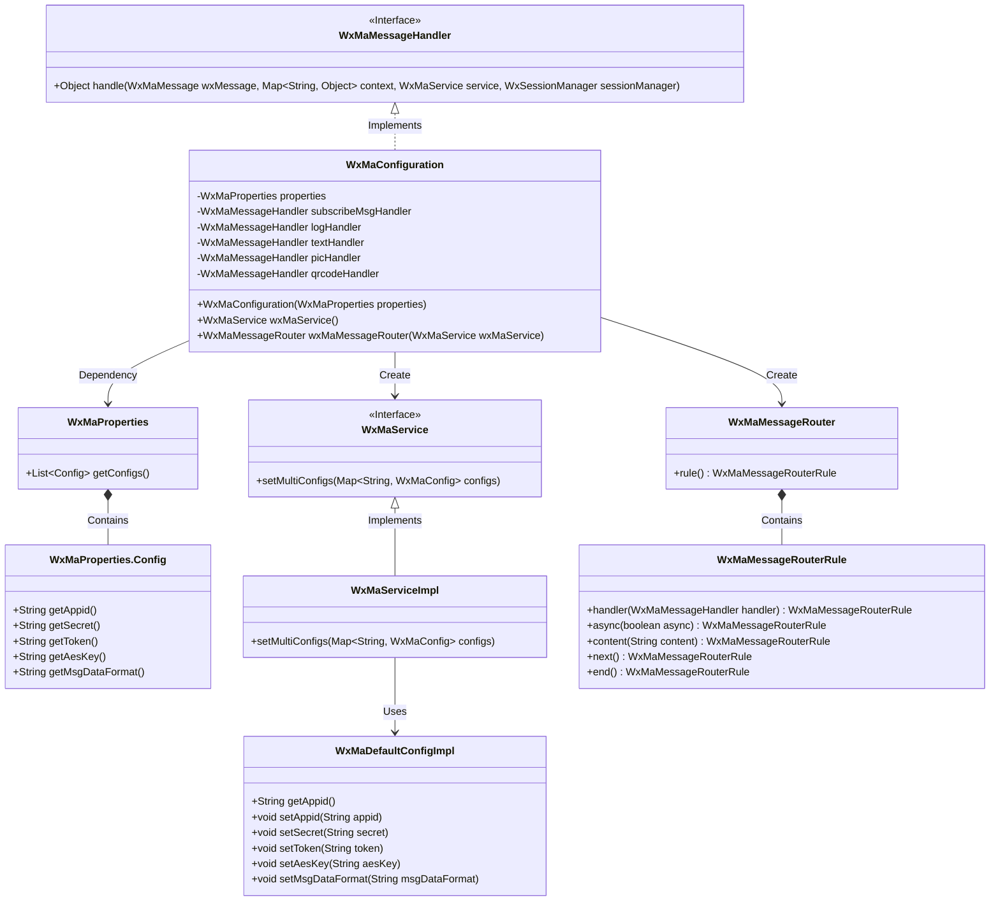
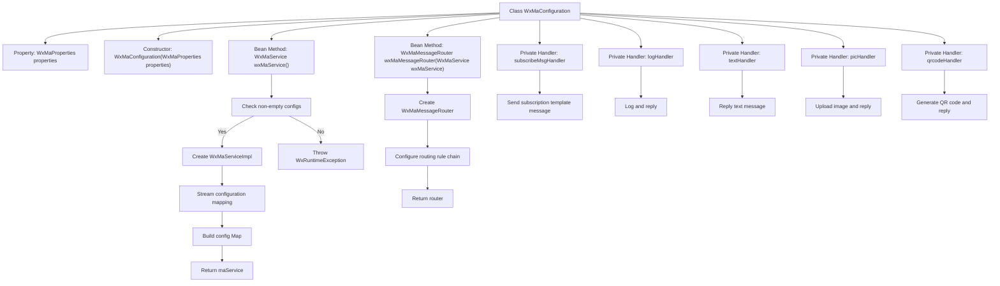
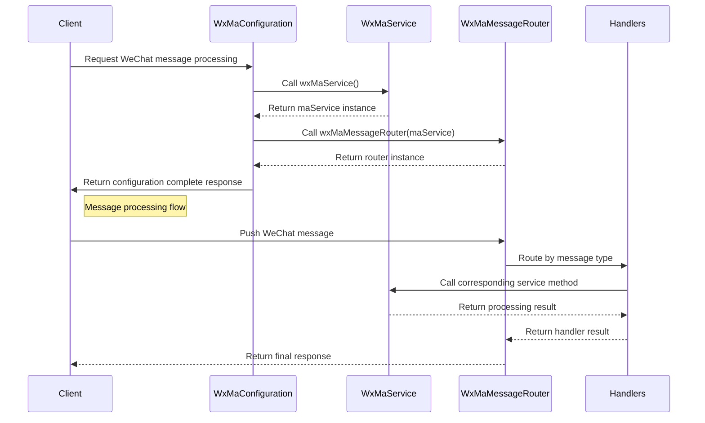

# Basic Information

|      |      |
|------|------|
| Name | WxMaConfiguration |
| Language | .java |
| Code Path | weixin-java-miniapp-demo/src/main/java/com/github/binarywang/demo/wx/miniapp/config/WxMaConfiguration.java |
| Package Name | com.github.binarywang.demo.wx.miniapp.config |
| Dependencies | ['cn.binarywang.wx.miniapp.api.WxMaService', 'cn.binarywang.wx.miniapp.api.impl.WxMaServiceImpl', 'cn.binarywang.wx.miniapp.bean.WxMaKefuMessage', 'cn.binarywang.wx.miniapp.bean.WxMaSubscribeMessage', 'cn.binarywang.wx.miniapp.config.impl.WxMaDefaultConfigImpl', 'cn.binarywang.wx.miniapp.config.impl.WxMaRedisConfigImpl', 'cn.binarywang.wx.miniapp.message.WxMaMessageHandler', 'cn.binarywang.wx.miniapp.message.WxMaMessageRouter', 'com.google.common.collect.Lists', 'lombok.extern.slf4j.Slf4j', 'me.chanjar.weixin.common.bean.result.WxMediaUploadResult', 'me.chanjar.weixin.common.error.WxErrorException', 'me.chanjar.weixin.common.error.WxRuntimeException', 'org.springframework.beans.factory.annotation.Autowired', 'org.springframework.boot.context.properties.EnableConfigurationProperties', 'org.springframework.context.annotation.Bean', 'org.springframework.context.annotation.Configuration', 'redis.clients.jedis.JedisPool', 'java.io.File', 'java.util.List', 'java.util.stream.Collectors'] |
| Brief Description | WeChat Mini Program configuration class, initializes WxMaService and message routing, handles message types such as subscriptions, text, images, QR codes, etc. |

# Description

This is a WeChat Mini Program backend configuration class, primarily responsible for initializing WeChat Mini Program services and configuring message routing. The class injects configuration properties through its constructor, verifies their validity, and then creates a multi-account configured Mini Program service instance. The message router defines five categories of message processing rules: logging, subscription messages, text messages, image messages, and QR code messages, with each message type having a corresponding handler. Handler functionalities include sending customer service messages, subscription messages, image uploads, and QR code generation. Notably, the image and QR code handlers first upload media files before sending. All handlers return null values, with exceptions being logged.

# Class Summary

| Name   | Type  | Description |
|-------|------|-------------|
| WxMaConfiguration | class | This is a WeChat Mini Program configuration class that includes service initialization and message routing settings. It supports multi-account configuration via WxMaProperties and provides message handling functionalities such as subscriptions, text, images, and QR codes. |

## Class WxMaConfiguration

|      |      |
|------|------|
| Access Modifier | @Slf4j;@Configuration;@EnableConfigurationProperties(WxMaProperties.class);public |
| Type | class |
| Name | WxMaConfiguration |
| Description | This is a WeChat Mini Program configuration class that includes service initialization and message routing settings. It supports multi-account configuration via WxMaProperties and provides message handling functionalities such as subscriptions, text, images, and QR codes. |

### UML Class Diagram

This code represents a configuration class for a WeChat Mini Program backend service, primarily responsible for initializing the WeChat Mini Program service (WxMaService) and message router (WxMaMessageRouter). The WxMaConfiguration class, annotated with @Configuration, reads configuration information from WxMaProperties to initialize WxMaService and sets up multiple message handlers to process different types of WeChat messages. The class diagram illustrates the dependency relationships between the configuration class and WeChat service components, including the configuration properties class, service interface and its implementation, message router, and various message handlers. The design employs dependency injection and the strategy pattern, enabling flexible extensibility of message processing logic.

### Internal Method Call Graph

This code implements a Spring Boot configuration class for WeChat Mini Program backend services, primarily accomplishing two core functions: 1) Initializing multi-account WeChat Mini Program service configurations (WxMaService); 2) Building message routing rule chains (WxMaMessageRouter). The flowchart illustrates the class structure and main method invocation relationships, while the sequence diagram depicts the complete process of service initialization and message processing. The code implements different types of message processing logic (log recording, text replies, image uploads, QR code generation, etc.) through five message handlers (logHandler, textHandler, etc.), demonstrating the application of the Chain of Responsibility pattern. The configuration class injects core services into the Spring container via @Bean methods, supporting multi-account configuration and exception validation.

### Field List

| Name  | Type  | Description |
|-------|-------|------|
| picHandler = (wxMessage, context, service, sessionManager) -> {        try {            WxMediaUploadResult uploadResult = service.getMediaService()                .uploadMedia("image", "png",                    ClassLoader.getSystemResourceAsStream("tmp.png"));            service.getMsgService().sendKefuMsg(                WxMaKefuMessage                    .newImageBuilder()                    .mediaId(uploadResult.getMediaId())                    .toUser(wxMessage.getFromUser())                    .build());        } catch (WxErrorException e) {            e.printStackTrace();        }        return null;    } | WxMaMessageHandler | Processing WeChat Mini Program Image Messages: Upload temporary images and send them as customer service messages to users, catching exceptions without handling them. |
| subscribeMsgHandler = (wxMessage, context, service, sessionManager) -> {        service.getMsgService().sendSubscribeMsg(WxMaSubscribeMessage.builder()            .templateId("此处更换为自己的模板id")            .data(Lists.newArrayList(                new WxMaSubscribeMessage.MsgData("keyword1", "339208499")))            .toUser(wxMessage.getFromUser())            .build());        return null;    } | WxMaMessageHandler | This code defines a WeChat Mini Program message handler for sending subscription messages. It constructs the message using a template ID and keyword data, then sends it to the specified user. |
| textHandler = (wxMessage, context, service, sessionManager) -> {        service.getMsgService().sendKefuMsg(WxMaKefuMessage.newTextBuilder().content("回复文本消息")            .toUser(wxMessage.getFromUser()).build());        return null;    } | WxMaMessageHandler | This code defines a WeChat Mini Program message handler for automatically replying to user text messages. When a user message is received, it sends the "Reply Text Message" content to the user via the customer service interface. The handler takes the message object, context, service, and session manager as parameters. |
| logHandler = (wxMessage, context, service, sessionManager) -> {        log.info("收到消息：" + wxMessage.toString());        service.getMsgService().sendKefuMsg(WxMaKefuMessage.newTextBuilder().content("收到信息为：" + wxMessage.toJson())            .toUser(wxMessage.getFromUser()).build());        return null;    } | WxMaMessageHandler | Define WeChat Mini Program message handling logic: Record received messages and automatically reply with the user's message content. |
| properties | WxMaProperties | A private immutable configuration property object for WeChat Mini Programs. |
| qrcodeHandler = (wxMessage, context, service, sessionManager) -> {        try {            final File file = service.getQrcodeService().createQrcode("123", 430);            WxMediaUploadResult uploadResult = service.getMediaService().uploadMedia("image", file);            service.getMsgService().sendKefuMsg(                WxMaKefuMessage                    .newImageBuilder()                    .mediaId(uploadResult.getMediaId())                    .toUser(wxMessage.getFromUser())                    .build());        } catch (WxErrorException e) {            e.printStackTrace();        }        return null;    } | WxMaMessageHandler | The code defines a WeChat Mini Program message handler, which is used to generate QR code images and send them to users. The processing flow includes creating a QR code, uploading it to the WeChat server, and sending it to a specified user via the customer service message interface. Error messages are printed when exceptions occur. |

### Method List

| Name  | Type  | Description |
|-------|-------|------|
| wxMaService | WxMaService | Create a WeChat Mini Program service instance, check the configuration, and initialize multi-account settings, including parameters such as appid and secret key. If not configured, throw an exception prompt. |
| wxMaMessageRouter | WxMaMessageRouter | Create a WeChat Mini Program message routing, configure synchronous handlers for processing subscription, text, image, and QR code messages. |

