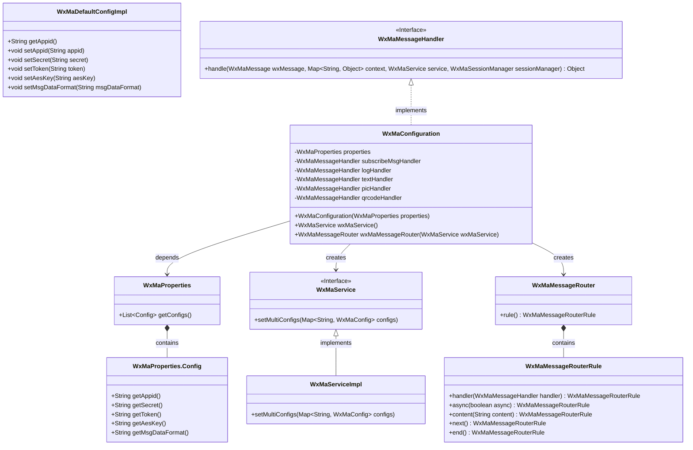
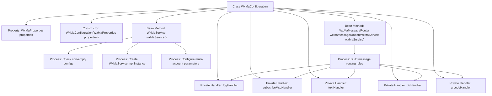

# Basic Information

|      |      |
|------|------|
| Name | WxMaConfiguration |
| Language | .java |
| Code Path | weixin-java-miniapp-demo/src/main/java/com/github/binarywang/demo/wx/miniapp/config/WxMaConfiguration.java |
| Package Name | com.github.binarywang.demo.wx.miniapp.config |
| Dependencies | ['cn.binarywang.wx.miniapp.api.WxMaService', 'cn.binarywang.wx.miniapp.api.impl.WxMaServiceImpl', 'cn.binarywang.wx.miniapp.bean.WxMaKefuMessage', 'cn.binarywang.wx.miniapp.bean.WxMaSubscribeMessage', 'cn.binarywang.wx.miniapp.config.impl.WxMaDefaultConfigImpl', 'cn.binarywang.wx.miniapp.config.impl.WxMaRedisConfigImpl', 'cn.binarywang.wx.miniapp.message.WxMaMessageHandler', 'cn.binarywang.wx.miniapp.message.WxMaMessageRouter', 'com.google.common.collect.Lists', 'lombok.extern.slf4j.Slf4j', 'me.chanjar.weixin.common.bean.result.WxMediaUploadResult', 'me.chanjar.weixin.common.error.WxErrorException', 'me.chanjar.weixin.common.error.WxRuntimeException', 'org.springframework.beans.factory.annotation.Autowired', 'org.springframework.boot.context.properties.EnableConfigurationProperties', 'org.springframework.context.annotation.Bean', 'org.springframework.context.annotation.Configuration', 'redis.clients.jedis.JedisPool', 'java.io.File', 'java.util.List', 'java.util.stream.Collectors'] |
| Brief Description | WeChat Mini Program configuration class, containing service initialization and message routing setup. It loads configurations via WxMaProperties, creates WxMaService to handle multiple accounts, and defines message handlers to process subscription, text, image, and QR code messages. |

# Description

This is a configuration class for a WeChat Mini Program backend service, with main functionalities including initializing the WeChat Mini Program service and configuring message routing. The class enables configuration properties through annotations and injects WxMaProperties to obtain multi-account configurations. The wxMaService method checks the validity of the configuration before creating a multi-account Mini Program service instance. The wxMaMessageRouter method defines message processing rules, including logic for handling subscription messages, text, images, QR codes, and other types. Each message handler implements different business logic, such as sending customer service messages, logging, uploading media files, and generating QR codes. Exception handling is implemented by catching WxErrorException.

# Class Summary

| Name   | Type  | Description |
|-------|------|-------------|
| WxMaConfiguration | class | WeChat Mini Program configuration class, initializes services and message routing, handles subscription, text, image, and QR code messages, including logging and error handling. |

## Class WxMaConfiguration

|      |      |
|------|------|
| Access Modifier | @Slf4j;@Configuration;@EnableConfigurationProperties(WxMaProperties.class);public |
| Type | class |
| Name | WxMaConfiguration |
| Description | WeChat Mini Program configuration class, initializes services and message routing, handles subscription, text, image, and QR code messages, including logging and error handling. |

### UML Class Diagram

This code represents a backend configuration class for WeChat Mini Programs, primarily responsible for initializing the WeChat Mini Program service (WxMaService) and message router (WxMaMessageRouter). The WxMaConfiguration class reads configuration information from WxMaProperties to create and configure a WxMaServiceImpl instance, while defining various message handlers (WxMaMessageHandler) to process different types of WeChat messages. The class diagram illustrates the relationships between the configuration class and core WeChat SDK components, including configuration properties, service implementation, message routing, and handlers, reflecting the fundamental architecture of WeChat Mini Program backend message processing.

### Internal Method Call Graph

This flowchart illustrates the core structure of a WeChat Mini Program configuration class. The WxMaConfiguration class injects configuration properties through its constructor and provides two key Beans: wxMaService() initializes multi-account services with configuration validation, while wxMaMessageRouter() constructs a routing chain incorporating five message processing rules. Private handlers respectively process subscription messages, logging, and text/image/QR code messages, forming a complete message processing pipeline where the image and QR code handlers additionally involve media file upload operations.

### Field List

| Name  | Type  | Description |
|-------|-------|------|
| logHandler = (wxMessage, context, service, sessionManager) -> {        log.info("收到消息：" + wxMessage.toString());        service.getMsgService().sendKefuMsg(WxMaKefuMessage.newTextBuilder().content("收到信息为：" + wxMessage.toJson())            .toUser(wxMessage.getFromUser()).build());        return null;    } | WxMaMessageHandler | Define a WeChat Mini Program message handler to log received messages and automatically reply with the user's message content. |
| textHandler = (wxMessage, context, service, sessionManager) -> {        service.getMsgService().sendKefuMsg(WxMaKefuMessage.newTextBuilder().content("回复文本消息")            .toUser(wxMessage.getFromUser()).build());        return null;    } | WxMaMessageHandler | WeChat Mini Program Message Handling: Automatically reply to text messages with a customer service message stating "Reply to text message," and return the message sender. |
| subscribeMsgHandler = (wxMessage, context, service, sessionManager) -> {        service.getMsgService().sendSubscribeMsg(WxMaSubscribeMessage.builder()            .templateId("此处更换为自己的模板id")            .data(Lists.newArrayList(                new WxMaSubscribeMessage.MsgData("keyword1", "339208499")))            .toUser(wxMessage.getFromUser())            .build());        return null;    } | WxMaMessageHandler | WeChat Mini Program Subscription Message Handler Code: Sends subscription messages to users using template ID, including keywords and data. |
| picHandler = (wxMessage, context, service, sessionManager) -> {        try {            WxMediaUploadResult uploadResult = service.getMediaService()                .uploadMedia("image", "png",                    ClassLoader.getSystemResourceAsStream("tmp.png"));            service.getMsgService().sendKefuMsg(                WxMaKefuMessage                    .newImageBuilder()                    .mediaId(uploadResult.getMediaId())                    .toUser(wxMessage.getFromUser())                    .build());        } catch (WxErrorException e) {            e.printStackTrace();        }        return null;    } | WxMaMessageHandler | Define a WeChat Mini Program image processor to upload temporary images and send customer service messages to users, printing errors when exceptions occur. |
| properties | WxMaProperties | Privately immutable WeChat Mini Program configuration property object. |
| qrcodeHandler = (wxMessage, context, service, sessionManager) -> {        try {            final File file = service.getQrcodeService().createQrcode("123", 430);            WxMediaUploadResult uploadResult = service.getMediaService().uploadMedia("image", file);            service.getMsgService().sendKefuMsg(                WxMaKefuMessage                    .newImageBuilder()                    .mediaId(uploadResult.getMediaId())                    .toUser(wxMessage.getFromUser())                    .build());        } catch (WxErrorException e) {            e.printStackTrace();        }        return null;    } | WxMaMessageHandler | Processing WeChat Mini Program messages, generating QR codes and uploading them as images, then sending them to users via customer service messages. Print errors in case of exceptions. |

### Method List

| Name  | Type  | Description |
|-------|-------|------|
| wxMaService | WxMaService | Create a WeChat Mini Program service instance, check the configuration, and initialize multi-account settings, including parameters such as appid and secret. If not configured, an exception will be thrown. |
| wxMaMessageRouter | WxMaMessageRouter | Create a WeChat Mini Program message router, configuring synchronous handlers for subscription, text, image, and QR code messages. |

