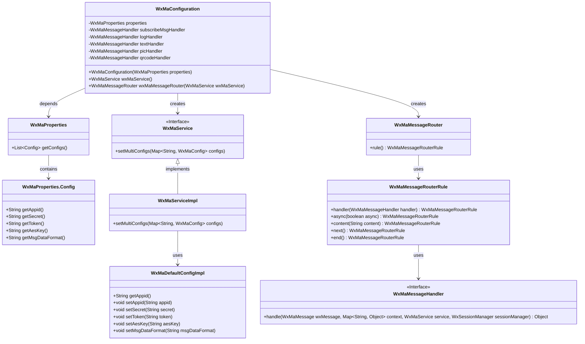
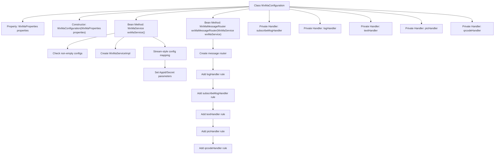

# Basic Information

|      |      |
|------|------|
| Name | WxMaConfiguration |
| Language | .java |
| Code Path | weixin-java-miniapp-demo/src/main/java/com/github/binarywang/demo/wx/miniapp/config/WxMaConfiguration.java |
| Package Name | com.github.binarywang.demo.wx.miniapp.config |
| Dependencies | ['cn.binarywang.wx.miniapp.api.WxMaService', 'cn.binarywang.wx.miniapp.api.impl.WxMaServiceImpl', 'cn.binarywang.wx.miniapp.bean.WxMaKefuMessage', 'cn.binarywang.wx.miniapp.bean.WxMaSubscribeMessage', 'cn.binarywang.wx.miniapp.config.impl.WxMaDefaultConfigImpl', 'cn.binarywang.wx.miniapp.config.impl.WxMaRedisConfigImpl', 'cn.binarywang.wx.miniapp.message.WxMaMessageHandler', 'cn.binarywang.wx.miniapp.message.WxMaMessageRouter', 'com.google.common.collect.Lists', 'lombok.extern.slf4j.Slf4j', 'me.chanjar.weixin.common.bean.result.WxMediaUploadResult', 'me.chanjar.weixin.common.error.WxErrorException', 'me.chanjar.weixin.common.error.WxRuntimeException', 'org.springframework.beans.factory.annotation.Autowired', 'org.springframework.boot.context.properties.EnableConfigurationProperties', 'org.springframework.context.annotation.Bean', 'org.springframework.context.annotation.Configuration', 'redis.clients.jedis.JedisPool', 'java.io.File', 'java.util.List', 'java.util.stream.Collectors'] |
| Brief Description | WeChat Mini Program configuration class, including service initialization and message routing setup, supports various message processing such as text, images, QR codes, etc. |

# Description

This is a WeChat Mini Program backend configuration class, primarily responsible for initializing WeChat Mini Program services and configuring message routing. The class injects configuration properties via its constructor, validates configurations when creating a WxMaService instance, and sets multi-account parameters. The message routing section defines five message handling rules: log recording, subscription message reply, text reply, image reply, and QR code reply. Each handler implements message response logic, such as sending customer service messages, uploading media files, or generating QR codes. The configuration class utilizes Lombok logging annotations and Spring configuration annotations to ensure proper service initialization and chained processing of message routing.

# Class Summary

| Name   | Type  | Description |
|-------|------|-------------|
| WxMaConfiguration | class | This is a WeChat Mini Program configuration class, containing Bean definitions for WxMaService and WxMaMessageRouter, handling message types such as subscription messages, text, images, and QR codes. |

## Class WxMaConfiguration

|      |      |
|------|------|
| Access Modifier | @Slf4j;@Configuration;@EnableConfigurationProperties(WxMaProperties.class);public |
| Type | class |
| Name | WxMaConfiguration |
| Description | This is a WeChat Mini Program configuration class, containing Bean definitions for WxMaService and WxMaMessageRouter, handling message types such as subscription messages, text, images, and QR codes. |

### UML Class Diagram

This code represents a backend configuration class for WeChat Mini Programs, primarily responsible for initializing the WeChat Mini Program service (WxMaService) and message router (WxMaMessageRouter). The WxMaConfiguration class reads configuration information from WxMaProperties to initialize WxMaService and sets up multiple message handlers to process different types of user messages. The class diagram illustrates the dependency relationships and interface implementations among these classes, including core components such as configuration property classes, service implementation classes, message routing rules, and message handlers.

### Internal Method Call Graph

This flowchart illustrates the core structure of a WeChat Mini Program configuration class, featuring two primary Bean creation processes: wxMaService initializes multi-account configurations by constructing service instances through stream-style processing; wxMaMessageRouter configures message handlers via chained rules, incorporating processing logic for message types such as logging, subscription messages, text/image/QR code, etc. All private handlers implement a unified message processing interface, utilizing WxMaService for message exchange and media file operations.

### Field List

| Name  | Type  | Description |
|-------|-------|------|
| properties | WxMaProperties | Private immutable WeChat Mini Program configuration property object. |
| textHandler = (wxMessage, context, service, sessionManager) -> {        service.getMsgService().sendKefuMsg(WxMaKefuMessage.newTextBuilder().content("回复文本消息")            .toUser(wxMessage.getFromUser()).build());        return null;    } | WxMaMessageHandler | WeChat Mini Program text message processing logic: Upon receiving a user message, automatically reply with a fixed text content and return it to the sender via the customer service interface. |
| subscribeMsgHandler = (wxMessage, context, service, sessionManager) -> {        service.getMsgService().sendSubscribeMsg(WxMaSubscribeMessage.builder()            .templateId("此处更换为自己的模板id")            .data(Lists.newArrayList(                new WxMaSubscribeMessage.MsgData("keyword1", "339208499")))            .toUser(wxMessage.getFromUser())            .build());        return null;    } | WxMaMessageHandler | This code defines a WeChat Mini Program message handler for sending subscription messages. It constructs the message using a template ID and keyword data, then sends it to the specified user. The return value is null. |
| picHandler = (wxMessage, context, service, sessionManager) -> {        try {            WxMediaUploadResult uploadResult = service.getMediaService()                .uploadMedia("image", "png",                    ClassLoader.getSystemResourceAsStream("tmp.png"));            service.getMsgService().sendKefuMsg(                WxMaKefuMessage                    .newImageBuilder()                    .mediaId(uploadResult.getMediaId())                    .toUser(wxMessage.getFromUser())                    .build());        } catch (WxErrorException e) {            e.printStackTrace();        }        return null;    } | WxMaMessageHandler | WeChat Mini Program image processing logic: Upload temporary images and send customer service messages, print errors in case of exceptions. |
| logHandler = (wxMessage, context, service, sessionManager) -> {        log.info("收到消息：" + wxMessage.toString());        service.getMsgService().sendKefuMsg(WxMaKefuMessage.newTextBuilder().content("收到信息为：" + wxMessage.toJson())            .toUser(wxMessage.getFromUser()).build());        return null;    } | WxMaMessageHandler | Define WeChat Mini Program message handling logic: Record received message content and automatically reply to users, including the function of forwarding messages to customer service. |
| qrcodeHandler = (wxMessage, context, service, sessionManager) -> {        try {            final File file = service.getQrcodeService().createQrcode("123", 430);            WxMediaUploadResult uploadResult = service.getMediaService().uploadMedia("image", file);            service.getMsgService().sendKefuMsg(                WxMaKefuMessage                    .newImageBuilder()                    .mediaId(uploadResult.getMediaId())                    .toUser(wxMessage.getFromUser())                    .build());        } catch (WxErrorException e) {            e.printStackTrace();        }        return null;    } | WxMaMessageHandler | Processing WeChat Mini Program QR Code Requests: Generate a QR code and upload it as an image message to send to the user, while printing error logs in case of exceptions. |

### Method List

| Name  | Type  | Description |
|-------|-------|------|
| wxMaService | WxMaService | Create a WeChat Mini Program service instance, verify the configuration, initialize multi-account settings, configure parameters such as appid, and return the service instance. |
| wxMaMessageRouter | WxMaMessageRouter | Create a WeChat Mini Program message router, configuring handlers for subscription, text, image, QR code, and other message types. |

