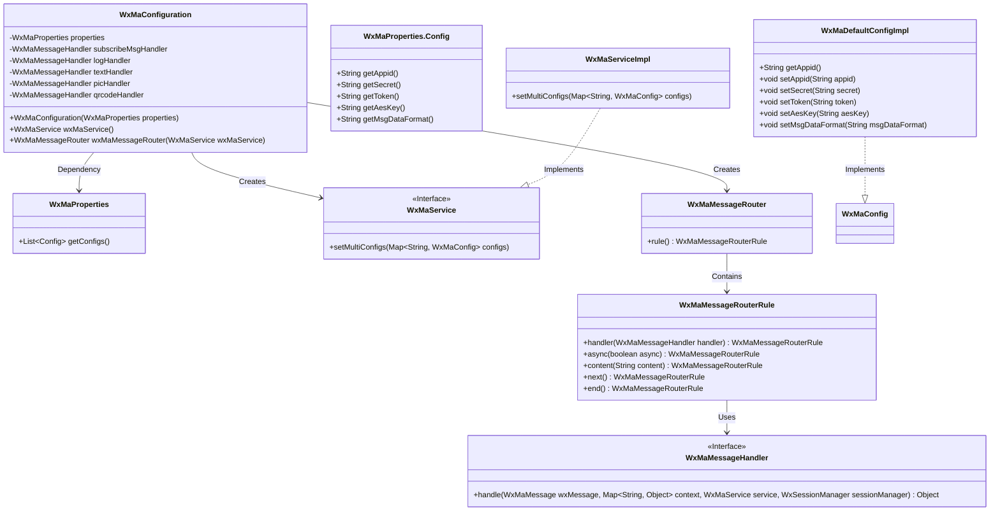

# Basic Information

|      |      |
|------|------|
| Name | WxMaConfiguration |
| Language | .java |
| Code Path | weixin-java-miniapp-demo/src/main/java/com/github/binarywang/demo/wx/miniapp/config/WxMaConfiguration.java |
| Package Name | com.github.binarywang.demo.wx.miniapp.config |
| Dependencies | ['cn.binarywang.wx.miniapp.api.WxMaService', 'cn.binarywang.wx.miniapp.api.impl.WxMaServiceImpl', 'cn.binarywang.wx.miniapp.bean.WxMaKefuMessage', 'cn.binarywang.wx.miniapp.bean.WxMaSubscribeMessage', 'cn.binarywang.wx.miniapp.config.impl.WxMaDefaultConfigImpl', 'cn.binarywang.wx.miniapp.config.impl.WxMaRedisConfigImpl', 'cn.binarywang.wx.miniapp.message.WxMaMessageHandler', 'cn.binarywang.wx.miniapp.message.WxMaMessageRouter', 'com.google.common.collect.Lists', 'lombok.extern.slf4j.Slf4j', 'me.chanjar.weixin.common.bean.result.WxMediaUploadResult', 'me.chanjar.weixin.common.error.WxErrorException', 'me.chanjar.weixin.common.error.WxRuntimeException', 'org.springframework.beans.factory.annotation.Autowired', 'org.springframework.boot.context.properties.EnableConfigurationProperties', 'org.springframework.context.annotation.Bean', 'org.springframework.context.annotation.Configuration', 'redis.clients.jedis.JedisPool', 'java.io.File', 'java.util.List', 'java.util.stream.Collectors'] |
| Brief Description | This is a WeChat Mini Program configuration class that includes service initialization and message routing setup. It loads configurations via WxMaProperties and creates a WxMaService instance to handle multi-account configurations. The message router defines processing logic for different content types, including subscription messages, text, images, and QR code response handling. |

# Description

This is a configuration class for a WeChat Mini Program server, primarily responsible for initializing the WeChat Mini Program service and configuring message routing. The class injects configuration properties through its constructor, verifies their validity, and then creates multi-account Mini Program service instances. The message router defines processing rules for different content types, including handlers for logging, subscription messages, text, images, and QR codes. Each handler implements message response logic, such as sending customer service messages, uploading media files, or generating QR codes. The configuration class ensures that relevant configurations are automatically loaded and the message processing mechanism is initialized when the service starts.

# Class Summary

| Name   | Type  | Description |
|-------|------|-------------|
| WxMaConfiguration | class | WeChat Mini Program configuration class, initializes services and sets up message routing rules, handling subscription, text, image, and QR code messages. |

## Class WxMaConfiguration

|      |      |
|------|------|
| Access Modifier | @Slf4j;@Configuration;@EnableConfigurationProperties(WxMaProperties.class);public |
| Type | class |
| Name | WxMaConfiguration |
| Description | WeChat Mini Program configuration class, initializes services and sets up message routing rules, handling subscription, text, image, and QR code messages. |

### UML Class Diagram

This code represents a WeChat Mini Program backend configuration class, whose main functionalities include initializing the WeChat Mini Program service (WxMaService) and message router (WxMaMessageRouter). The WxMaConfiguration class is marked as a Spring configuration class via the @Configuration annotation and relies on WxMaProperties to obtain configuration parameters. The wxMaService() method creates a multi-account configured Mini Program service instance, while the wxMaMessageRouter() method constructs message processing routing rules, incorporating various message handlers such as logging, subscription messages, text/image/QR code handlers. The class diagram illustrates the core components and their relationships, including configuration classes, service interfaces, and message handlers, reflecting a typical architecture for WeChat Mini Program backend services in a Spring Boot environment.

### Internal Method Call Graph

This flowchart illustrates the core structure of the WeChat Mini Program configuration class, containing two bean initialization processes: wxMaService() validates configurations and builds multi-account service instances, while wxMaMessageRouter() creates a message router with multi-level processing rules. The sequence diagram depicts how the Spring container initializes these components and how the configuration class assembles WxMaService and message routers. Private handlers implement different message processing logics through lambda, covering scenarios like logging, subscription message responses, and multimedia message replies.

### Field List

| Name  | Type  | Description |
|-------|-------|------|
| properties | WxMaProperties | Private immutable WeChat Mini Program configuration property object. |
| textHandler = (wxMessage, context, service, sessionManager) -> {        service.getMsgService().sendKefuMsg(WxMaKefuMessage.newTextBuilder().content("回复文本消息")            .toUser(wxMessage.getFromUser()).build());        return null;    } | WxMaMessageHandler | WeChat Mini Program Text Message Handling: Automatically replies with a fixed text content upon receiving a user message and sends it to the user via the customer service interface. |
| logHandler = (wxMessage, context, service, sessionManager) -> {        log.info("收到消息：" + wxMessage.toString());        service.getMsgService().sendKefuMsg(WxMaKefuMessage.newTextBuilder().content("收到信息为：" + wxMessage.toJson())            .toUser(wxMessage.getFromUser()).build());        return null;    } | WxMaMessageHandler | Define the WeChat Mini Program message handling logic: Record received messages and automatically reply with the original message content from the user. |
| subscribeMsgHandler = (wxMessage, context, service, sessionManager) -> {        service.getMsgService().sendSubscribeMsg(WxMaSubscribeMessage.builder()            .templateId("此处更换为自己的模板id")            .data(Lists.newArrayList(                new WxMaSubscribeMessage.MsgData("keyword1", "339208499")))            .toUser(wxMessage.getFromUser())            .build());        return null;    } | WxMaMessageHandler | WeChat Mini Program Subscription Message Handler, which sends subscription messages to users using specified template IDs and keyword data. |
| picHandler = (wxMessage, context, service, sessionManager) -> {        try {            WxMediaUploadResult uploadResult = service.getMediaService()                .uploadMedia("image", "png",                    ClassLoader.getSystemResourceAsStream("tmp.png"));            service.getMsgService().sendKefuMsg(                WxMaKefuMessage                    .newImageBuilder()                    .mediaId(uploadResult.getMediaId())                    .toUser(wxMessage.getFromUser())                    .build());        } catch (WxErrorException e) {            e.printStackTrace();        }        return null;    } | WxMaMessageHandler | WeChat Mini Program message handler, upload images and send customer service messages, print errors when exceptions occur. |
| qrcodeHandler = (wxMessage, context, service, sessionManager) -> {        try {            final File file = service.getQrcodeService().createQrcode("123", 430);            WxMediaUploadResult uploadResult = service.getMediaService().uploadMedia("image", file);            service.getMsgService().sendKefuMsg(                WxMaKefuMessage                    .newImageBuilder()                    .mediaId(uploadResult.getMediaId())                    .toUser(wxMessage.getFromUser())                    .build());        } catch (WxErrorException e) {            e.printStackTrace();        }        return null;    } | WxMaMessageHandler | WeChat Mini Program message handler, which generates a QR code image and uploads it after receiving a message, then returns it to the user via the customer service message interface. Prints error logs in case of exceptions. |

### Method List

| Name  | Type  | Description |
|-------|-------|------|
| wxMaService | WxMaService | Create a WeChat Mini Program service instance, check the configuration, and initialize multi-account settings, including parameters such as appid and secret key. If any configuration is missing, throw an exception prompt. |
| wxMaMessageRouter | WxMaMessageRouter | Create a WeChat Mini Program message router, configure handlers for subscription, text, image, and QR code messages, and set up synchronous processing mode. |

