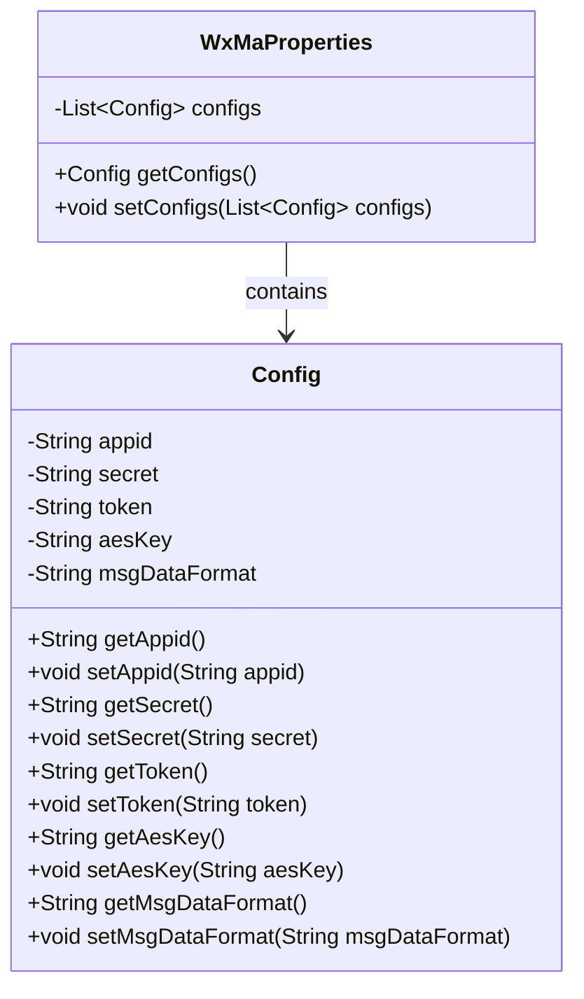
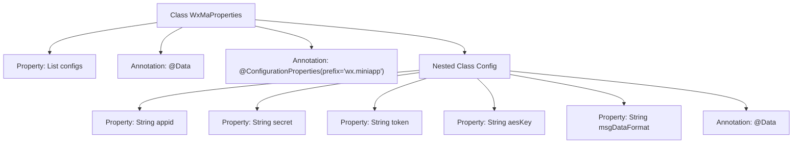

# Basic Information

|      |      |
|------|------|
| Name | WxMaProperties |
| Language | .java |
| Code Path | weixin-java-miniapp-demo/src/main/java/com/github/binarywang/demo/wx/miniapp/config/WxMaProperties.java |
| Package Name | com.github.binarywang.demo.wx.miniapp.config |
| Dependencies | ['java.util.List', 'org.springframework.boot.context.properties.ConfigurationProperties', 'lombok.Data'] |
| Brief Description | The WxMaProperties class defines the configuration properties for WeChat Mini Programs, containing multiple Config objects. Each Config object includes fields such as appid, secret, token, aesKey, and msgDataFormat. |

# Description

The content defines a Java class named WxMaProperties, which is used to configure the properties related to WeChat Mini Programs. The class utilizes the @Data and @ConfigurationProperties annotations, with the prefix set to wx.miniapp. It includes a list of Config type named configs, where each Config object contains five fields: appid (Mini Program ID), secret (Mini Program secret key), token (message server token), aesKey (message encryption key), and msgDataFormat (message format, either XML or JSON). These fields are used to configure the basic information and message server settings for WeChat Mini Programs.

# Class Summary

| Name   | Type  | Description |
|-------|------|-------------|
| WxMaProperties | class | The WxMaProperties class defines the configuration properties for WeChat Mini Programs, containing multiple Config objects, each of which stores configuration information such as appid, secret, token, aesKey, and msgDataFormat. |

## Class WxMaProperties

|      |      |
|------|------|
| Access Modifier | @Data;@ConfigurationProperties(prefix = "wx.miniapp");public |
| Type | class |
| Name | WxMaProperties |
| Description | The WxMaProperties class defines the configuration properties for WeChat Mini Programs, containing multiple Config objects, each of which stores configuration information such as appid, secret, token, aesKey, and msgDataFormat. |

### UML Class Diagram

This code demonstrates the structure of a WeChat Mini Program configuration class WxMaProperties and its nested configuration class Config. WxMaProperties uses the @ConfigurationProperties annotation to bind configurations with the "wx.miniapp" prefix, containing a list of Config type. The Config class encapsulates core configuration items of the Mini Program such as appid, secret, token, etc., with all fields generating getters/setters via Lombok. The class diagram clearly reflects the containment relationship between the main configuration class and nested configuration items, as well as the access control permissions of each property.

### Internal Method Call Graph

This code defines a WxMaProperties class for configuring WeChat Mini Program related properties. The class uses Lombok's @Data annotation to automatically generate getter/setter methods and binds configurations with the "wx.miniapp" prefix via @ConfigurationProperties. It contains a nested static Config class with core Mini Program configuration items like appid, secret, and token, also annotated with @Data. The flowchart clearly illustrates the class structure, property relationships, and annotation hierarchy, demonstrating a typical design pattern for configuration classes.

### Field List

| Name  | Type  | Description |
|-------|-------|------|
| configs | List<Config> | Declare a private list variable named configs to store objects of type Config. |

### Method List

| Name  | Type  | Description |
|-------|-------|------|

