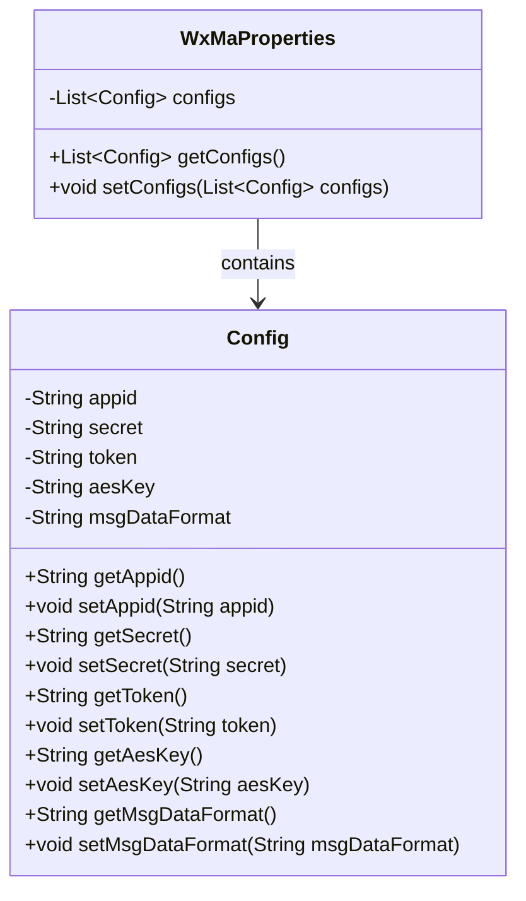
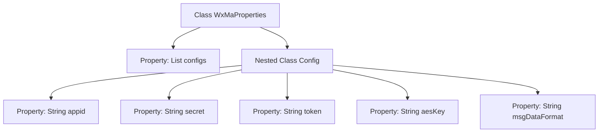

# Basic Information

|      |      |
|------|------|
| Name | WxMaProperties |
| Language | .java |
| Code Path | weixin-java-miniapp-demo/src/main/java/com/github/binarywang/demo/wx/miniapp/config/WxMaProperties.java |
| Package Name | com.github.binarywang.demo.wx.miniapp.config |
| Dependencies | ['java.util.List', 'org.springframework.boot.context.properties.ConfigurationProperties', 'lombok.Data'] |
| Brief Description | The WxMaProperties class is used to configure WeChat Mini Program attributes, containing multiple Config items, each with fields such as appid, secret, token, aesKey, and msgDataFormat. |

# Description

The content defines a WeChat Mini Program configuration property class named WxMaProperties, which uses the @ConfigurationProperties annotation to bind configurations prefixed with `wx.miniapp`. The class includes a list of Config type named `configs`, used to store configurations for multiple Mini Programs. Each Config consists of five fields: `appid` (Mini Program ID), `secret` (Mini Program secret key), `token` (message server token), `aesKey` (message encryption key), and `msgDataFormat` (message format, XML or JSON). The @Data annotation automatically generates getter/setter methods. The overall structure supports multi-Mini Program configuration management.

# Class Summary

| Name   | Type  | Description |
|-------|------|-------------|
| WxMaProperties | class | The WxMaProperties class defines the configuration properties for WeChat Mini Programs, containing multiple Config objects. Each Config object includes fields such as appid, secret, token, aesKey, and msgDataFormat. |

## Class WxMaProperties

|      |      |
|------|------|
| Access Modifier | @Data;@ConfigurationProperties(prefix = "wx.miniapp");public |
| Type | class |
| Name | WxMaProperties |
| Description | The WxMaProperties class defines the configuration properties for WeChat Mini Programs, containing multiple Config objects. Each Config object includes fields such as appid, secret, token, aesKey, and msgDataFormat. |

### UML Class Diagram

This code defines a WeChat Mini Program configuration class WxMaProperties, which uses the @ConfigurationProperties annotation to bind configurations with the "wx.miniapp" prefix. The inner static class Config encapsulates core Mini Program configuration items: appid, secret, token, aesKey, and message format msgDataFormat. The class diagram shows that WxMaProperties contains multiple Config objects through an aggregation relationship, with all fields automatically generating getter/setter methods via Lombok's @Data annotation, enabling convenient management of configuration properties. This structure supports multiple Mini Program configurations and is suitable for Spring Boot application scenarios that require managing parameters for multiple WeChat Mini Programs.

### Internal Method Call Graph

This code defines a Spring Boot configuration class WxMaProperties for mapping configuration items prefixed with wx.miniapp. The core structure consists of a main configuration class and a nested static Config class. The main class manages multiple mini-program configurations through the configs list, with each Config object storing key parameters such as appid, secret, token, aesKey, and msgDataFormat. The use of Lombok's @Data annotation automatically generates getter/setter methods, simplifying the encapsulation logic of configuration properties.

### Field List

| Name  | Type  | Description |
|-------|-------|------|
| configs | List<Config> | List of private configuration variables `configs`. |

### Method List

| Name  | Type  | Description |
|-------|-------|------|

