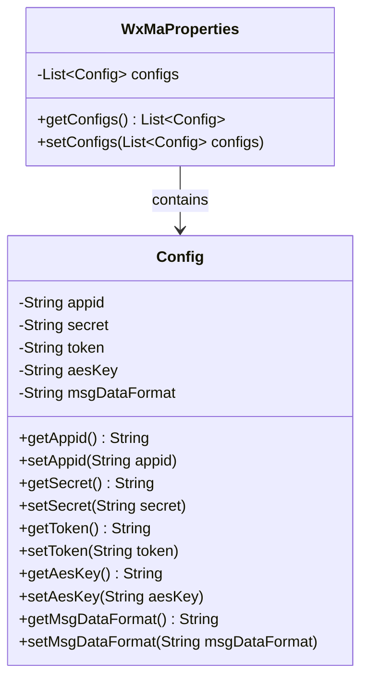
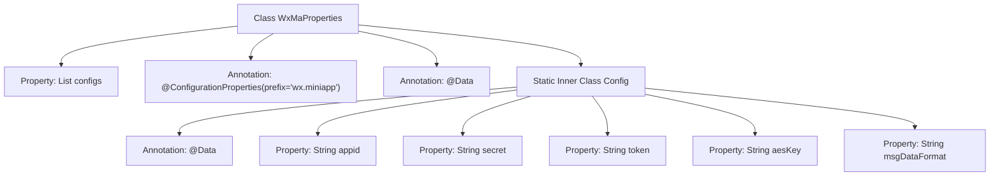

# Basic Information

|      |      |
|------|------|
| Name | WxMaProperties |
| Language | .java |
| Code Path | weixin-java-miniapp-demo/src/main/java/com/github/binarywang/demo/wx/miniapp/config/WxMaProperties.java |
| Package Name | com.github.binarywang.demo.wx.miniapp.config |
| Dependencies | ['java.util.List', 'org.springframework.boot.context.properties.ConfigurationProperties', 'lombok.Data'] |
| Brief Description | The WxMaProperties class is used to configure WeChat Mini Program attributes, including fields such as appid, secret, token, aesKey, and msgDataFormat. |

# Description

This is a Java class definition for configuring properties of a WeChat Mini Program. The main class `WxMaProperties` uses the `@ConfigurationProperties` annotation to bind configurations with the `wx.miniapp` prefix, containing a list of `Config` type named `configs`. The static inner class `Config` defines Mini Program-related configuration items: `appid` (Mini Program ID), `secret` (Mini Program secret key), `token` (message server token), `aesKey` (message encryption key), and `msgDataFormat` (message format XML/JSON). All fields are annotated with `@Data` to automatically generate getter/setter methods.

# Class Summary

| Name   | Type  | Description |
|-------|------|-------------|
| WxMaProperties | class | The WxMaProperties class is used to configure WeChat Mini Program attributes, containing multiple Config items, each of which includes fields such as appid, secret, token, aesKey, and msgDataFormat. |

## Class WxMaProperties

|      |      |
|------|------|
| Access Modifier | @Data;@ConfigurationProperties(prefix = "wx.miniapp");public |
| Type | class |
| Name | WxMaProperties |
| Description | The WxMaProperties class is used to configure WeChat Mini Program attributes, containing multiple Config items, each of which includes fields such as appid, secret, token, aesKey, and msgDataFormat. |

### UML Class Diagram

This code defines a WeChat Mini Program configuration class WxMaProperties, which uses the @ConfigurationProperties annotation to bind configurations with the "wx.miniapp" prefix. It includes a static nested class Config for storing core configuration items of a single mini program such as appid, secret, token, etc. WxMaProperties supports multiple mini program configurations through List<Config> and leverages Lombok's @Data annotation to automatically generate getter/setter methods. The class diagram clearly illustrates the aggregation relationship between WxMaProperties and Config, as well as all string-type configuration fields within the Config class.

### Internal Method Call Graph

This code defines a Spring Boot configuration class WxMaProperties for mapping configuration items with the 'wx.miniapp' prefix. The class contains a list of Config static inner class, which encapsulates five core configuration parameters required by WeChat Mini Program: appid, secret, token, aesKey, and msgDataFormat. The @Data annotation from Lombok automatically generates getter/setter methods, while the @ConfigurationProperties annotation enables automatic configuration binding. This structure supports multiple mini-program configurations, with each Config instance corresponding to a set of configuration parameters for one mini-program.

### Field List

| Name  | Type  | Description |
|-------|-------|------|
| configs | List<Config> | Private configuration list, storing a collection of Config objects. |

### Method List

| Name  | Type  | Description |
|-------|-------|------|

