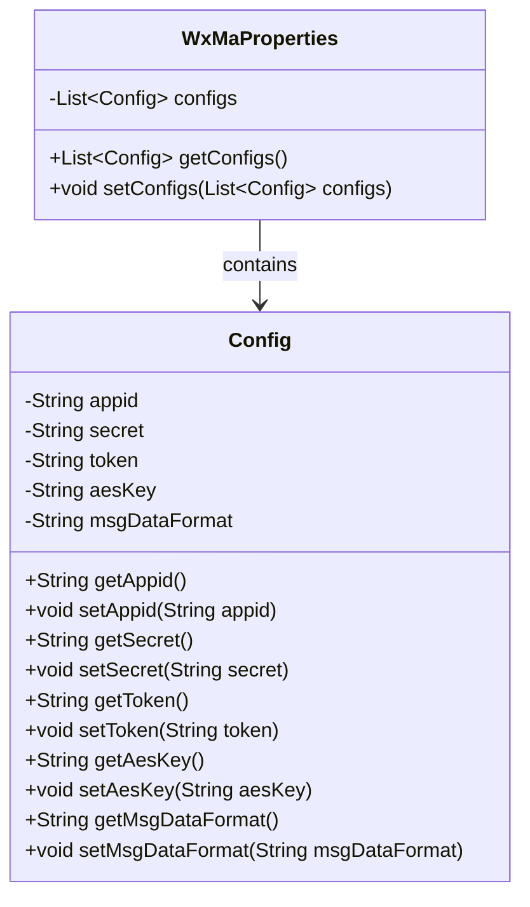
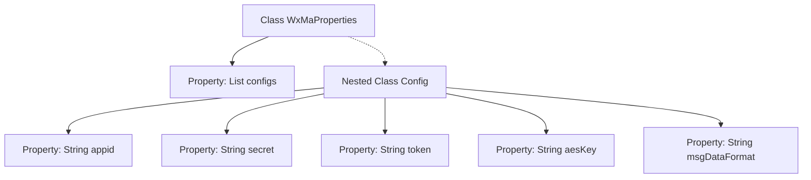

# Basic Information

|      |      |
|------|------|
| Name | WxMaProperties |
| Language | .java |
| Code Path | weixin-java-miniapp-demo/src/main/java/com/github/binarywang/demo/wx/miniapp/config/WxMaProperties.java |
| Package Name | com.github.binarywang.demo.wx.miniapp.config |
| Dependencies | ['java.util.List', 'org.springframework.boot.context.properties.ConfigurationProperties', 'lombok.Data'] |
| Brief Description | This is a WeChat Mini Program configuration class, which includes multiple Mini Program configuration items. Each configuration item has fields such as appid, secret, token, aesKey, and message format msgDataFormat. |

# Description

This is a Java class used for configuring properties related to WeChat Mini Programs. The main class, `WxMaProperties`, utilizes the `@ConfigurationProperties` annotation with the prefix `wx.miniapp` and contains a list of `Config` type named `configs`. The `Config` class defines the core configuration items for WeChat Mini Programs: `appid` (Mini Program ID), `secret` (Mini Program secret key), `token` (message server token), `aesKey` (message encryption key), and `msgDataFormat` (message format, supporting XML or JSON). All fields automatically generate getter and setter methods via Lombok's `@Data` annotation.

# Class Summary

| Name   | Type  | Description |
|-------|------|-------------|
| WxMaProperties | class | The WxMaProperties class defines the configuration properties for WeChat Mini Programs, containing multiple Config objects, each of which sets parameters such as appid, secret, token, aesKey, and msgDataFormat. |

## Class WxMaProperties

|      |      |
|------|------|
| Access Modifier | @Data;@ConfigurationProperties(prefix = "wx.miniapp");public |
| Type | class |
| Name | WxMaProperties |
| Description | The WxMaProperties class defines the configuration properties for WeChat Mini Programs, containing multiple Config objects, each of which sets parameters such as appid, secret, token, aesKey, and msgDataFormat. |

### UML Class Diagram

This code describes a WeChat Mini Program configuration class WxMaProperties, which contains a list of Config classes named configs. The Config class encapsulates core configuration items of the WeChat Mini Program, including attributes such as appid, secret, token, aesKey, and msgDataFormat. The WxMaProperties class is bound to configuration files through the @ConfigurationProperties annotation, with Config serving as its internal static class, forming a composition relationship between the two. All fields automatically generate getter and setter methods via Lombok's @Data annotation, simplifying the code structure.

### Internal Method Call Graph

This flowchart illustrates the structure of the WxMaProperties class and its nested Config class. As the main configuration class, WxMaProperties contains a configs property of type List<Config>. The Config class defines five core configuration properties for WeChat Mini Programs: appid (application ID), secret (application secret), token (message verification token), aesKey (encryption key), and msgDataFormat (message format). Through the @ConfigurationProperties annotation, this class supports automatic injection of property values prefixed with "wx.miniapp" from configuration files.

### Field List

| Name  | Type  | Description |
|-------|-------|------|
| configs | List<Config> | Private configuration list. |

### Method List

| Name  | Type  | Description |
|-------|-------|------|

