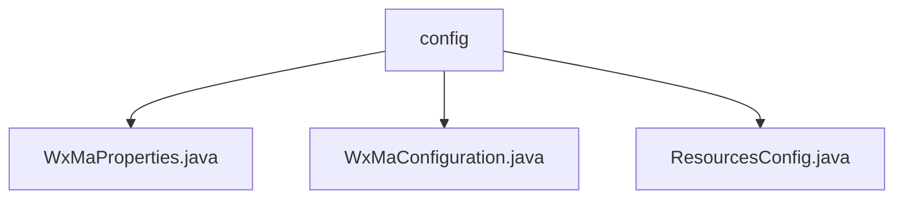

# Basic Information

|      |      |
|------|------|
| Name | config |
| Language | .java |
| Code Path | weixin-java-miniapp-demo/src/main/java/com/github/binarywang/demo/wx/miniapp/config |
| Package Name | docs.src.main.java.com.github.binarywang.demo.wx.miniapp.config |
| Brief Description | WeChat Mini Program Java Configuration Classes: WxMaProperties defines core configuration items for mini programs; WxMaConfiguration initializes multi-account services and message routing; ResourcesConfig configures local file storage and cross-origin access. |

# Description

## Overview  
This module serves as a Java configuration center for the backend of WeChat Mini Programs, with its core responsibilities including managing Mini Program account configurations, initializing service instances, and handling message routing. The interface specifications uniformly adopt the Spring Boot configuration style, such as using `@ConfigurationProperties` to define Mini Program attributes and `WebMvcConfigurer` to handle resource mapping. Key data structures include `WxMaProperties.Config` (containing fields like appid/secret) and message router rules. External dependencies include Spring Boot, Lombok, and the WeChat SDK. For example, `msgDataFormat` configures message formats, or cross-origin settings allow GET access to resources.

## Core Business Scenarios  
The module supports multi-account Mini Program service initialization, similar to the microservice configuration center model. The business workflow includes: validating configurations → creating service instances → registering message handlers (e.g., text/image processing). The interaction mode is annotation-driven, such as injecting file paths via `@Value`. Typical applications include configuring bulk messages, generating QR codes, and other WeChat ecosystem features. API types cover REST resource mapping (e.g., local file access) and message routing APIs (e.g., subscription message callbacks). For example, after an image upload, the media file handler is triggered, and a CDN link is returned.

### Package Internal Structure View

This flowchart illustrates the file structure relationships within the config directory of the WeChat Mini Program demo project. The top-level node is the config folder, which contains three configuration files: WxMaProperties.java, WxMaConfiguration.java, and ResourcesConfig.java. These files belong to the basic configuration classes of the WeChat Mini Program, handling different aspects of configuration information, and together form the configuration module of the project.

# File List

| Name   | Type  | Description |
|-------|------|-------------|
| [WxMaProperties.java](WxMaProperties.md) | file | This is a WeChat Mini Program configuration class, which includes multiple Mini Program configuration items. Each configuration item has fields such as appid, secret, token, aesKey, and message format msgDataFormat. |
| [WxMaConfiguration.java](WxMaConfiguration.md) | file | This is a WeChat Mini Program configuration class that includes service initialization and message routing setup. It loads configurations via WxMaProperties and creates a WxMaService instance to handle multi-account configurations. The message router defines processing logic for different content types, including subscription messages, text, images, and QR code response handling. |
| [ResourcesConfig.java](ResourcesConfig.md) | file | Resource configuration class, defining local file paths and prefixes, mapping resource paths, and enabling cross-origin support to allow GET request access. |

