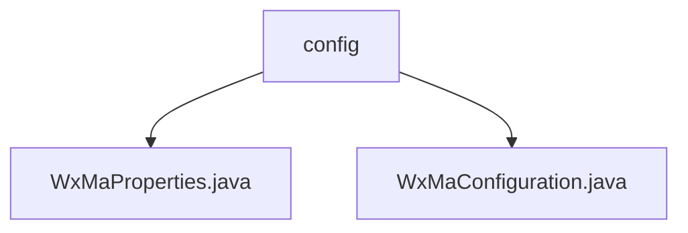

# Basic Information

|      |      |
|------|------|
| Name | config |
| Language | .java |
| Code Path | weixin-java-miniapp-demo/src/main/java/com/github/binarywang/demo/wx/miniapp/config |
| Package Name | docs.src.main.java.com.github.binarywang.demo.wx.miniapp.config |
| Brief Description | WeChat Mini Program Java configuration classes: WxMaProperties binds Mini Program configuration items (ID, secret key, etc.), WxMaConfiguration initializes services and handles message routing (text, image reply logic, etc.). |

# Description

## Overview  
This module is a Java implementation of the backend service for WeChat Mini Programs, with its core responsibilities being the management of Mini Program configuration properties and the initialization of message handling services. The interface specifications include injecting configurations via the `wx.miniapp` prefix and defining message routing rule chains. The key data structure is the `WxMaProperties.Config` class, which contains fields such as AppID and secret keys. External dependencies include Spring configuration annotations, Lombok, and the WeChat SDK. For example, the configuration class supports multi-account parameter validation, and the message handler implements logic such as QR code generation.  

## Main Business Scenarios  
The module primarily handles Mini Program service initialization and message interactions, resembling an event bus pattern. The business process includes loading configurations, creating `WxMaService` instances, and registering message handler chains. Interaction modes cover scenarios such as text/image replies and subscription message pushes. For instance, the image handler uploads media files, while the QR code handler generates parameterized QR codes. API types focus on Mini Program service configuration and message routing, with integration examples demonstrating multi-account management and chained message responses.

### Package Internal Structure View

This flowchart illustrates the hierarchical structure of the configuration module in the WeChat Mini Program demo project. The root node is the config directory, which contains two Java configuration files: WxMaProperties.java and WxMaConfiguration.java. These files handle Mini Program property configuration and overall configuration logic respectively, collectively forming the foundational configuration module of the project. The clear structure reflects the organization of configuration files, adhering to the configuration management standards typical of Spring Boot applications.

# File List

| Name   | Type  | Description |
|-------|------|-------------|
| [WxMaProperties.java](WxMaProperties.md) | file | The WxMaProperties class is used to configure WeChat Mini Program properties, including fields such as appid, secret, token, aesKey, and msgDataFormat. |
| [WxMaConfiguration.java](WxMaConfiguration.md) | file | WeChat Mini Program configuration class, including service initialization and message routing setup, supporting various message processing such as text, images, QR codes, etc. |

