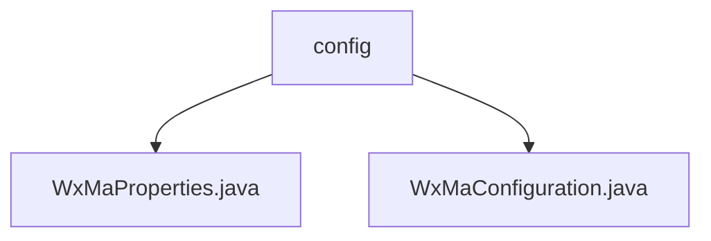

# Basic Information

|      |      |
|------|------|
| Name | config |
| Language | .java |
| Code Path | weixin-java-miniapp-demo/src/main/java/com/github/binarywang/demo/wx/miniapp/config |
| Package Name | docs.src.main.java.com.github.binarywang.demo.wx.miniapp.config |
| Brief Description | The WxMaProperties class configures WeChat Mini Program attributes, including fields such as appid and secret. The WxMaConfiguration class initializes Mini Program services, sets message routing rules, and processes messages like text and images. |

# Description

## Overview  
This module serves as the configuration center for WeChat Mini Program backend services, with its core responsibilities being the management of multi-account configurations and message routing rules. The WxMaProperties class defines the basic attributes of the Mini Program (such as AppID/Secret), while the WxMaConfiguration class handles service initialization and message processing. Key data structures include a Config list (containing 5 authentication fields) and a message router (similar to an event bus pattern). The only dependency is the WeChat SDK. For example, it supports dynamic loading of multiple accounts, and message processing covers scenarios such as text, images, and QR codes.  

## Main Business Scenarios  
The module primarily handles two types of processes: 1) Validating configurations and creating WxMaService instances during service initialization; 2) Invoking corresponding handlers based on message types during message routing (e.g., uploading images to a temporary media library). The typical interaction pattern is: user message → matching handler → response via the customer service API. For instance, a QR code message triggers the generation and return of an image URL, while subscription messages automatically reply with preset content. The full functionality covers the entire chain from service configuration to message distribution.

### Package Internal Structure View

This flowchart illustrates the hierarchical structure of the configuration module in the WeChat Mini Program demo project. The root node is the config directory, which contains two Java configuration files: WxMaProperties.java for property configuration and WxMaConfiguration.java for implementing core configuration logic. This structure reflects a typical organization of configuration classes in Spring Boot projects.

# File List

| Name   | Type  | Description |
|-------|------|-------------|
| [WxMaProperties.java](WxMaProperties.md) | file | The WxMaProperties class defines the configuration properties for WeChat Mini Programs, containing multiple Config objects. Each Config object includes fields such as appid, secret, token, aesKey, and msgDataFormat. |
| [WxMaConfiguration.java](WxMaConfiguration.md) | file | WeChat Mini Program configuration class, initializes services and message routing, handles subscription, text, image, and QR code messages. |

