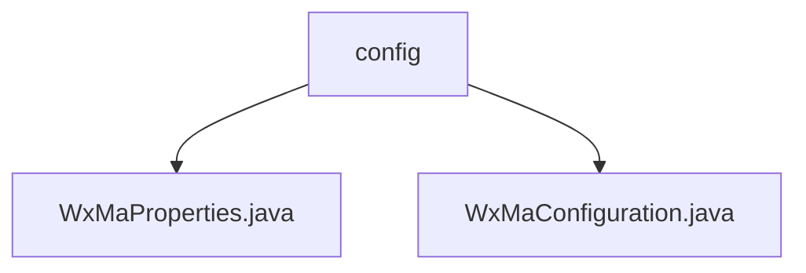

# Basic Information

|      |      |
|------|------|
| Name | config |
| Language | .java |
| Code Path | weixin-java-miniapp-demo/src/main/java/com/github/binarywang/demo/wx/miniapp/config |
| Package Name | docs.src.main.java.com.github.binarywang.demo.wx.miniapp.config |
| Brief Description | The WxMaProperties class configures WeChat Mini Program attributes, including fields such as appid and secret. The WxMaConfiguration class initializes Mini Program services and message routing, handling message types like subscriptions and text, with exception handling included. |

# Description

## Overview  
This module serves as the configuration center for the backend services of WeChat Mini Programs. Its core responsibility is to manage multi-account Mini Program configurations and initialize message processing services. The interface specification follows Spring Boot configuration binding, loading configuration items prefixed with `wx.miniapp` via `@ConfigurationProperties`. Key data structures include the `Config` list within `WxMaProperties`, which contains authentication fields such as AppID and Secret, as well as message format settings. External dependencies primarily include the WeChat Mini Program Java SDK and the Spring Boot configuration module. For example, it supports XML/JSON message format configurations and validates field effectiveness.  

## Main Business Scenarios  
The module is used to rapidly initialize service instances for multiple Mini Program accounts, resembling a factory pattern, while constructing a chain of message routing rules. The business process includes: reading configurations → validating parameters → creating services → registering handlers (e.g., subscription messages, image uploads). The interaction mode matches message types through routing rules and dispatches them to corresponding handlers, similar to an event bus pattern. Typical applications include sending customer service messages and generating QR codes. For instance, it captures `WxErrorException` to uniformly handle WeChat API exceptions.

### Package Internal Structure View

This flowchart illustrates the file structure of the configuration module in the WeChat Mini Program demo project. The config directory contains two Java configuration files: WxMaProperties.java stores the Mini Program property configurations, while WxMaConfiguration.java handles the initialization of Mini Program-related configurations. This structure clearly separates configuration properties from configuration logic.

# File List

| Name   | Type  | Description |
|-------|------|-------------|
| [WxMaProperties.java](WxMaProperties.md) | file | The WxMaProperties class defines the configuration properties for WeChat Mini Programs, containing multiple Config objects. Each Config object includes fields such as appid, secret, token, aesKey, and msgDataFormat. |
| [WxMaConfiguration.java](WxMaConfiguration.md) | file | WeChat Mini Program configuration class, including service initialization and message routing setup. It loads configurations via WxMaProperties, creates WxMaService to handle multiple accounts, and defines message handlers to process subscription, text, image, and QR code messages. |

