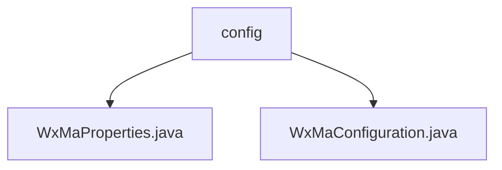

# Basic Information

|      |      |
|------|------|
| Name | config |
| Language | .java |
| Code Path | weixin-java-miniapp-demo/src/main/java/com/github/binarywang/demo/wx/miniapp/config |
| Package Name | docs.src.main.java.com.github.binarywang.demo.wx.miniapp.config |
| Brief Description | The configuration class WxMaProperties for WeChat Mini Program is bound to the prefix wx.miniapp, containing a list of multiple mini-program configurations. Each configuration includes fields such as appid and secret. The WxMaConfiguration class initializes mini-program services and configures message routing, handling message types like text and images, and includes upload and generation functionalities. |

# Description

## Overview  
The core responsibility of this module is to manage multi-account configurations and message routing for WeChat Mini Programs, supporting dynamic service initialization and handling various message events. It utilizes Spring Boot's @ConfigurationProperties for configuration binding and employs a factory-like pattern to create multi-instance services. Key data structures include WxMaProperties.Config (containing fields such as appid/secret) and handler mappings defined by the message router. The only external dependency is the WeChat Mini Program SDK. For example, Config stores Mini Program credentials, while message handlers process operations like image uploads.  

## Key Business Scenarios  
The module primarily implements centralized configuration and message distribution for multiple Mini Program accounts, resembling an event bus pattern. Business processes include: validating configurations and creating service instances during initialization; routing messages to corresponding handlers based on type (text/image, etc.), such as triggering media upload and generating responses for QR code messages. Integration examples demonstrate five types of message processing, all following the "receive-process-log" pattern, with exceptions logged without interrupting the workflow.

### Package Internal Structure View

This flowchart illustrates the hierarchical structure of the configuration module in the WeChat Mini Program Demo project. The root node is the config directory, which contains two Java configuration files: WxMaProperties.java stores Mini Program property configurations, while WxMaConfiguration.java is responsible for initializing WeChat Mini Program-related configurations. This structure clearly demonstrates a typical organization of configuration classes in Spring Boot projects, separating different configuration concerns through independent files.

# File List

| Name   | Type  | Description |
|-------|------|-------------|
| [WxMaProperties.java](WxMaProperties.md) | file | The WxMaProperties class is used to configure WeChat Mini Program properties, containing multiple Config items, each with fields such as appid, secret, token, aesKey, and msgDataFormat. |
| [WxMaConfiguration.java](WxMaConfiguration.md) | file | WeChat Mini Program configuration class, initializes WxMaService and message routing, handles message types such as subscriptions, text, images, QR codes, etc. |

