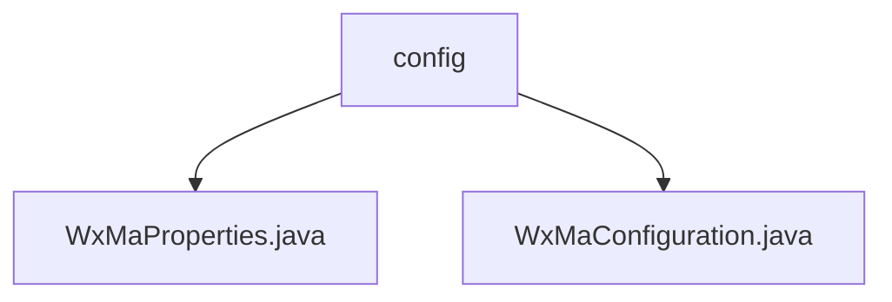

# Basic Information

|      |      |
|------|------|
| Name | config |
| Language | .java |
| Code Path | weixin-java-miniapp-demo/src/main/java/com/github/binarywang/demo/wx/miniapp/config |
| Package Name | docs.src.main.java.com.github.binarywang.demo.wx.miniapp.config |
| Brief Description | The WxMaProperties class configures WeChat Mini Program attributes, including fields such as appid and secret. The WxMaConfiguration class initializes Mini Program services and message routing, defining the logic for various message handlers. |

# Description

## Overview  
This module is a Java configuration implementation for the WeChat Mini Program server, with its core responsibilities being the management of multi-account configurations and the initialization of message processing services. The interface specifications adhere to Spring Boot's @ConfigurationProperties standard and support XML/JSON message formats. Key data structures include WxMaProperties (containing a Config list) and message router rules. External dependencies include Lombok and the WeChat SDK. For example, the Config class defines fields such as appid/secret, while the message router handles subscription messages and media files.  

## Main Business Scenarios  
The module primarily handles the initialization of multi-account services for Mini Programs and the configuration of message routing, similar to the factory pattern for creating service instances. The business process includes configuration validation, service instantiation, and handler registration. For instance, text messages trigger customer service responses, and QR code generation utilizes the Media API. The typical application pattern involves loading configurations at startup and distributing messages to corresponding handlers via the router during runtime. API types cover RESTful configurations and event callbacks, with integration examples including subscription message pushes and media file management.

### Package Internal Structure View

This flowchart illustrates the hierarchical structure of the configuration module in the WeChat Mini Program demo project. The config directory contains two Java configuration files: WxMaProperties.java stores the mini program's property configurations, while WxMaConfiguration.java handles the initialization settings for the mini program service. Together, these two files form the foundational configuration system of the mini program.

# File List

| Name   | Type  | Description |
|-------|------|-------------|
| [WxMaProperties.java](WxMaProperties.md) | file | This is a WeChat Mini Program configuration class, which includes multiple Mini Program configuration items. Each configuration item has fields such as appid, secret, token, aesKey, and message format msgDataFormat. |
| [WxMaConfiguration.java](WxMaConfiguration.md) | file | This is a WeChat Mini Program configuration class that includes service initialization and message routing setup. It loads configurations via WxMaProperties and creates a WxMaService instance to handle multi-account configurations. The message router defines processing logic for different content types, including subscription messages, text, images, and QR code response handling. |

