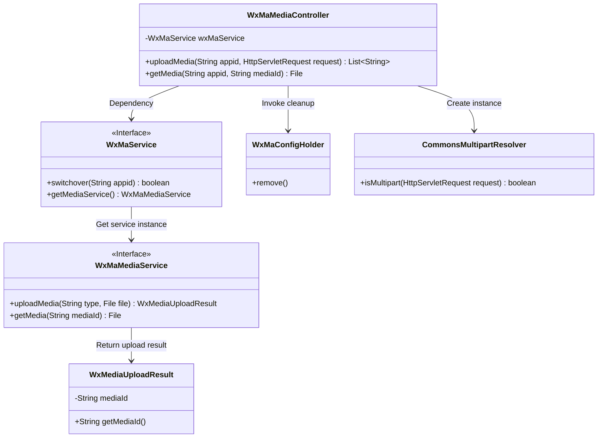
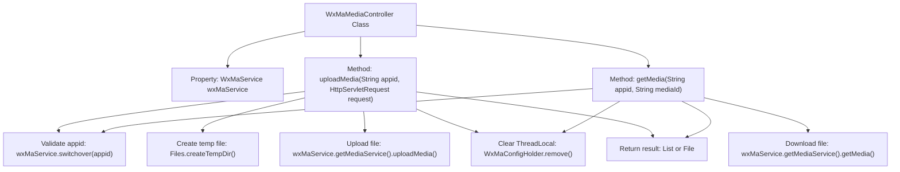

# Basic Information

|      |      |
|------|------|
| Name | WxMaMediaController |
| Language | .java |
| Code Path | weixin-java-miniapp-demo/src/main/java/com/github/binarywang/demo/wx/miniapp/controller/WxMaMediaController.java |
| Package Name | com.github.binarywang.demo.wx.miniapp.controller |
| Dependencies | ['cn.binarywang.wx.miniapp.api.WxMaService', 'cn.binarywang.wx.miniapp.constant.WxMaConstants', 'cn.binarywang.wx.miniapp.util.WxMaConfigHolder', 'com.google.common.collect.Lists', 'com.google.common.io.Files', 'lombok.AllArgsConstructor', 'lombok.extern.slf4j.Slf4j', 'me.chanjar.weixin.common.bean.result.WxMediaUploadResult', 'me.chanjar.weixin.common.error.WxErrorException', 'org.springframework.web.bind.annotation', 'org.springframework.web.multipart.MultipartFile', 'org.springframework.web.multipart.MultipartHttpServletRequest', 'org.springframework.web.multipart.commons.CommonsMultipartResolver', 'javax.servlet.http.HttpServletRequest', 'java.io.File', 'java.io.IOException', 'java.util.Iterator', 'java.util.List'] |
| Brief Description | This is a WeChat Mini Program media controller class that includes functionality for uploading and downloading temporary materials. The upload method accepts an appid and request, verifies the configuration, processes multi-file uploads, and returns a list of media_ids. The download method retrieves material files based on appid and mediaId. It cleans up ThreadLocal after operations. |

# Description

This is a controller class for media file management in a WeChat Mini Program, which includes functionalities for uploading and downloading temporary materials. The upload feature receives multiple files via a POST request, verifies the validity of the appid, saves the files to a temporary directory, and uploads them to the WeChat server, returning a list of media_ids. The download feature retrieves the corresponding media file via a GET request based on the mediaId. Both operations clean up the configuration information in ThreadLocal upon completion. The class logs critical operation information and handles exception cases.

# Class Summary

| Name   | Type  | Description |
|-------|------|-------------|
| WxMaMediaController | class | WxMaMediaController handles the uploading and downloading of temporary media files for WeChat Mini Programs. The upload interface receives files and returns a media_id, while the download interface retrieves files based on the media_id. It includes appid verification and ThreadLocal cleanup. |

## Class WxMaMediaController

|      |      |
|------|------|
| Access Modifier | @RestController;@AllArgsConstructor;@Slf4j;@RequestMapping("/wx/media/{appid}");public |
| Type | class |
| Name | WxMaMediaController |
| Description | WxMaMediaController handles the uploading and downloading of temporary media files for WeChat Mini Programs. The upload interface receives files and returns a media_id, while the download interface retrieves files based on the media_id. It includes appid verification and ThreadLocal cleanup. |

### UML Class Diagram

This class diagram illustrates the core structure of WeChat Mini Program media management controller. WxMaMediaController serves as a REST controller, operating media services through the WxMaService interface, relying on CommonsMultipartResolver for file upload processing, and utilizing WxMaConfigHolder for thread-local variable management. The WxMaMediaService interface defines media upload/download methods, returning WxMediaUploadResult objects containing media IDs. The entire design adopts a layered architecture with decoupled controller and business service layers, conforming to typical Spring MVC patterns.

### Internal Method Call Graph

Flowchart Description: This flowchart illustrates the core structure of the WxMaMediaController class, featuring two main methods: uploadMedia and getMedia. The upload process begins with appid validation, handles multipart requests, iteratively uploads files to a temporary directory, and finally returns a list of media_ids. The download process similarly validates the appid before directly retrieving the media file. Both methods include ThreadLocal cleanup operations to ensure thread safety. Arrows clearly depict the complete chain from method invocation to result return.

### Field List

| Name  | Type  | Description |
|-------|-------|------|
| wxMaService | WxMaService | A private immutable WeChat Mini Program service instance variable wxMaService. |

### Method List

| Name  | Type  | Description |
|-------|-------|------|
| uploadMedia | List<String> | Java Method: Handle WeChat Mini Program media file uploads, validate appid, parse multipart requests, save temporary files, and return a list of media IDs. |
| getMedia | File | The code is a Spring-based GET interface designed for downloading media files. It first checks if the appid configuration exists, throwing an exception if not. If the configuration exists, it retrieves the media file via the WeChat service, finally cleans up the ThreadLocal, and returns the file. |

