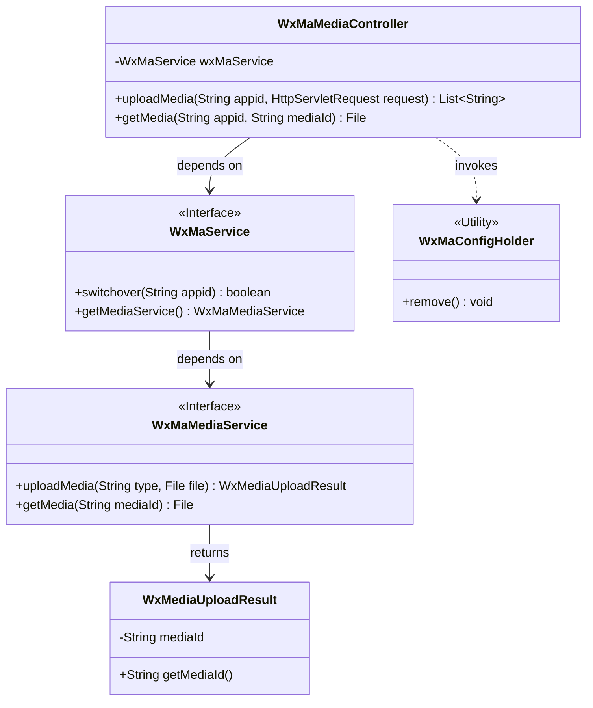
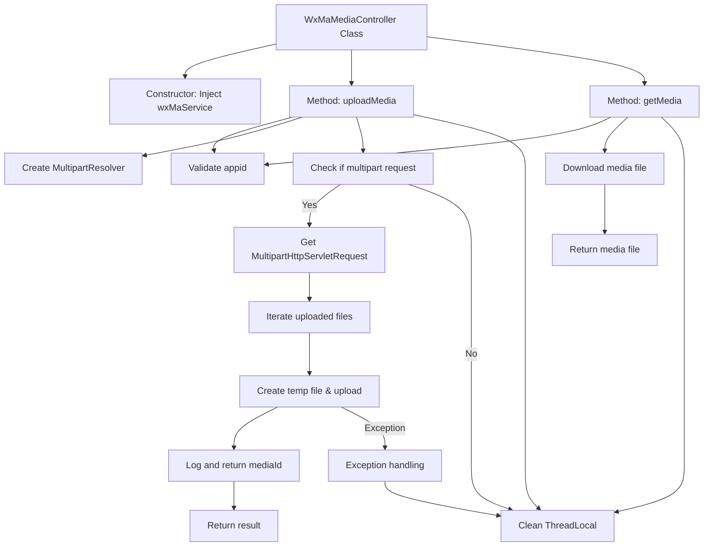

# Basic Information

|      |      |
|------|------|
| Name | WxMaMediaController |
| Language | .java |
| Code Path | weixin-java-miniapp-demo/src/main/java/com/github/binarywang/demo/wx/miniapp/controller/WxMaMediaController.java |
| Package Name | com.github.binarywang.demo.wx.miniapp.controller |
| Dependencies | ['cn.binarywang.wx.miniapp.api.WxMaService', 'cn.binarywang.wx.miniapp.constant.WxMaConstants', 'cn.binarywang.wx.miniapp.util.WxMaConfigHolder', 'com.google.common.collect.Lists', 'com.google.common.io.Files', 'lombok.AllArgsConstructor', 'lombok.extern.slf4j.Slf4j', 'me.chanjar.weixin.common.bean.result.WxMediaUploadResult', 'me.chanjar.weixin.common.error.WxErrorException', 'org.springframework.web.bind.annotation', 'org.springframework.web.multipart.MultipartFile', 'org.springframework.web.multipart.MultipartHttpServletRequest', 'org.springframework.web.multipart.commons.CommonsMultipartResolver', 'javax.servlet.http.HttpServletRequest', 'java.io.File', 'java.io.IOException', 'java.util.Iterator', 'java.util.List'] |
| Brief Description | WeChat Mini Program Media Controller, providing functionality for uploading and downloading temporary materials. Uploading returns a list of media_ids, while downloading returns media files. It checks the validity of the appid, handles multi-file uploads, and cleans up ThreadLocal resources. |

# Description

This is a controller class for media file management in a WeChat Mini Program, which includes functionalities for uploading and downloading temporary materials. The upload interface accepts multipart file requests, verifies the appid configuration, saves the files to a temporary directory, and uploads them to the WeChat server, returning a list of media_ids. The download interface retrieves the corresponding media file based on the mediaId. Both operations include ThreadLocal cleanup logic to ensure thread safety. The upload process records file paths and media_ids, and logs error messages in case of exceptions.

# Class Summary

| Name   | Type  | Description |
|-------|------|-------------|
| WxMaMediaController | class | WeChat Mini Program Media Controller, providing functionality for uploading and downloading temporary materials. Upload requires appid verification, supports multi-file processing, and returns a list of media_ids. Download requires verification of both appid and media_id, returning the media file. Clears ThreadLocal after operations. |

## Class WxMaMediaController

|      |      |
|------|------|
| Access Modifier | @RestController;@AllArgsConstructor;@Slf4j;@RequestMapping("/wx/media/{appid}");public |
| Type | class |
| Name | WxMaMediaController |
| Description | WeChat Mini Program Media Controller, providing functionality for uploading and downloading temporary materials. Upload requires appid verification, supports multi-file processing, and returns a list of media_ids. Download requires verification of both appid and media_id, returning the media file. Clears ThreadLocal after operations. |

### UML Class Diagram

Class Diagram Description: This diagram illustrates the structure of a WeChat Mini Program media controller (WxMaMediaController), which operates media services through the WxMaService interface, including methods for uploading and downloading temporary materials. The controller relies on WxMaService to switch application configurations and obtain media service instances. The WxMaMediaService interface defines specific media operations and returns WxMediaUploadResult objects. WxMaConfigHolder serves as a utility class for cleaning up thread-local variables. The entire design adheres to the principle of interface-oriented programming.

### Internal Method Call Graph

This code represents a WeChat Mini Program media file upload/download controller, primarily featuring two core methods: `uploadMedia` handles multi-file uploads by temporarily storing files in a temp directory before calling WeChat's API to obtain mediaId; `getMedia` downloads the corresponding media file based on mediaId. The process strictly validates appid, manages configuration via ThreadLocal, and includes robust exception handling and logging. All operations ensure ThreadLocal resources are cleaned up upon completion to guarantee thread safety.

### Field List

| Name  | Type  | Description |
|-------|-------|------|
| wxMaService | WxMaService | WeChat Mini Program service instance private constants. |

### Method List

| Name  | Type  | Description |
|-------|-------|------|
| uploadMedia | List<String> | The code is a Spring interface for handling file uploads. It validates the appid, receives a multi-file request, temporarily stores the files, uploads them to the WeChat server, returns a list of media IDs, and finally cleans up thread-local variables. |
| getMedia | File | Java Method: Download WeChat media files via appid and mediaId, return the file after validating the configuration, and clean up ThreadLocal. |

