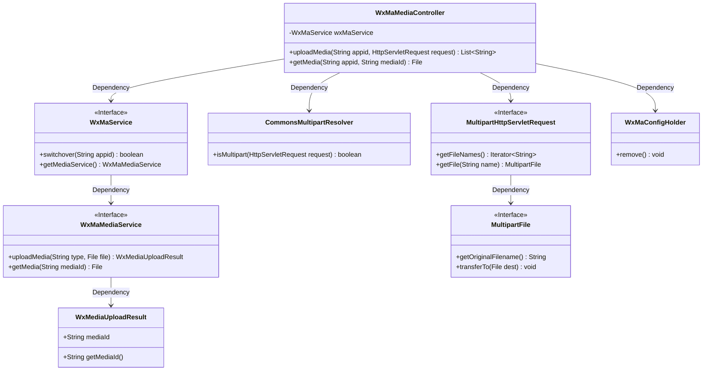
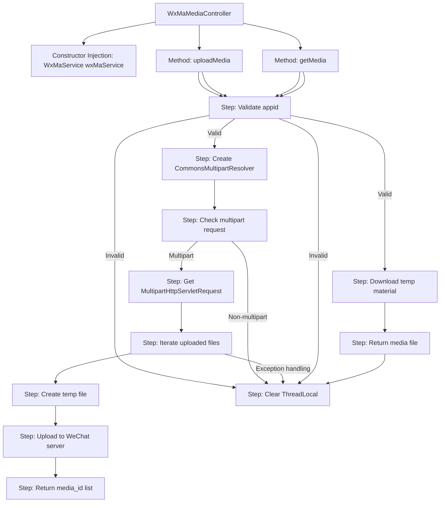
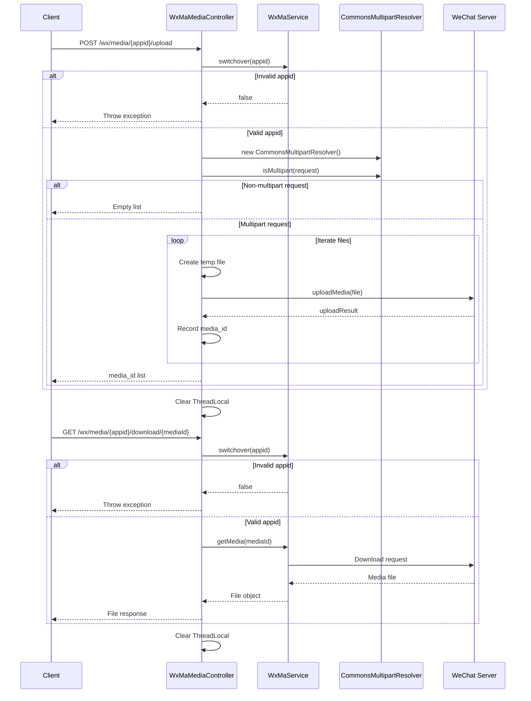

# Basic Information

|      |      |
|------|------|
| Name | WxMaMediaController |
| Language | .java |
| Code Path | weixin-java-miniapp-demo/src/main/java/com/github/binarywang/demo/wx/miniapp/controller/WxMaMediaController.java |
| Package Name | com.github.binarywang.demo.wx.miniapp.controller |
| Dependencies | ['cn.binarywang.wx.miniapp.api.WxMaService', 'cn.binarywang.wx.miniapp.constant.WxMaConstants', 'cn.binarywang.wx.miniapp.util.WxMaConfigHolder', 'com.google.common.collect.Lists', 'com.google.common.io.Files', 'lombok.AllArgsConstructor', 'lombok.extern.slf4j.Slf4j', 'me.chanjar.weixin.common.bean.result.WxMediaUploadResult', 'me.chanjar.weixin.common.error.WxErrorException', 'org.springframework.web.bind.annotation', 'org.springframework.web.multipart.MultipartFile', 'org.springframework.web.multipart.MultipartHttpServletRequest', 'org.springframework.web.multipart.commons.CommonsMultipartResolver', 'javax.servlet.http.HttpServletRequest', 'java.io.File', 'java.io.IOException', 'java.util.Iterator', 'java.util.List'] |
| Brief Description | WeChat Mini Program media controller, providing functions for uploading and downloading temporary materials. Upload requires appid verification and supports multi-file processing, returning a list of media_ids. Download requires verification of both appid and media_id, returning the media file. Clears ThreadLocal after operations. |

# Description

This is a WeChat Mini Program media file management controller class, which includes functions for uploading and downloading temporary materials. The upload interface accepts multi-file requests, validates the appid's effectiveness, saves the files to a temporary directory, and returns a list of media_ids. The download interface returns the corresponding file based on the mediaId. Both methods include ThreadLocal cleanup logic. The upload process records file paths and media_ids, and error logs are recorded in case of exceptions.

# Class Summary

| Name   | Type  | Description |
|-------|------|-------------|
| WxMaMediaController | class | This is a WeChat Mini Program media file controller, which includes the functionality to upload and download temporary materials. The upload interface receives files and returns a media_id, while the download interface retrieves files using the media_id. ThreadLocal data is cleared before and after processing. |

## Class WxMaMediaController

|      |      |
|------|------|
| Access Modifier | @RestController;@AllArgsConstructor;@Slf4j;@RequestMapping("/wx/media/{appid}");public |
| Type | class |
| Name | WxMaMediaController |
| Description | This is a WeChat Mini Program media file controller, which includes the functionality to upload and download temporary materials. The upload interface receives files and returns a media_id, while the download interface retrieves files using the media_id. ThreadLocal data is cleared before and after processing. |

### UML Class Diagram

This code represents a WeChat Mini Program media file upload/download controller, primarily featuring two core functions: uploading temporary materials to WeChat servers via HTTP interface (returning media_id lists) and downloading temporary materials based on media_id. The controller relies on WxMaService for WeChat API operations, utilizes CommonsMultipartResolver to handle multipart requests, and manages configurations through ThreadLocal mechanism. The entire design follows Spring MVC patterns, incorporating comprehensive exception handling and logging, with special attention paid to resource cleanup and thread safety.

### Internal Method Call Graph

The flowchart describes two core methods of the WeChat Material Controller: file upload and download. The upload process consists of 11 key steps, from parameter validation to chunked multi-file upload processing; the download process contains 6 steps, also requiring initial appid validation. Both methods ultimately clear configuration information stored in ThreadLocal. The sequence diagram details the interaction process between client and server, including exception handling branches and WeChat service calls.

### Field List

| Name  | Type  | Description |
|-------|-------|------|
| wxMaService | WxMaService | WeChat Mini Program service instance, non-modifiable. |

### Method List

| Name  | Type  | Description |
|-------|-------|------|
| getMedia | File | This is a GET interface based on the Spring framework, designed for downloading media files. The interface accepts appid and mediaId parameters, verifies the configuration, returns the media file, and cleans up the ThreadLocal. |
| uploadMedia | List<String> | Upload media file interface: After validating the appid, process multi-file uploads and return a list of WeChat media IDs. Log errors and clean up thread variables in case of exceptions. |

