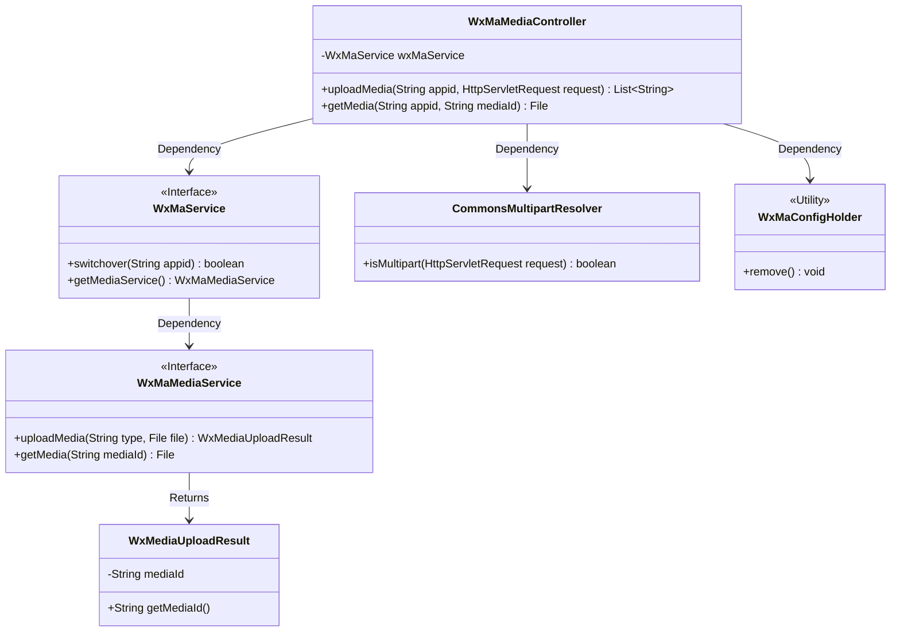
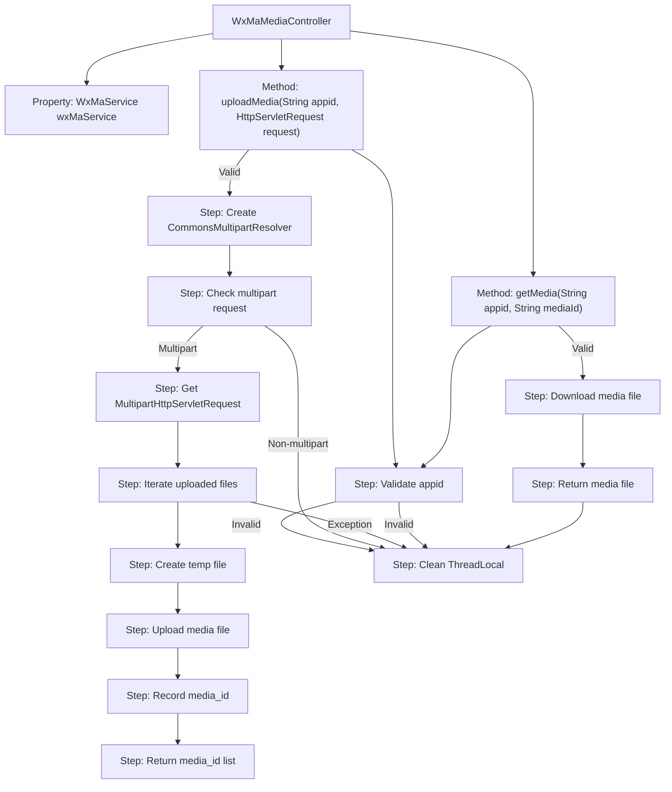

# Basic Information

|      |      |
|------|------|
| Name | WxMaMediaController |
| Language | .java |
| Code Path | weixin-java-miniapp-demo/src/main/java/com/github/binarywang/demo/wx/miniapp/controller/WxMaMediaController.java |
| Package Name | com.github.binarywang.demo.wx.miniapp.controller |
| Dependencies | ['cn.binarywang.wx.miniapp.api.WxMaService', 'cn.binarywang.wx.miniapp.constant.WxMaConstants', 'cn.binarywang.wx.miniapp.util.WxMaConfigHolder', 'com.google.common.collect.Lists', 'com.google.common.io.Files', 'lombok.AllArgsConstructor', 'lombok.extern.slf4j.Slf4j', 'me.chanjar.weixin.common.bean.result.WxMediaUploadResult', 'me.chanjar.weixin.common.error.WxErrorException', 'org.springframework.web.bind.annotation', 'org.springframework.web.multipart.MultipartFile', 'org.springframework.web.multipart.MultipartHttpServletRequest', 'org.springframework.web.multipart.commons.CommonsMultipartResolver', 'javax.servlet.http.HttpServletRequest', 'java.io.File', 'java.io.IOException', 'java.util.Iterator', 'java.util.List'] |
| Brief Description | WeChat Mini Program Media Controller, providing functionality for uploading and downloading temporary materials. Upload requires appid verification, supports multi-file processing, and returns a list of media_ids. Download requires verification of both appid and media_id, returning the media file. Clears ThreadLocal after operations. |

# Description

This is a controller class for media file management in a WeChat Mini Program, providing functionality for uploading and downloading temporary materials. The upload interface accepts multi-file requests, verifies the validity of the appid, saves the files to a temporary directory, uploads them to the WeChat server, and returns a list of media_ids. The download interface retrieves media files based on the mediaId. Both operations include ThreadLocal cleanup logic to ensure thread safety.

# Class Summary

| Name   | Type  | Description |
|-------|------|-------------|
| WxMaMediaController | class | WeChat Mini Program Material Controller, providing upload and download functions for temporary materials. Upload returns a list of media_ids, download returns files. Validates appid, handles multi-file uploads, and cleans up ThreadLocal. |

## Class WxMaMediaController

|      |      |
|------|------|
| Access Modifier | @RestController;@AllArgsConstructor;@Slf4j;@RequestMapping("/wx/media/{appid}");public |
| Type | class |
| Name | WxMaMediaController |
| Description | WeChat Mini Program Material Controller, providing upload and download functions for temporary materials. Upload returns a list of media_ids, download returns files. Validates appid, handles multi-file uploads, and cleans up ThreadLocal. |

### UML Class Diagram

Class Diagram Description: This diagram illustrates the core structure of a WeChat Mini Program media controller (WxMaMediaController), which operates media services through the WxMaService interface, relies on CommonsMultipartResolver for file upload handling, and utilizes WxMaConfigHolder for thread-local variable management. The controller provides temporary media upload/download functionality, interacts with WxMaMediaService, and returns WxMediaUploadResult objects, demonstrating clear hierarchy and dependency relationships.

### Internal Method Call Graph

This code represents a WeChat Mini Program media file upload/download controller, featuring two core methods: uploadMedia handles multi-file uploads by temporarily storing files and invoking WeChat APIs to obtain media_ids, while getMedia downloads corresponding media files based on media_id. The workflow rigorously validates appid, manages configurations via ThreadLocal, properly handles file operations and exceptions, and always cleans up ThreadLocal resources.

### Field List

| Name  | Type  | Description |
|-------|-------|------|
| wxMaService | WxMaService | WeChat Mini Program service instance, private and immutable. |

### Method List

| Name  | Type  | Description |
|-------|-------|------|
| uploadMedia | List<String> | The interface for handling uploaded media files verifies the appid, parses the multipart request, uploads each file individually, returns a list of media IDs, and finally cleans up the thread-local storage. |
| getMedia | File | This is a WeChat Mini Program media file download interface that retrieves files using the appid and mediaId, checks the configuration, returns the media file, and cleans up the thread-local storage. |

