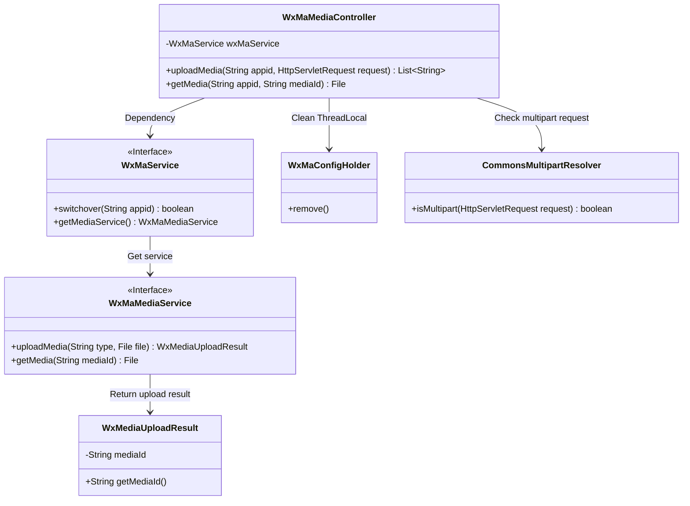
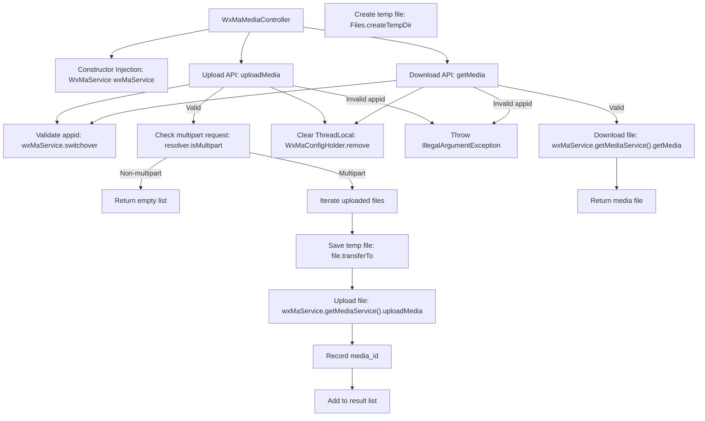
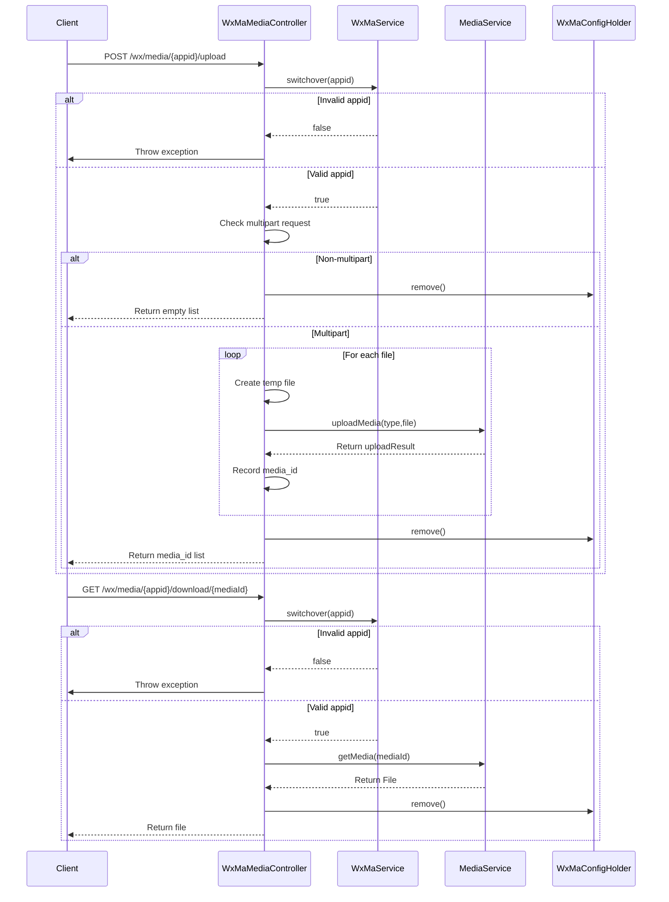

# Basic Information

|      |      |
|------|------|
| Name | WxMaMediaController |
| Language | .java |
| Code Path | weixin-java-miniapp-demo/src/main/java/com/github/binarywang/demo/wx/miniapp/controller/WxMaMediaController.java |
| Package Name | com.github.binarywang.demo.wx.miniapp.controller |
| Dependencies | ['cn.binarywang.wx.miniapp.api.WxMaService', 'cn.binarywang.wx.miniapp.constant.WxMaConstants', 'cn.binarywang.wx.miniapp.util.WxMaConfigHolder', 'com.google.common.collect.Lists', 'com.google.common.io.Files', 'lombok.AllArgsConstructor', 'lombok.extern.slf4j.Slf4j', 'me.chanjar.weixin.common.bean.result.WxMediaUploadResult', 'me.chanjar.weixin.common.error.WxErrorException', 'org.springframework.web.bind.annotation', 'org.springframework.web.multipart.MultipartFile', 'org.springframework.web.multipart.MultipartHttpServletRequest', 'org.springframework.web.multipart.commons.CommonsMultipartResolver', 'javax.servlet.http.HttpServletRequest', 'java.io.File', 'java.io.IOException', 'java.util.Iterator', 'java.util.List'] |
| Brief Description | WeChat Mini Program Material Controller, providing functions for uploading and downloading temporary materials. Uploading returns a list of media_ids, while downloading returns files. It is necessary to verify the validity of the appid and clean up ThreadLocal after operations. |

# Description

This is a controller class for media file management in a WeChat Mini Program, which includes functionalities for uploading and downloading temporary materials. The upload interface accepts an appid and HTTP request, verifies the configuration, processes multi-file uploads, and returns a list of media_ids. The download interface retrieves media files based on the appid and mediaId. Both operations include ThreadLocal cleanup logic. The upload process involves temporary file creation and exception handling, while the download directly returns the file object. The class uses Lombok to simplify logging and constructor code.

# Class Summary

| Name   | Type  | Description |
|-------|------|-------------|
| WxMaMediaController | class | This is a WeChat Mini Program media controller class that includes functionality for uploading and downloading temporary materials. The upload interface accepts files and returns a list of media_ids, while the download interface retrieves files via media_id. It cleans up ThreadLocal before and after processing and verifies whether the appid configuration exists. |

## Class WxMaMediaController

|      |      |
|------|------|
| Access Modifier | @RestController;@AllArgsConstructor;@Slf4j;@RequestMapping("/wx/media/{appid}");public |
| Type | class |
| Name | WxMaMediaController |
| Description | This is a WeChat Mini Program media controller class that includes functionality for uploading and downloading temporary materials. The upload interface accepts files and returns a list of media_ids, while the download interface retrieves files via media_id. It cleans up ThreadLocal before and after processing and verifies whether the appid configuration exists. |

### UML Class Diagram

Class Diagram Description: This diagram illustrates the core structure of a WeChat Mini Program media management controller (WxMaMediaController), which relies on the WxMaService interface to achieve multi-account switching and media service acquisition. The controller includes methods for uploading/downloading media files, involving file processing, ThreadLocal cleanup, and exception handling. WxMaService isolates concrete implementations through interfaces and interacts with the media service (WxMaMediaService), returning upload results (WxMediaUploadResult) containing mediaId. The overall design follows a layered architecture, aligning with Spring MVC style.

### Internal Method Call Graph

Flowchart Description: This flowchart illustrates the core logic of the WeChat Material Management Controller, featuring two main interfaces: upload and download. The upload process validates appid, checks multipart requests, handles multi-file uploads, and returns a media_id list. The download process similarly verifies appid before retrieving media files. Both processes conclude by cleaning ThreadLocal-stored configuration, demonstrating complete request lifecycle handling and resource management mechanisms.

Sequence Diagram Description: The sequence diagram details the interaction between client and controller, including appid validation, file operations, and resource cleanup. The upload process demonstrates multi-file loop processing, while the download process shows straightforward query logic. Both utilize WxMaService for configuration switching and ultimately clear thread-local variables via WxMaConfigHolder, ensuring system state consistency.

### Field List

| Name  | Type  | Description |
|-------|-------|------|
| wxMaService | WxMaService | A private immutable WeChat Mini Program service instance variable wxMaService. |

### Method List

| Name  | Type  | Description |
|-------|-------|------|
| uploadMedia | List<String> | Upload media file interface, verify the appid before processing multi-file uploads, return a list of media_ids, and clean up ThreadLocal. |
| getMedia | File | This is a GET interface based on the Spring framework, designed for downloading media files. The interface accepts the appid and mediaId parameters, verifies the validity of the appid, retrieves the corresponding media file through the WeChat Mini Program service, finally cleans up the thread-local storage, and returns the file. |

