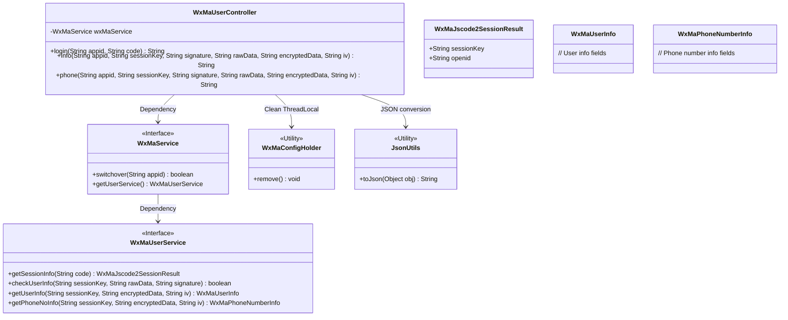
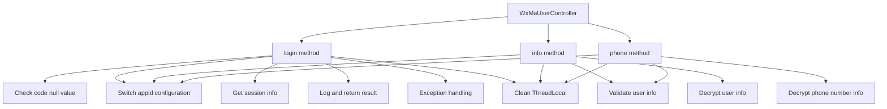

# Basic Information

|      |      |
|------|------|
| Name | WxMaUserController |
| Language | .java |
| Code Path | weixin-java-miniapp-demo/src/main/java/com/github/binarywang/demo/wx/miniapp/controller/WxMaUserController.java |
| Package Name | com.github.binarywang.demo.wx.miniapp.controller |
| Dependencies | ['cn.binarywang.wx.miniapp.api.WxMaService', 'cn.binarywang.wx.miniapp.bean.WxMaJscode2SessionResult', 'cn.binarywang.wx.miniapp.bean.WxMaPhoneNumberInfo', 'cn.binarywang.wx.miniapp.bean.WxMaUserInfo', 'cn.binarywang.wx.miniapp.util.WxMaConfigHolder', 'com.github.binarywang.demo.wx.miniapp.utils.JsonUtils', 'lombok.AllArgsConstructor', 'lombok.extern.slf4j.Slf4j', 'me.chanjar.weixin.common.error.WxErrorException', 'org.apache.commons.lang3.StringUtils', 'org.springframework.web.bind.annotation.GetMapping', 'org.springframework.web.bind.annotation.PathVariable', 'org.springframework.web.bind.annotation.RequestMapping', 'org.springframework.web.bind.annotation.RestController'] |
| Brief Description | WeChat Mini Program User Controller, providing interfaces for login, retrieving user information and phone numbers. It requires validation of appid and parameters, returns JSON data, handles exceptions, and cleans up ThreadLocal. |

# Description

This is a controller class related to WeChat Mini Program users, containing three interfaces. The login interface retrieves user session information, including sessionKey and openid, using a code. The user information retrieval interface validates parameters such as sessionKey and decrypts user information. Similarly, the phone number retrieval interface decrypts phone number information after validation. All interfaces first check whether the appid configuration exists and clean up ThreadLocal after processing. Error messages are returned in case of exceptions.

# Class Summary

| Name   | Type  | Description |
|-------|------|-------------|
| WxMaUserController | class | WeChat Mini Program User Controller, providing interfaces for login, user information, and mobile number retrieval, verifying appid and user data, returning JSON results, and clearing ThreadLocal after each request. |

## Class WxMaUserController

|      |      |
|------|------|
| Access Modifier | @RestController;@AllArgsConstructor;@Slf4j;@RequestMapping("/wx/user/{appid}");public |
| Type | class |
| Name | WxMaUserController |
| Description | WeChat Mini Program User Controller, providing interfaces for login, user information, and mobile number retrieval, verifying appid and user data, returning JSON results, and clearing ThreadLocal after each request. |

### UML Class Diagram

This class diagram illustrates the core structure of a WeChat Mini Program user controller. The WxMaUserController serves as a REST controller, accessing WeChat Mini Program services through the WxMaService interface, with three key methods: login, user info retrieval, and phone number acquisition. The controller relies on WxMaUserService for session management, user verification, and data decryption, while utilizing WxMaConfigHolder for thread-local configuration management and JsonUtils for JSON conversion. The overall design adheres to the Dependency Inversion Principle, isolating concrete implementations through interfaces.

### Internal Method Call Graph

The flowchart illustrates the workflows of three main API interfaces in WxMaUserController: login handles WeChat authentication and session retrieval, info obtains basic user information, and phone processes user phone number data. All interfaces include appid configuration switching and ThreadLocal cleanup, with core differences lying in data processing logic: login focuses on session management, while info and phone handle user profile data and phone number decryption/validation respectively. Exception handling and resource cleanup are implemented throughout, demonstrating robust design.

### Field List

| Name  | Type  | Description |
|-------|-------|------|
| wxMaService | WxMaService | WeChat Mini Program service instance, private and immutable. |

### Method List

| Name  | Type  | Description |
|-------|-------|------|
| info | String | WeChat Mini Program User Information Interface: Verify the appid and user data, then return the decrypted user information. Returns an error message if failed. |
| login | String | This is a WeChat Mini Program login interface that accepts appid and code parameters. After verifying that the code is not empty, it checks whether the appid configuration exists. It retrieves user session information, logs the activity, and returns the result in JSON format. In case of exceptions, it logs the error and cleans up the ThreadLocal. |
| phone | String | This is an interface for a WeChat Mini Program to retrieve a user's phone number. First, it checks the appid configuration, then verifies the user information, and finally decrypts the phone number data and returns it. If any step fails, an error message is returned. |

