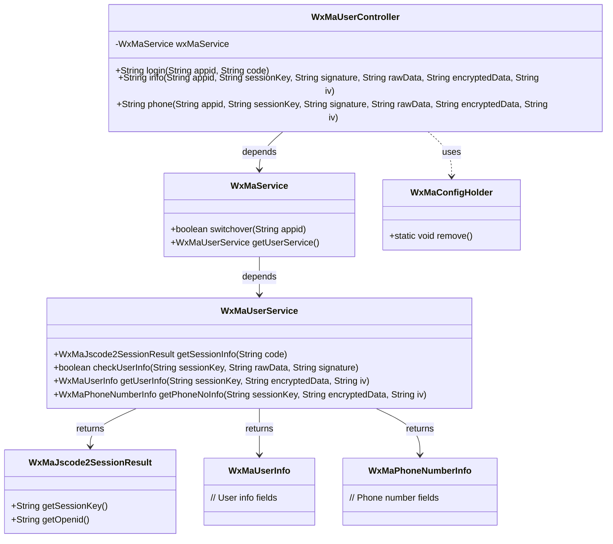
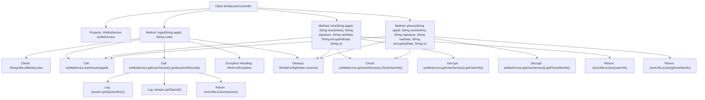

# Basic Information

|      |      |
|------|------|
| Name | WxMaUserController |
| Language | .java |
| Code Path | weixin-java-miniapp-demo/src/main/java/com/github/binarywang/demo/wx/miniapp/controller/WxMaUserController.java |
| Package Name | com.github.binarywang.demo.wx.miniapp.controller |
| Dependencies | ['cn.binarywang.wx.miniapp.api.WxMaService', 'cn.binarywang.wx.miniapp.bean.WxMaJscode2SessionResult', 'cn.binarywang.wx.miniapp.bean.WxMaPhoneNumberInfo', 'cn.binarywang.wx.miniapp.bean.WxMaUserInfo', 'cn.binarywang.wx.miniapp.util.WxMaConfigHolder', 'com.github.binarywang.demo.wx.miniapp.utils.JsonUtils', 'lombok.AllArgsConstructor', 'lombok.extern.slf4j.Slf4j', 'me.chanjar.weixin.common.error.WxErrorException', 'org.apache.commons.lang3.StringUtils', 'org.springframework.web.bind.annotation.GetMapping', 'org.springframework.web.bind.annotation.PathVariable', 'org.springframework.web.bind.annotation.RequestMapping', 'org.springframework.web.bind.annotation.RestController'] |
| Brief Description | WeChat Mini Program User Controller, providing interfaces for login, retrieving user information and phone numbers, verifying appid and user data, returning JSON results, and cleaning up ThreadLocal. |

# Description

This is a WeChat Mini Program user management controller class, which includes three interfaces: the login interface verifies user credentials and returns session information; the user information interface validates and decrypts user data before returning it; the phone number interface validates and decrypts the user's bound phone number information before returning it. All interfaces require validation of the appid's validity and clear the ThreadLocal-stored configuration information upon completion of processing.

# Class Summary

| Name   | Type  | Description |
|-------|------|-------------|
| WxMaUserController | class | WeChat Mini Program User Controller, providing interfaces for login, retrieving user information, and phone number. It returns JSON results after verifying the appid and user data, and clears ThreadLocal after each request. |

## Class WxMaUserController

|      |      |
|------|------|
| Access Modifier | @RestController;@AllArgsConstructor;@Slf4j;@RequestMapping("/wx/user/{appid}");public |
| Type | class |
| Name | WxMaUserController |
| Description | WeChat Mini Program User Controller, providing interfaces for login, retrieving user information, and phone number. It returns JSON results after verifying the appid and user data, and clears ThreadLocal after each request. |

### UML Class Diagram

Class diagram description: This diagram illustrates a WeChat Mini Program user management controller WxMaUserController, which invokes WeChat-related services through WxMaService. The controller provides three interfaces for login, retrieving user information, and obtaining phone numbers, relying on WxMaService to implement core business logic. WxMaService utilizes WxMaUserService to execute specific WeChat API calls, returning session information, user data, and phone number details. All operations ultimately clear configuration information stored in ThreadLocal. The class relationships clearly demonstrate the collaboration between a Spring Boot controller and the WeChat service layer.

### Internal Method Call Graph

This code represents a WeChat Mini Program user-related controller containing three main interfaces: login, get user info (info), and get user phone number (phone). Each interface first checks if the appid configuration exists, then performs corresponding business processing, and finally cleans up ThreadLocal resources. The login interface retrieves session information via code, the user info interface requires signature verification and data decryption, while the phone number interface similarly decrypts phone number data after signature verification. All interfaces return results in JSON format and log processing information along with exception handling during execution.

### Field List

| Name  | Type  | Description |
|-------|-------|------|
| wxMaService | WxMaService | WeChat Mini Program service instance, private and immutable. |

### Method List

| Name  | Type  | Description |
|-------|-------|------|
| login | String | This is a WeChat Mini Program login interface that receives the appid and code parameters. After verifying that the code is not empty, it switches to the corresponding appid configuration, retrieves the user session information, and returns it. In case of exceptions, it logs the error and returns an error message, and finally cleans up the ThreadLocal. |
| info | String | The code is a backend interface for a WeChat Mini Program, designed to verify user information and decrypt returned user data. It first checks the appid configuration, then validates the user information signature, and finally decrypts the data to return the user information in JSON format. |
| phone | String | The code is an API interface for a WeChat Mini Program to retrieve a user's phone number. It first verifies the appid and user information. If the verification fails, it returns an error; if successful, it decrypts the phone number and returns the result in JSON format. |

