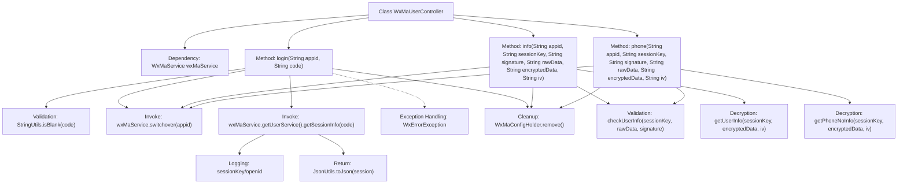

# Basic Information

|      |      |
|------|------|
| Name | WxMaUserController |
| Language | .java |
| Code Path | weixin-java-miniapp-demo/src/main/java/com/github/binarywang/demo/wx/miniapp/controller/WxMaUserController.java |
| Package Name | com.github.binarywang.demo.wx.miniapp.controller |
| Dependencies | ['cn.binarywang.wx.miniapp.api.WxMaService', 'cn.binarywang.wx.miniapp.bean.WxMaJscode2SessionResult', 'cn.binarywang.wx.miniapp.bean.WxMaPhoneNumberInfo', 'cn.binarywang.wx.miniapp.bean.WxMaUserInfo', 'cn.binarywang.wx.miniapp.util.WxMaConfigHolder', 'com.github.binarywang.demo.wx.miniapp.utils.JsonUtils', 'lombok.AllArgsConstructor', 'lombok.extern.slf4j.Slf4j', 'me.chanjar.weixin.common.error.WxErrorException', 'org.apache.commons.lang3.StringUtils', 'org.springframework.web.bind.annotation.GetMapping', 'org.springframework.web.bind.annotation.PathVariable', 'org.springframework.web.bind.annotation.RequestMapping', 'org.springframework.web.bind.annotation.RestController'] |
| Brief Description | WeChat Mini Program User Controller, providing interfaces for login, retrieving user information and phone numbers, verifying appid and user data, returning results in JSON format, handling exceptions, and cleaning up ThreadLocal. |

# Description

This controller class handles WeChat Mini Program user-related functionalities and includes three interfaces. The login interface retrieves user session information via a code, verifies the validity of the appid, and returns the sessionKey and openid. The user info interface validates the sessionKey and signature before decrypting and returning user data. The phone number interface similarly decrypts and returns user phone number information after validation. Each operation clears the ThreadLocal-stored configuration to ensure thread safety. All interface paths include the appid parameter, and the returned results are in JSON format strings.

# Class Summary

| Name   | Type  | Description |
|-------|------|-------------|
| WxMaUserController | class | WeChat Mini Program User Controller, providing interfaces for login, user information, and mobile number retrieval. It verifies the appid and user data before returning JSON results, and clears ThreadLocal after each request. |

## Class WxMaUserController

|      |      |
|------|------|
| Access Modifier | @RestController;@AllArgsConstructor;@Slf4j;@RequestMapping("/wx/user/{appid}");public |
| Type | class |
| Name | WxMaUserController |
| Description | WeChat Mini Program User Controller, providing interfaces for login, user information, and mobile number retrieval. It verifies the appid and user data before returning JSON results, and clears ThreadLocal after each request. |

### UML Class Diagram

Class diagram description: This diagram illustrates a WeChat Mini Program user controller (WxMaUserController) and its related dependencies. The controller accesses WeChat services through the WxMaService interface, which in turn relies on the WxMaUserService interface for user-related operations. The controller also utilizes WxMaConfigHolder for managing thread-local variables and JsonUtils for JSON serialization. The overall structure demonstrates clear hierarchical relationships and service boundaries, aligning with RESTful design principles.

### Internal Method Call Graph

Flowchart Description:
This flowchart illustrates the core structure of the WxMaUserController class and the invocation flow of its three main interface methods. The login method handles WeChat Mini Program login by first validating the code's validity, then obtaining session information via wxMaService. The info and phone methods retrieve user information and phone numbers respectively, both requiring appid validation, user information verification, and decryption operations. All methods ultimately clean up the ThreadLocal-stored configuration. Exception handling and logging are integrated throughout the process, demonstrating comprehensive business logic and security validation mechanisms.

### Field List

| Name  | Type  | Description |
|-------|-------|------|
| wxMaService | WxMaService | WeChat Mini Program service instance, private and immutable. |

### Method List

| Name  | Type  | Description |
|-------|-------|------|
| info | String | The code is a backend interface for a WeChat Mini Program, designed to verify user information and decrypt returned user data. It first checks the appid configuration, then validates the user information signature, and finally decrypts the data to return the user information in JSON format. |
| login | String | This is a WeChat Mini Program login interface that retrieves user session information via a code. After verifying the code is non-empty and the appid is valid, it returns a JSON containing sessionKey and openid. Error messages are returned in case of exceptions, and ThreadLocal is cleaned up at the end. |
| phone | String | WeChat mobile number retrieval API: Verify the appid and user information, decrypt the mobile number data, and return the result. Returns an error message on failure or the mobile number JSON on success. |

