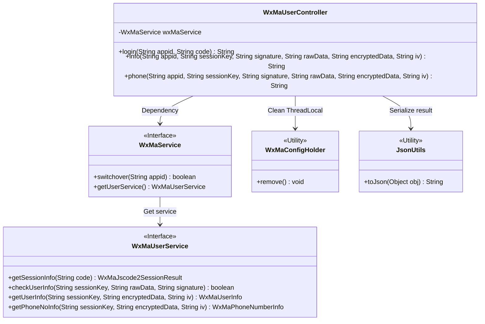
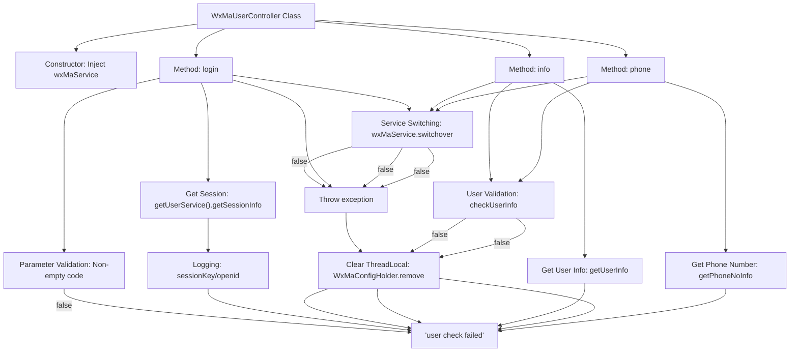

# Basic Information

|      |      |
|------|------|
| Name | WxMaUserController |
| Language | .java |
| Code Path | weixin-java-miniapp-demo/src/main/java/com/github/binarywang/demo/wx/miniapp/controller/WxMaUserController.java |
| Package Name | com.github.binarywang.demo.wx.miniapp.controller |
| Dependencies | ['cn.binarywang.wx.miniapp.api.WxMaService', 'cn.binarywang.wx.miniapp.bean.WxMaJscode2SessionResult', 'cn.binarywang.wx.miniapp.bean.WxMaPhoneNumberInfo', 'cn.binarywang.wx.miniapp.bean.WxMaUserInfo', 'cn.binarywang.wx.miniapp.util.WxMaConfigHolder', 'com.github.binarywang.demo.wx.miniapp.utils.JsonUtils', 'lombok.AllArgsConstructor', 'lombok.extern.slf4j.Slf4j', 'me.chanjar.weixin.common.error.WxErrorException', 'org.apache.commons.lang3.StringUtils', 'org.springframework.web.bind.annotation.GetMapping', 'org.springframework.web.bind.annotation.PathVariable', 'org.springframework.web.bind.annotation.RequestMapping', 'org.springframework.web.bind.annotation.RestController'] |
| Brief Description | WeChat Mini Program User Controller, providing interfaces for login, retrieving user information, and phone number. It verifies the appid and user data before returning JSON results, and clears ThreadLocal after each request. |

# Description

This is a WeChat Mini Program user management controller class that provides three core interfaces. The login interface retrieves user session information, including sessionKey and openid, using a code and verifies the validity of the appid. The user information interface validates parameters such as sessionKey and decrypts user data. The phone number interface similarly performs validation before decrypting and retrieving the user's phone number information. All interfaces will clear the ThreadLocal-stored configurations after operations to ensure thread safety. Error messages are returned in exceptional cases, while successful operations return data in JSON format.

# Class Summary

| Name   | Type  | Description |
|-------|------|-------------|
| WxMaUserController | class | WeChat Mini Program User Controller, providing interfaces for login, user information, and mobile number retrieval, verifying appid and handling data decryption, and cleaning up ThreadLocal. |


## Class WxMaUserController

|      |      |
|------|------|
| Access Modifier | @RestController;@AllArgsConstructor;@Slf4j;@RequestMapping("/wx/user/{appid}");public |
| Type | class |
| Name | WxMaUserController |
| Description | WeChat Mini Program User Controller, providing interfaces for login, user information, and mobile number retrieval, verifying appid and handling data decryption, and cleaning up ThreadLocal. |


### UML Class Diagram



This code demonstrates a WeChat Mini Program user management controller `WxMaUserController`, which implements user login, information retrieval, and phone number decryption through the `WxMaService` interface. The controller relies on `WxMaUserService` to handle core business logic, uses `WxMaConfigHolder` to manage thread-local variables, and serializes results via `JsonUtils`. All operations include appid verification and ThreadLocal cleanup mechanisms to ensure thread safety and configuration isolation. The class diagram clearly illustrates the dependency relationships between components and interface contracts.


### Internal Method Call Graph



```mermaid
sequenceDiagram
    participant Client
    participant Controller as WxMaUserController
    participant Service as WxMaService
    participant UserService
    participant Config as WxMaConfigHolder

    Client->>Controller: GET /login(appid, code)
    alt code is empty
        Controller-->>Client: "empty jscode"
    else
        Controller->>Service: switchover(appid)
        Service-->>Controller: false
        Controller-->>Client: Throw exception
    else
        Controller->>Service: getUserService()
        Service->>UserService: getSessionInfo(code)
        UserService-->>Service: sessionResult
        Service-->>Controller: sessionResult
        Controller->>Config: remove()
        Controller-->>Client: JSON(sessionResult)
    end

    Client->>Controller: GET /info(appid, params)
    Controller->>Service: switchover(appid)
    Service-->>Controller: false
    Controller-->>Client: Throw exception
    else
        Controller->>UserService: checkUserInfo(...)
        UserService-->>Controller: false
        Controller->>Config: remove()
        Controller-->>Client: "user check failed"
    else
        Controller->>UserService: getUserInfo(...)
        UserService-->>Controller: userInfo
        Controller->>Config: remove()
        Controller-->>Client: JSON(userInfo)
    end
```

Flowchart Description: This flowchart illustrates the call flows of three core interfaces in the WeChat Mini Program user controller. The login interface handles user authentication by validating the code parameter before obtaining session information via wxMaService. Both info and phone interfaces first validate the appid configuration, then perform user information verification, and finally retrieve basic user information and phone number respectively. All interface calls conclude with clearing ThreadLocal-stored configurations to ensure thread safety.

Sequence Diagram Description: The sequence diagram details the interaction process between the client and WxMaUserController, including key steps such as parameter validation, service switching, and user service invocation. It demonstrates both normal flows and exception handling branches, particularly highlighting critical stages like switchover verification and user information validation, along with the consistently executed ThreadLocal cleanup operation.

### Field List

| Name  | Type  | Description |
|-------|-------|------|
| wxMaService | WxMaService | Private immutable WeChat Mini Program service instance variables. |

### Method List

| Name  | Type  | Description |
|-------|-------|------|
| login | String | This is a WeChat Mini Program login interface that receives appid and code parameters, verifies that the code is not empty, switches the corresponding appid configuration, retrieves user session information, and returns a JSON result. In case of exceptions, it logs the error and cleans up ThreadLocal. |
| info | String | This is a backend interface for a WeChat Mini Program, used to verify user information and decrypt returned user data. First, it checks the appid configuration, then validates the user information signature, and finally decrypts the data and returns the user information in JSON format. |
| phone | String | This is an interface for a WeChat Mini Program to retrieve a user's phone number. First, it checks the appid configuration, then verifies the user information, and finally decrypts the phone number data and returns it. If it fails, an error message is returned. |


