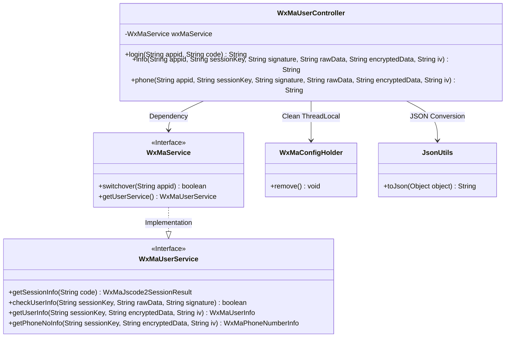
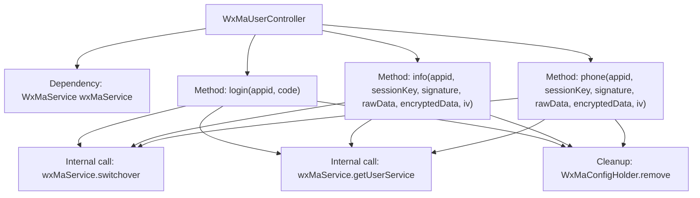
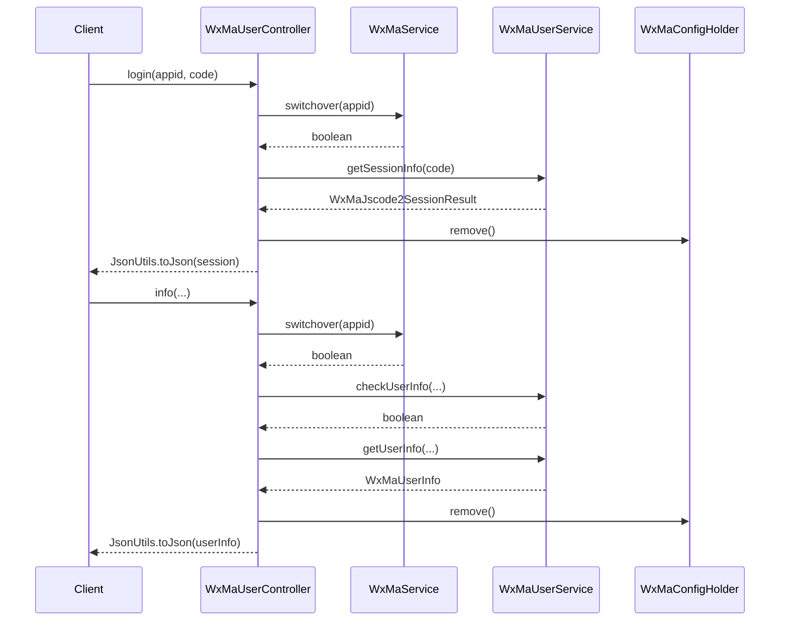

# Basic Information

|      |      |
|------|------|
| Name | WxMaUserController |
| Language | .java |
| Code Path | weixin-java-miniapp-demo/src/main/java/com/github/binarywang/demo/wx/miniapp/controller/WxMaUserController.java |
| Package Name | com.github.binarywang.demo.wx.miniapp.controller |
| Dependencies | ['cn.binarywang.wx.miniapp.api.WxMaService', 'cn.binarywang.wx.miniapp.bean.WxMaJscode2SessionResult', 'cn.binarywang.wx.miniapp.bean.WxMaPhoneNumberInfo', 'cn.binarywang.wx.miniapp.bean.WxMaUserInfo', 'cn.binarywang.wx.miniapp.util.WxMaConfigHolder', 'com.github.binarywang.demo.wx.miniapp.utils.JsonUtils', 'lombok.AllArgsConstructor', 'lombok.extern.slf4j.Slf4j', 'me.chanjar.weixin.common.error.WxErrorException', 'org.apache.commons.lang3.StringUtils', 'org.springframework.web.bind.annotation.GetMapping', 'org.springframework.web.bind.annotation.PathVariable', 'org.springframework.web.bind.annotation.RequestMapping', 'org.springframework.web.bind.annotation.RestController'] |
| Brief Description | WeChat Mini Program User Controller, providing interfaces for login, user information, and mobile number retrieval. It verifies the appid and user data before returning JSON results, and clears ThreadLocal after each request. |

# Description

The WxMaUserController is a Spring Boot-based WeChat Mini Program user management controller that includes three core interfaces. The login interface retrieves user session information via a code, verifies the appid validity, and returns the sessionKey and openid. The info interface validates the user data signature before decrypting and returning user information. Similarly, the phone interface verifies the signature and decrypts the user's phone number information. All interfaces ensure thread safety by cleaning up configuration information stored in ThreadLocal. The controller utilizes Lombok to simplify code and logs critical operations.

# Class Summary

| Name   | Type  | Description |
|-------|------|-------------|
| WxMaUserController | class | WeChat Mini Program User Controller, providing interfaces for login, user information, and mobile number retrieval. It requires validation of appid and sessionKey, returns JSON data, and cleans up ThreadLocal. |

## Class WxMaUserController

|      |      |
|------|------|
| Access Modifier | @RestController;@AllArgsConstructor;@Slf4j;@RequestMapping("/wx/user/{appid}");public |
| Type | class |
| Name | WxMaUserController |
| Description | WeChat Mini Program User Controller, providing interfaces for login, user information, and mobile number retrieval. It requires validation of appid and sessionKey, returns JSON data, and cleans up ThreadLocal. |

### UML Class Diagram

This code represents a WeChat Mini Program user management controller with three core functionalities: login, retrieving user information, and obtaining phone numbers. The class diagram illustrates how WxMaUserController accesses WeChat services through the WxMaService interface, relies on WxMaConfigHolder for thread-local variable management, and utilizes JsonUtils for data serialization. The WxMaService interface implements the WxMaUserService interface to provide user-related operations. The overall design aligns with the Spring MVC architecture, achieving implementation details isolation through interfaces, with clear dependency relationships and responsibility division.

### Internal Method Call Graph

This flowchart illustrates the core structure and invocation relationships of the WeChat Mini Program user controller, featuring three main interface methods (login/info/phone) with unified processing flows. All methods follow the "configuration switch → business processing → thread cleanup" call chain, interacting with WeChat APIs through WxMaService and ultimately returning JSON-formatted data. The sequence diagram details the complete call sequences for login and info methods, including critical steps for exception handling and thread-local variable cleanup.

### Field List

| Name  | Type  | Description |
|-------|-------|------|
| wxMaService | WxMaService | A private immutable WeChat Mini Program service instance variable wxMaService. |

### Method List

| Name  | Type  | Description |
|-------|-------|------|
| login | String | This is a WeChat Mini Program login interface that retrieves user session information using a code. After verifying the code and appid, it returns session data, while logging errors and clearing ThreadLocal in case of exceptions. |
| info | String | This is a WeChat Mini Program backend interface used to verify user information and decrypt returned user data. First, it checks the appid configuration, then validates the user information signature, and finally decrypts the data and returns the user information in JSON format. |
| phone | String | This is an interface for a WeChat Mini Program to obtain a user's phone number. After verifying the appid and user information, it decrypts and returns the phone number data. |

