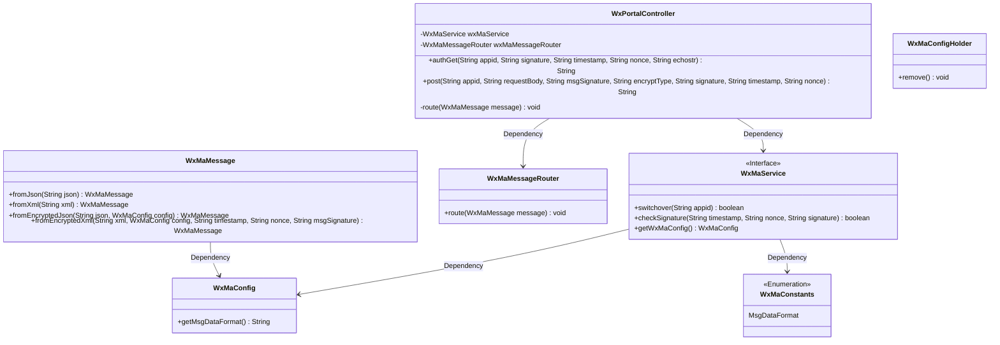
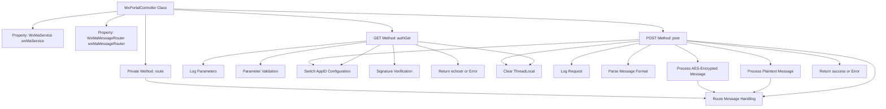

# Basic Information

|      |      |
|------|------|
| Name | WxPortalController |
| Language | .java |
| Code Path | weixin-java-miniapp-demo/src/main/java/com/github/binarywang/demo/wx/miniapp/controller/WxPortalController.java |
| Package Name | com.github.binarywang.demo.wx.miniapp.controller |
| Dependencies | ['cn.binarywang.wx.miniapp.api.WxMaService', 'cn.binarywang.wx.miniapp.bean.WxMaMessage', 'cn.binarywang.wx.miniapp.constant.WxMaConstants', 'cn.binarywang.wx.miniapp.message.WxMaMessageRouter', 'cn.binarywang.wx.miniapp.util.WxMaConfigHolder', 'lombok.AllArgsConstructor', 'lombok.extern.slf4j.Slf4j', 'org.apache.commons.lang3.StringUtils', 'org.springframework.web.bind.annotation', 'java.util.Objects'] |
| Brief Description | WeChat Mini Program Controller Class, handling GET/POST requests, verifying signatures, and routing messages. GET is used for WeChat server authentication, while POST processes plaintext or AES-encrypted messages, verifies the appid, forwards the message, and returns a success or error response. |

# Description

The controller serves as a backend interface for a WeChat Mini Program, comprising two primary methods. The `authGet` method handles authentication requests from the WeChat server, verifying signature parameters before returning the `echostr` string. The `post` method processes WeChat messages, supporting both plaintext and AES-encrypted formats. It parses JSON or XML message bodies based on configuration and routes messages through a message router. Both methods clean up ThreadLocal-stored configurations upon completion. In exceptional cases, error prompts are returned or exceptions are thrown. Detailed request logs are recorded for debugging purposes.

# Class Summary

| Name   | Type  | Description |
|-------|------|-------------|
| WxPortalController | class | WeChat Mini Program controller class, handling GET/POST requests, verifying signatures, and routing messages. GET is used for server authentication, POST processes plaintext or AES-encrypted messages, verifies the appid before forwarding to the message router, and finally cleans up ThreadLocal. |

## Class WxPortalController

|      |      |
|------|------|
| Access Modifier | @RestController;@AllArgsConstructor;@RequestMapping("/wx/portal/{appid}");@Slf4j;public |
| Type | class |
| Name | WxPortalController |
| Description | WeChat Mini Program controller class, handling GET/POST requests, verifying signatures, and routing messages. GET is used for server authentication, POST processes plaintext or AES-encrypted messages, verifies the appid before forwarding to the message router, and finally cleans up ThreadLocal. |

### UML Class Diagram

This class diagram illustrates the core structure of a WeChat Mini Program portal controller. The WxPortalController serves as a REST controller, relying on WxMaService for WeChat service configuration and signature verification, and on WxMaMessageRouter for message routing. The system processes WeChat messages in different formats (JSON/XML) and encryption types (plaintext/AES) via WxMaMessage, while using WxMaConfigHolder to manage thread-local configurations. The design encapsulates the complete workflow of WeChat message processing, including authentication, message parsing, routing, and thread-safe cleanup.

### Internal Method Call Graph

This flowchart illustrates the core processing logic of the WeChat portal controller. The GET method is used for WeChat server authentication, including parameter validation, signature verification, and response return. The POST method handles message push, supporting JSON/XML formatted plaintext and AES-encrypted message processing, with results returned after routing distribution. Both methods include a ThreadLocal cleanup mechanism to ensure thread safety. The private route method encapsulates the core logic of message routing, logging errors without interrupting the flow when exceptions occur.

### Field List

| Name  | Type  | Description |
|-------|-------|------|
| wxMaMessageRouter | WxMaMessageRouter | Private immutable instance of WeChat Mini Program message router. |
| wxMaService | WxMaService | WeChat Mini Program service instance, private and immutable. |

### Method List

| Name  | Type  | Description |
|-------|-------|------|
| post | String | The interface for handling WeChat requests supports plaintext and AES-encrypted messages. After verifying the appid, it parses and routes messages based on their format (JSON/XML), then cleans up thread data and returns success or error. |
| authGet | String | This is a WeChat authentication interface that receives verification requests from the WeChat server, validates the parameters and signature, and returns a response string. If parameters are missing or the signature is invalid, it throws an exception or returns an illegal request prompt. |
| route | void | The private method `route` handles WeChat message routing and logs error messages in case of exceptions. |

