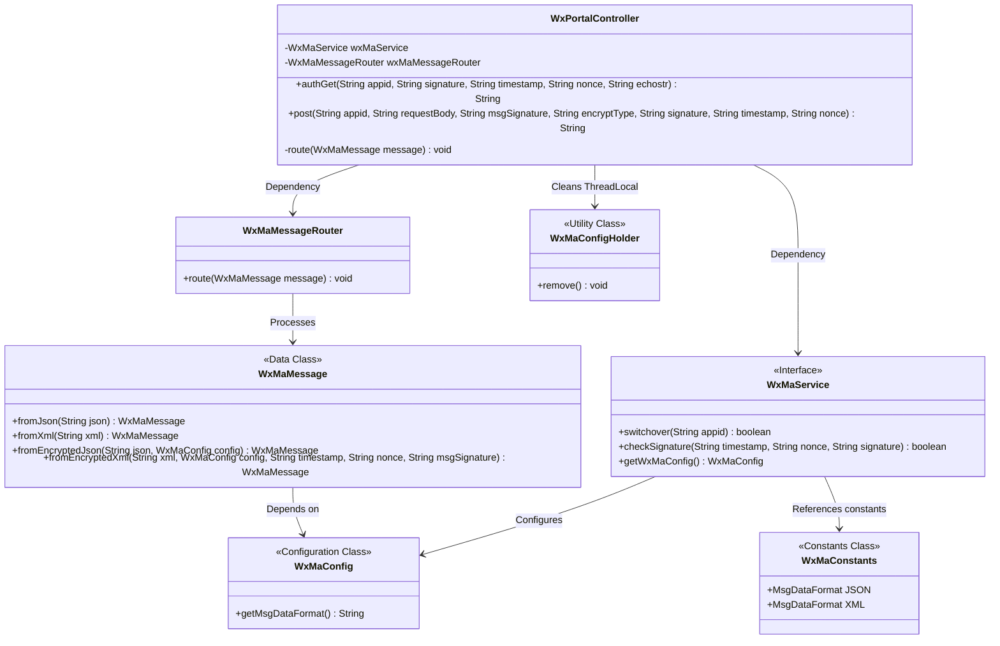
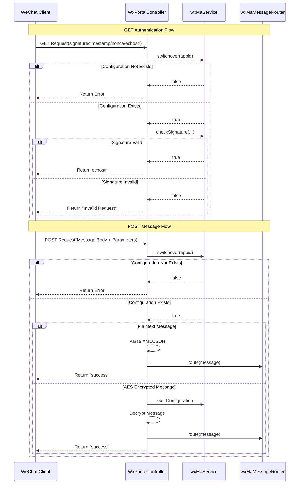

# Basic Information

|      |      |
|------|------|
| Name | WxPortalController |
| Language | .java |
| Code Path | weixin-java-miniapp-demo/src/main/java/com/github/binarywang/demo/wx/miniapp/controller/WxPortalController.java |
| Package Name | com.github.binarywang.demo.wx.miniapp.controller |
| Dependencies | ['cn.binarywang.wx.miniapp.api.WxMaService', 'cn.binarywang.wx.miniapp.bean.WxMaMessage', 'cn.binarywang.wx.miniapp.constant.WxMaConstants', 'cn.binarywang.wx.miniapp.message.WxMaMessageRouter', 'cn.binarywang.wx.miniapp.util.WxMaConfigHolder', 'lombok.AllArgsConstructor', 'lombok.extern.slf4j.Slf4j', 'org.apache.commons.lang3.StringUtils', 'org.springframework.web.bind.annotation', 'java.util.Objects'] |
| Brief Description | This is a WeChat Mini Program backend controller class that handles authentication and message requests from the WeChat server. It includes GET and POST methods, used for server verification and receiving user messages respectively, supporting plaintext and AES-encrypted messages. After verifying the signature, it routes the processing and returns a response. |

# Description

The code defines a WeChat Mini Program portal controller class, which includes GET and POST request handling methods. The GET method is used for WeChat server authentication, verifying the signature parameters and returning the echostr string. The POST method processes WeChat messages, supporting both plaintext and AES-encrypted formats. It converts the messages into message objects based on configuration, routes them for processing, and finally returns "success." Both methods clean up the thread-local stored configuration upon completion. The controller distinguishes configurations for different Mini Programs via the path variable appid, throwing an exception if the configuration does not exist. All operations are logged in detail.

# Class Summary

| Name   | Type  | Description |
|-------|------|-------------|
| WxPortalController | class | WeChat Mini Program Controller, handling authentication and message requests, verifying signatures and routing messages, supporting plaintext and AES encrypted messages. |

## Class WxPortalController

|      |      |
|------|------|
| Access Modifier | @RestController;@AllArgsConstructor;@RequestMapping("/wx/portal/{appid}");@Slf4j;public |
| Type | class |
| Name | WxPortalController |
| Description | WeChat Mini Program Controller, handling authentication and message requests, verifying signatures and routing messages, supporting plaintext and AES encrypted messages. |

### UML Class Diagram

This code demonstrates a WeChat Mini Program backend controller (WxPortalController) that primarily handles authentication and message push requests from the WeChat server. The class diagram clearly illustrates the controller's dependencies on the WxMaService interface and WxMaMessageRouter, as well as the WxMaMessage data class, WxMaConfig configuration class, and utility class WxMaConfigHolder involved in message processing. The controller provides two core methods, authGet and post, which handle GET verification requests and POST message pushes respectively. It performs signature verification and configuration switching through WxMaService, and ultimately routes messages via WxMaMessageRouter. The overall design reflects clear responsibility division and modular thinking.

### Internal Method Call Graph

```mermaid
graph TD
    A["WxPortalController Class"]
    B["GET Authentication Request: authGet"]
    C["POST Message Handling: post"]
    D["Internal Routing Method: route"]
    E["Dependency Service: wxMaService"]
    F["Dependency Router: wxMaMessageRouter"]

    A --> B
    A --> C
    A --> D
    A --> E
    A --> F

    B --> B1["Check Parameter Completeness"]
    B --> B2["Switch appid Configuration"]
    B --> B3["Verify Signature"]
    B --> B4["Return echostr or Error"]
    B --> B5["Clean ThreadLocal"]

    C --> C1["Check appid Configuration"]
    C --> C2["Determine Message Format"]
    C --> C3["Process Plaintext Message"]
    C --> C4["Process AES Encrypted Message"]
    C --> C5["Route Message"]
    C --> C6["Clean ThreadLocal"]
    C --> C7["Return 'success' or Error"]

    D --> D1["Call wxMaMessageRouter.route"]
    D --> D2["Exception Handling"]
```

The flowchart illustrates the core processing logic of the WeChat Mini Program message controller WxPortalController, encompassing two major flows: GET request authentication with the WeChat server and POST message handling. The GET flow ensures request legitimacy through signature verification, while the POST flow processes plaintext and AES-encrypted messages separately, ultimately distributing business logic via a message router. Both flows incorporate ThreadLocal cleanup mechanisms, demonstrating comprehensive request lifecycle management. The sequence diagram details the invocation sequence and conditional branches among components during client-server interactions.

### Field List

| Name  | Type  | Description |
|-------|-------|------|
| wxMaMessageRouter | WxMaMessageRouter | WeChat Mini Program message routing object, used for handling messages. |
| wxMaService | WxMaService | WeChat Mini Program Service Instance (Private Immutable) |

### Method List

| Name  | Type  | Description |
|-------|-------|------|
| post | String | Process WeChat XML/JSON requests, support plaintext and AES-encrypted messages, verify appid to route messages and return successful responses. |
| authGet | String | Process WeChat authentication requests, verify parameters and signatures, return echostr or error messages. |
| route | void | The private method `route` receives a `WxMaMessage` message, processes it by calling `wxMaMessageRouter.route`, and logs an error message if an exception occurs. |

